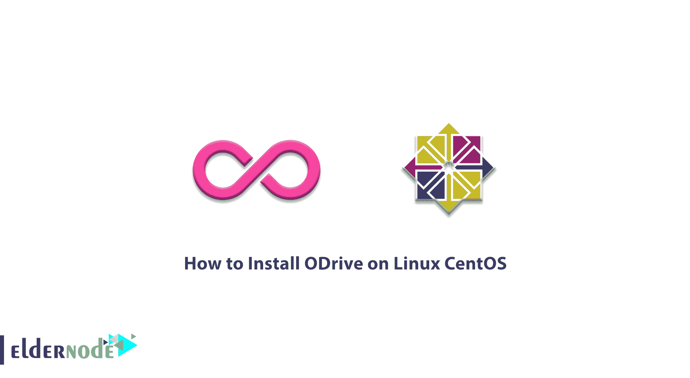

# 如何在 Linux Centos - Eldernode 博客上安装 ODrive

> 原文：<https://blog.eldernode.com/install-odrive-on-linux-centos/>



ODrive 是一个基于电子的免费开源应用程序。该程序允许用户与 Google Drive 同步和/或备份文件，而无需打开浏览器标签或使用基于终端的工具。ODrive 通过 web 界面和桌面同步客户端的组合来工作。用户可以使用该应用程序轻松下载同步客户端。需要注意的是，设置这个程序既快速又简单。在本文中，我们试图学习如何在 Linux CentOS 7，8 上安装 ODrive。你可以访问 [Eldernode](https://eldernode.com/) 提供的套装来购买 [CentOS VPS](https://eldernode.com/centos-vps/) 服务器。

## **教程在 Linux CentOS 7 或 8 上安装 ODrive**

ODrive 是一个强大的多云管理工具，提供了最好的同步方式。使用这个工具的一个最重要的优点是安装简单，易于使用。也没有额外的选项或设置需要掌握，没有控制或集成需要启用。在本文的后续部分，我们将提到 ODrive 程序的好处。然后我们会一步一步的学习如何在 [Linux](https://blog.eldernode.com/tag/linux/) CentOS 上安装 ODrive。请加入我们。

### **ODrive**的优缺点

在这一节中，我们首先提到 ODrive 的一些好处。然后我们将处理它的缺点。

1-具有强大的共享和协作功能。

2-零知识加密

3-用于 Linux、Mac 和 [Windows](https://blog.eldernode.com/tag/windows/) 的桌面同步客户端

4-有一个免费程序和七天的免费试用。

*以下是 ODrive 的一些缺点:*

1-没有云到云同步。

2-没有双因素身份验证。

3-没有每月付款选项。

4-低于标准的客户服务。

### **在 Linux Centos 7 | 8 上安装 ODrive**

您可以简单地按照下面的步骤在 Linux 上安装 ODrive[Centos](https://blog.eldernode.com/tag/centos/)。您必须首先启用快照。快照是打包了所有依赖项的程序，可以在所有的 [Linux 发行版](https://blog.eldernode.com/what-is-the-difference-between-different-linux-distributions/)中从一个单独的构建中运行。请注意，快照是自动更新的。

请注意，Snap 可从 CentOS 和 Red Hat 的企业 Linux (EPEL)数据包存储库中获得。因此，您可以通过运行以下命令来添加 EPEL 存储库:

```
sudo yum install epel-release -y
```

在下一步中，您必须使用以下命令安装 Snap:

```
sudo yum install snapd -y
```

现在，您需要执行以下命令来启用管理主 snap 通信套接字的 **systemd** 单元:

```
sudo systemctl enable --now snapd.socket
```

在下一步中，您需要在 **/var/lib/snapd/snap** 和 **/snap** 之间创建一个符号链接，并启用经典 snap 支持。所以只需运行以下命令:

```
sudo ln -s /var/lib/snapd/snap /snap
```

执行上述步骤后，建议您**重启**系统一次，以应用更改。

最后，运行以下命令在 Linux CentOS 上安装 ODrive:

```
sudo snap install odrive --edge -y
```

## 结论

ODrive 是一种云到云的管理服务，用户可以使用它来统一和管理多个云帐户。该服务通过 web 界面和桌面同步客户端的组合来工作。应该注意的是，与其他云到云管理系统不同，ODrive 没有云到云同步和备份，但提供了其他好处，如安全性和协作选项。在本文中，我们试图了解如何在 Linux Centos 上安装 ODrive。