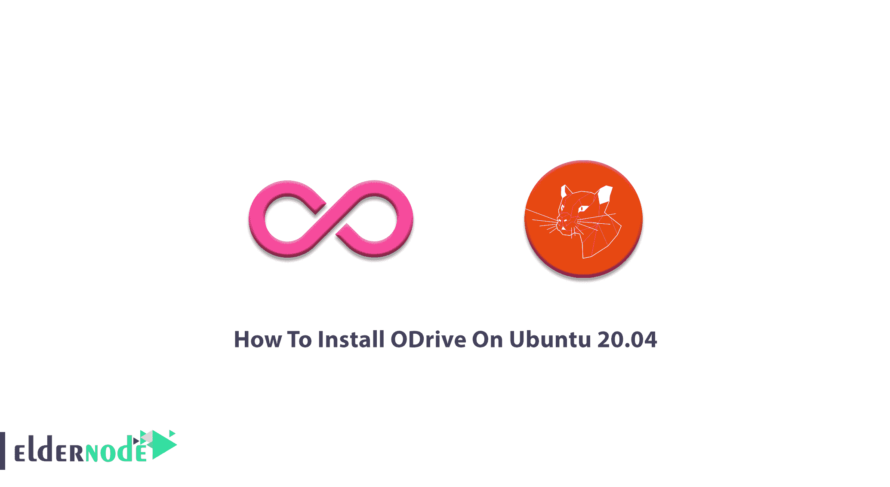
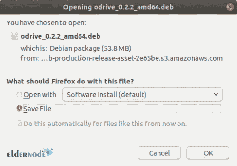
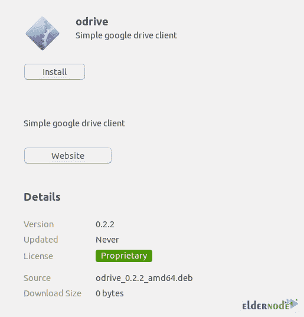
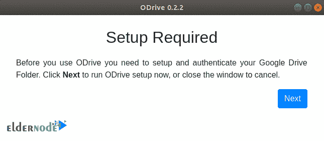
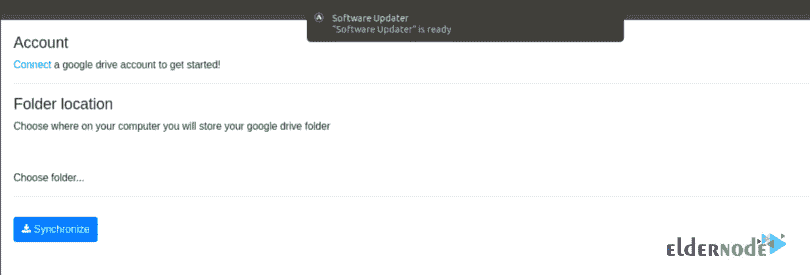

# 如何在 Ubuntu 20.04 上安装 ODrive 完整] - Eldernode 博客

> 原文：<https://blog.eldernode.com/install-odrive-on-ubuntu-20-04/>



Open Dive 是一个非官方的 Google Drive Linux 客户端，允许文件、系统通知之间的自动同步，并在系统中运行。它会为你在网上看到的所有东西提供一个文件夹。ODrive 支持脸书、GoogleDrive、Instagram、微软 OneDrive、Dropbox、Gmail、Windows 和 Linux 文件服务器。例如，如果你打开脸书文件夹，你会看到你所有的照片。在本文中，你将学习如何在 Ubuntu 20.04 上安装 ODrive。

如今，我们都生活在数字世界。应用程序和服务帮助你在互联网上散布你的生活。使用 ODrive，您可以将所有在线文件保存在桌面上的一个文件夹中。如果你习惯于使用 Dropbox 将所有内容上传到一个地方，请尝试 ODrive 来保存所有内容并通过它进行访问。即使您在不同的应用程序中有内容，ODrive 也会为您的所有内容提供统一的界面。要成为幸运的顾客之一，在 2021 年[老年人节](https://eldernode.com/)购买您自己的 [Ubuntu VPS](https://eldernode.com/ubuntu-vps/) 。

## **教程在 Ubuntu 20.04 上安装 ODrive LTS**

ODrive 是一个存放所有在线内容的文件夹，受 GPL v3 许可。它隐藏了 Google Drive 和你的本地 [Linux](https://blog.eldernode.com/tag/linux/) 机器之间同步和文档的复杂性。和我们一起来看看**在 [Ubuntu](https://blog.eldernode.com/tag/ubuntu/) 上安装和使用 ODrive 的两种方法**。让我们看看这两种方法是什么:

### 第一:利用。deb 文件

新用户更喜欢第一种方法。在 Ubuntu 上安装软件是一种安全的方式。因为这种方法类似于在 Windows 上安装 ODrive 的过程，所以您会有一种相似感，并帮助您更好地过渡到 Linux 环境。

下载[的最新稳定版本。deb 文件](https://github.com/liberodark/ODrive/releases)。



一旦它被下载，去它的位置并且点击下载文件并且点击打开与软件安装。

这样，Ubuntu 软件中心就开通了。要开始安装，请单击安装。您将被要求输入您的帐户密码进行身份验证。因此，输入它让过程开始。



### **第二:使用抓包**

在 Ubuntu 上安装 ODrive 的第二种方法是使用 Snap 包。此外，Snap 软件包是可以安装在所有 Linux 发行版上的通用软件包。

## **如何使用 Snap 服务在 Ubuntu 上安装 ODrive**

在这一步中，您将学习如何**在 Ubuntu 上启用快照并安装 ODrive** 。应该对源代码进行一些更改。于是， [snaps](https://snapcraft.io/store) 和 [flatpaks](https://blog.eldernode.com/install-flatpak-on-ubuntu-20-04/) 相继推出。当您使用这些软件包时，您将能够在 Mint Linux 发行版上安装为 Mint 开发的软件。运行以下命令，使用快照软件包安装 ODrive:

```
sudo apt install snapd
```

```
sudo snap install odrive-unofficial
```

现在，ODrive 应该已经安装在 Ubuntu 上了。

### **如何在 Linux Ubuntu 上使用 ODrive**

安装后启动应用程序。如果这是你第一次打开应用程序，你需要配置和验证你的 Google drive。因此，单击“下一步”继续。



因为 ODrive 可以访问您的 google 帐户，所以会要求您登录您的 google 帐户。然后，您必须指定将用于同步的本地文件夹。点击连接并登录您的 google 帐户。完成所有操作后，单击同步。现在，你看到你的 Google Drive 内容会立即开始同步。您的 google driver 文件夹中所有可能的更改都将在这个本地文件夹中可见。



## 结论

在本文中，您了解了如何在 Ubuntu 20.04 上安装 ODrive。安装 ODrive 有多种方法，本指南中介绍了两种方法。然而，这取决于你的选择。ODrive 通过将所有内容放在桌面上的一个文件夹中来简化云。作为用户，您将处于中心位置，可以访问所有平台。使用 ODrive 非常简单。它执行所有必要的功能，您可能需要同步您的文件和数据。