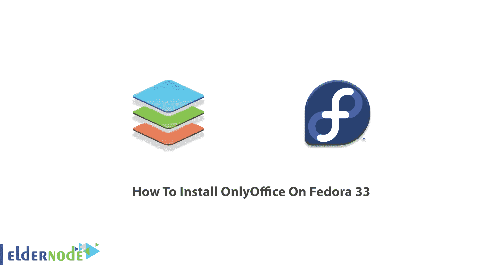
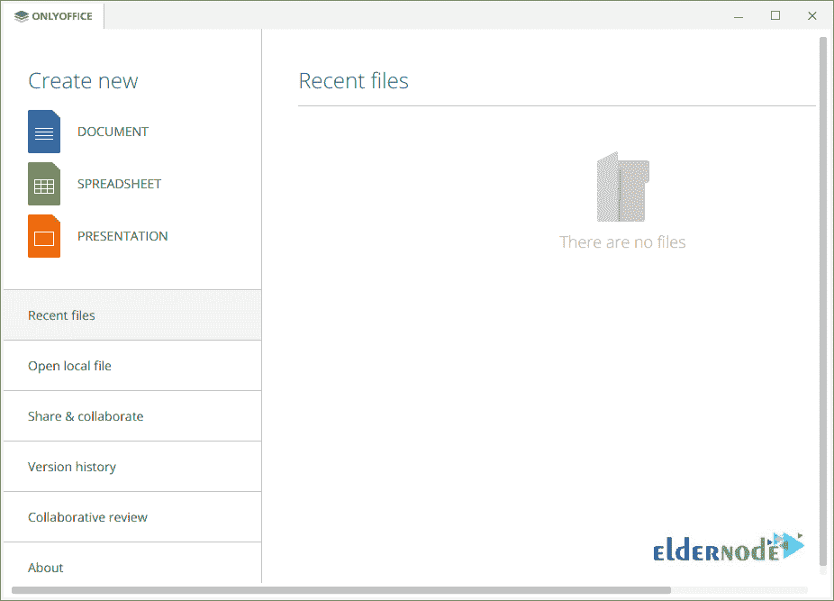
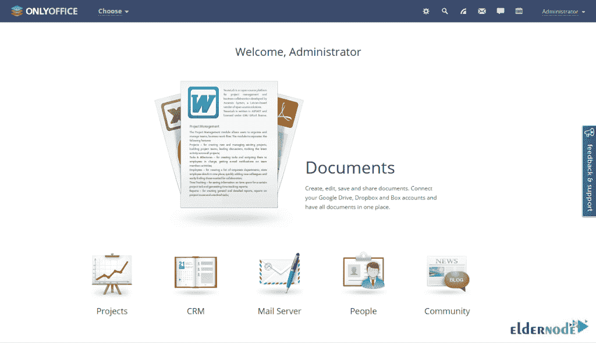
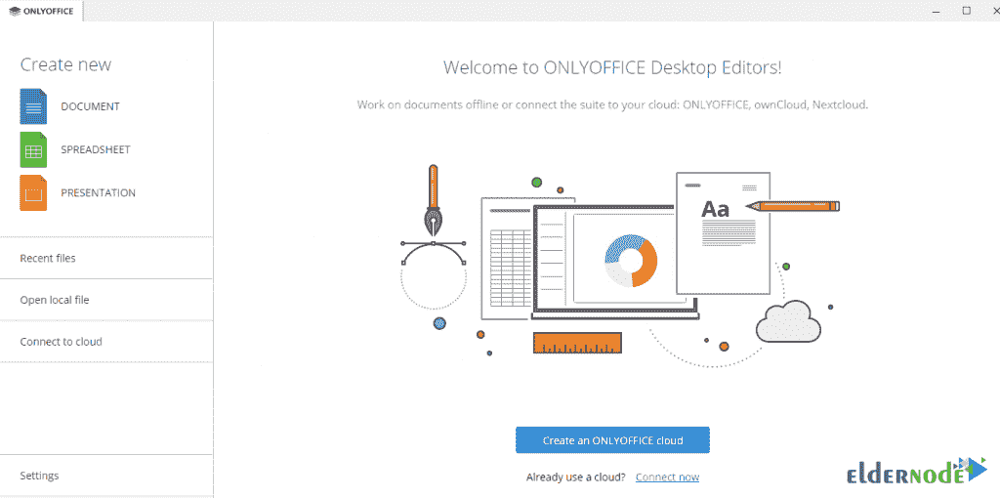

# 如何在 Fedora 33 - Eldernode 博客上安装 OnlyOffice

> 原文：<https://blog.eldernode.com/install-onlyoffice-on-fedora-33/>



如果您希望开始内部团队协作，ONLYOFFICE 正是为此目的而设计的。互联网社区对 OnlyOffice 给予了非常积极的反馈，因此，它为来自不同国家的用户提供了高而稳定的增长。现在全世界有超过 7，000，000 人在使用 OnlyOffice 运行他们自己的办公室。如果你想成为他们中的一员，请加入我们这篇文章，学习如何在 Fedora 33 上安装 ONLYOFFICE。在 [Eldernode](https://eldernode.com/) 上找到您想要的软件包，购买您自己的 **[Linux VPS](https://eldernode.com/linux-vps/)** 并入住我们酒店。

## **教程仅在 Fedora 上安装 office 33**

ONLYOFFICE 有免费版和企业版。你使用的是 [Windows](https://blog.eldernode.com/tag/windows/) 、 [Linux](https://blog.eldernode.com/tag/linux/) 或 macOS 并没有什么不同。在专业工作中处理文档、电子表格和演示文稿所需的所有工具只有 OFFICE。只有 Office 支持基于 Web 的、IOS 的、Android 的和桌面的。中小型企业将能够使用它。

### **OnlyOffice 功能**

OnlyOffice 提供在线文档编辑器、文档管理平台、公司通信、邮件和项目管理工具。以下是 OnlyOffice 的主要优点。

–文件管理

–在线办公套件

–电子邮件聚合器

–CRM 系统和发票

–业务协作工具

–项目管理

–日历

–团队成员名单

## **仅在 Fedora 上安装 office 33 | Fedora 32**

在 [Fedora](https://blog.eldernode.com/tag/fedora/) 33 上安装 OnlyOffice 有两种方法。在接下来的内容中，你将会学到这两者。所以，我们从第一种方法开始。让我们浏览一下本指南的步骤，并回顾一下在 Fedora 33 上安装 OnlyOffice 的第一种方法。

第一步:

[下载](https://www.onlyoffice.com/download-desktop.aspx)OnlyOffice for Fedora GNU/Linux 获得 only office。Fedora 的转速。

第二步:

要在 Fedora 上安装 OnlyOffice，只需运行以下命令:

```
sudo dnf in onlyoffice-desktopeditors*.rpm
```

第三步:

如果一切正常，您现在应该只能运行 Office 了。所以，利用桌面启动器:



### **如何在 Fedora 上启用 Snaps 并只安装 Office**

如果这不是您第一次阅读 Eldernode 博客，那么您已经多次学习了如何使用 snaps 来安装工具。第二种方法就是这样。您可以在 Fedora 上启用 snaps，以便仅在其上安装 Office。

首先，使用下面的命令在 Fedora 上安装 snap。

```
sudo dnf install snapd
```

然后，确保快照的路径更新正确。为此，您可以注销并再次登录，或者**重启**您的系统。

使用下面的命令在 **/var/lib/snapd/snap** 和 **/snap** 之间创建一个符号链接，并启用经典 snap 支持。

```
sudo ln -s /var/lib/snapd/snap /snap
```

最后，您可以运行以下命令来仅安装 Office 桌面编辑器:

```
sudo snap install onlyoffice-desktopeditors
```

就是这样！开始使用 OnlyOffice 并使用它的各种功能。



### **如何在 Fedora Linux 上使用 only office**

您可以使用任何一种教授的方法在 Fedora 33 上安装 OnlyOffice。一旦安装了 OnlyOffice，您必须看到下图。当您打开程序时，从左栏中选择您考虑的选项，并选择从文档、电子表格或演示文稿开始。



## 结论

在本文中，您学习了如何在 Fedora 33 上安装 OnlyOffice。现在，您可以开始在一个地方管理文档、项目、团队和客户关系。因此，您不再需要在多个应用程序之间来回切换来执行不同的任务。如果您只使用 Office，请发送您的反馈，让您在 [Eldernode 社区](https://community.eldernode.com/)上的朋友了解更多信息。