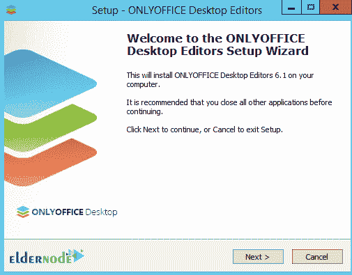
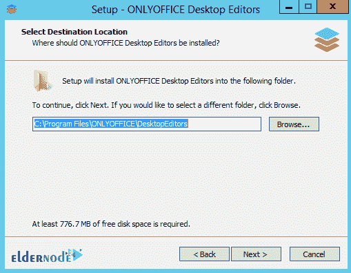

# 如何在 Windows 10 上安装 only office RDP-elder node 博客

> 原文：<https://blog.eldernode.com/install-onlyoffice-on-windows-10/>

ONLYOFFICE 是管理、编辑和创建各种类型的 OFFICE 文档(如文档文件、电子表格和 PowerPoint)的专业软件的名称。标准和官方的 Microsoft Office 格式直接依赖于 Microsoft Word、Microsoft Excel 和 Microsoft PowerPoint。我们想推出 Microsoft Office 的专业替代产品。在本文中，我们将教你如何在 Windows 10 RDP 上安装 OnlyOffice。需要注意的是，你可以访问 [Eldernode](https://eldernode.com/) 中可用的包来购买一台 **[Windows 10 RDP](https://eldernode.com/windows-10-rdp/)** 服务器。

## **教程仅在 Windows 10 RDP 服务器上安装 office**

OnlyOffice 实际上包括文档编辑器、电子表格编辑器和演示文稿编辑器三个强大的软件包。文档编辑器软件支持多种 DOC、DOCX、ODT、RTF、TXT、PDF、HTML、EPUB、XPS 格式。电子表格编辑器软件还支持 XLS，XLSX，ODS，CSV，HTML 格式。最后，演示文稿编辑器软件完全支持 PPTX，PPT，ODP，PDF 格式。

在本文的其余部分，我们将了解 OnlyOffice 的一些特性。然后我们将向您介绍如何在 RDP 的 Windows 系统上安装 OnlyOffice。请加入我们。

### **only office 软件的特点**

Microsoft Office 的合适专业替代产品

2-拥有用于文档编辑器、电子表格和多媒体演示的特殊工具

3-支持标准 Microsoft Office 格式

4-与 Microsoft Office 软件包相比，数量非常少

5-完全支持 32 位和 64 位版本的 Windows 10、8.1、8、7

## **仅在 Windows 10 上安装 office**

在本节中，我们将一步一步地向您展示如何在 Windows 10 RDP 版上安装 OnlyOffice。要做到这一点，只需在第一步进入 [OnlyOffice 网站](https://www.onlyoffice.com/download-desktop.aspx?from=default)。然后你必须向下滚动一点，只下载 Office，如下所示:

转到下载文件的位置。然后双击它。选择您想要的**语言**并点击**确定**。

在下一步中，您必须点击**下一步**以继续安装过程。

在下一步中，要确认协议，您必须选择**我接受协议**并点击**下一步**。

现在，您需要指定安装 OnlyOffice 的路径。然后点击**下一个**。

如果您想在桌面上创建唯一的 Office 图标，请选中此选项并单击下一个的**。**

在下一部分中，您可以选择 **Associate all** 来安装这个包中的所有项目。如果您打算只安装某些格式，必须先选择关联，然后选择所需的格式。然后点击**下一个**。

最后点击**安装**。

*

最后点击**完成**完成 OnlyOffice 安装过程。

### **如何在 Windows 10 上只使用 office RDP**

成功安装 OnlyOffice 后，您将通过运行此程序看到下图。您可以从左栏中选择所需的选项，包括文档、电子表格和演示文稿。

## 结论

OnlyOffice(前身为 TeamLab)是一款免费的办公软件套件。它具有在线文档编辑器、文档管理平台、公司通信、邮件和项目管理工具。在这篇文章中，我们试图教你如何在 Windows 10 RDP 上安装 OnlyOffice。