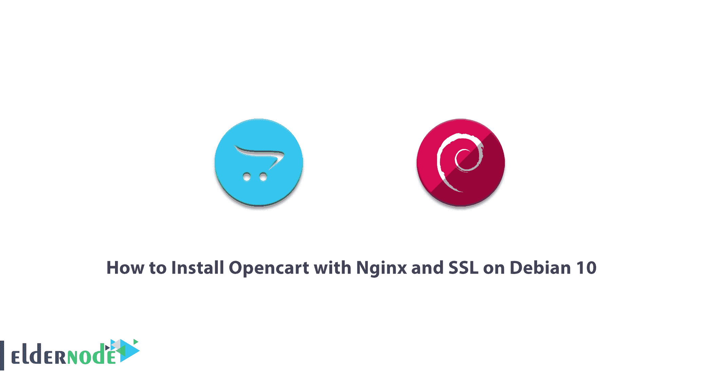

# 如何在 Debian 10 - Eldernode 上安装带 Nginx 和 SSL 的 Opencart

> 原文：<https://blog.eldernode.com/install-opencart-with-nginx-and-ssl-on-debian/>



OpenCart 是一个专业的开源商店建设系统，它基于众多功能和应用程序以及用户友好的外观而设计。它还创建了一个完整和独特的在线商店，并可用于在线业务。这个商店建筑系统是当今在线商店中最流行的系统之一。OpenCart 非常吸引人和用户友好的外观允许卖家创建一个完整和独特的在线商店，并将其用于他们的在线业务。OpenCart 由于其惊人的特性而获得了如此多的人气和受欢迎程度，例如具有极其强大的 SEO、各种功能模块和模板、多语言、支持各种本地和全球支付网关。在这篇文章中，我们试图向你学习如何在 Debian 10 上安装带有 Nginx 和 SSL 的 Opencart。如果你想买一个 [VPS 服务器](https://eldernode.com/vps/)，你可以在 [Eldernode](https://eldernode.com/) 看到可用的包。

## **教程在 Debian 10 上用 Nginx 和 SSL 安装 open cart**

要在 Debian 10 上安装带有 [Nginx](https://blog.eldernode.com/install-nginx-debian-10/) 和 SSL 的 Opencart，需要按照本教程中的步骤操作。第一步，您必须使用以下命令更新系统。执行这些命令后，您必须重新启动系统一次。

```
apt-get update -y
```

```
apt-get upgrade -y
```

### **如何安装 LEMP 服务器**

更新并重启系统后，你现在必须[安装 LEMP](https://blog.eldernode.com/install-lemp-debian-10/) 服务器。首先，您需要使用以下命令安装 Opencart 的要求:

```
apt-get install nginx mariadb-server php-common php-cli php-fpm php-opcache php-gd php-mysql php-curl php-intl php-xsl php-mbstring php-zip php-bcmath php-soap unzip git -y
```

现在您需要打开一个文本编辑器，编辑 **php.ini** 文件。我们在这里使用 nano 编辑器。

```
nano /etc/php/7.3/fpm/php.ini
```

打开文件后，如下更改其变量并**保存**它。

```
memory_limit = 256M  upload_max_filesize = 100M  opcache.save_comments=1  max_execution_time = 300  date.timezone = Europe/London
```

### **教程配置 MariaDB 数据库**

需要注意的是，Debian 10 中并没有设置 [MariaDB](https://blog.eldernode.com/mariadb-installation-on-ubuntu/) root 密码。因此，您必须在输入 MariaDB 之后，借助以下命令来完成此操作:

```
mysql
```

```
MariaDB [(none)]> SET PASSWORD FOR 'root'@'localhost' = PASSWORD("yournewrootpassword");
```

设置密码后，现在应该将 MariaDB 身份验证插件设置为 **mysql_native_password** 。为此，请运行以下命令:

```
MariaDB [(none)]> SET GLOBAL innodb_fast_shutdown = 0;
```

```
MariaDB [(none)]> UPDATE mysql.user SET plugin = 'mysql_native_password' WHERE User = 'root';
```

您现在必须使用以下命令刷新权限:

```
MariaDB [(none)]> FLUSH PRIVILEGES;
```

```
MariaDB [(none)]> EXIT;
```

在下一步中，您可以使用以下命令输入 MariaDB:

```
mysql -u root -p
```

成功完成上述步骤后，现在可以使用以下命令创建数据库和用户了:

```
MariaDB [(none)]> CREATE DATABASE opencartdb;
```

```
MariaDB [(none)]> GRANT ALL ON opencartdb.* TO 'opencart'@'localhost' IDENTIFIED BY 'password';
```

完成更改后，再次刷新权限:

```
MariaDB [(none)]> FLUSH PRIVILEGES;
```

```
MariaDB [(none)]> EXIT;
```

### **如何下载 OpenCart**

使用以下命令下载 OpenCart:

```
wget https://github.com/opencart/opencart/releases/download/3.0.3.2/opencart-3.0.3.2.zip
```

然后使用以下命令提取下载的文件:

```
unzip opencart-3.0.3.2.zip
```

下一步是通过运行以下命令转到 [Nginx](https://blog.eldernode.com/secure-nginx-encrypt-debian-10/) web 根目录:

```
mv upload /var/www/html/opencart
```

现在您需要将目录更改为 opencart，并使用以下命令重命名**config-dist.php**文件:

```
cd /var/www/html/opencart/
```

```
mv config-dist.php config.php
```

```
mv admin/config-dist.php admin/config.php
```

最后，您需要为 opencart 列表提供必要的权限:

```
chown -R www-data:www-data /var/www/html/opencart/
```

```
chmod -R 775 /var/www/html/opencart/
```

下一步，我们将进入 OpenCart 的 Nginx 配置。请继续关注本文的其余部分。

### **了解如何为 OpenCart** 配置 Nginx】

在本教程的这一部分，我们将讨论用于 OpenCart 的 Nginx 配置步骤。您必须通过运行以下命令为 OpenCart 服务创建一个 Nginx 虚拟主机配置文件。使用 nano 编辑器打开 **opencart.conf** 文件。

```
nano /etc/nginx/sites-available/opencart.conf
```

将以下内容放入配置文件中:

```
server {  listen 80;  server_name opencart.domain.com;  root /var/www/html/opencart;  index index.php;  access_log /var/log/nginx/opencart_access.log;  error_log /var/log/nginx/opencart_error.log;    location = /favicon.ico {  log_not_found off;  access_log off;  }    location = /robots.txt {  allow all;  log_not_found off;  access_log off;  }    location / {  try_files $uri $uri/ /index.php?$args;  }    location ~ \.php$ {  include snippets/fastcgi-php.conf;  fastcgi_pass unix:/run/php/php7.3-fpm.sock;  }    location ~* \.(js|css|png|jpg|jpeg|gif|ico|svg)$ {  expires max;  log_not_found off;  }    }
```

**将内容插入配置文件后保存**。现在你应该检查 Nginx 的**语法错误**:

nginx -t

请注意，上述命令的输出必须类似于以下命令:

```
nginx: the configuration file /etc/nginx/nginx.conf syntax is ok
```

```
nginx: configuration file /etc/nginx/nginx.conf test is successful
```

确保以上命令正确执行后，现在可以启用 Nginx 虚拟主机文件了:

```
ln -s /etc/nginx/sites-available/opencart.conf /etc/nginx/sites-enabled/
```

在这一步结束时，您必须使用以下命令重启 **Nginx** 和 **PHP-FPM** :

```
systemctl restart nginx
```

```
systemctl restart php7.3-fpm
```

### 如何用加密 SSL 保护 open cart

在这一步中，您需要安装 **Certbot 客户端**，以便在您的网站上安装 Let's Encrypt。因此，您需要使用以下命令创建一个 Certbot 存储库:

```
echo "deb http://ftp.debian.org/debian buster-backports main" >> /etc/apt/sources.list
```

在下一步中，您必须使用第一个命令更新系统。您还必须使用第二个命令来安装 Nginx 的 Certbot 客户端:

```
apt-get update -y
```

```
apt-get install python3-certbot-nginx -t buster-backports
```

现在你需要下载让我们加密 SSL。您还需要配置 Nginx 来使用 SSL:

```
certbot --nginx -d opencart.domain.com
```

在下一步中，您需要提供有效的电子邮件地址。

在下面，你会遇到一个像下面这样的图像。在这一部分，您必须选择是否将 HTTP 流量定向到 HTTPS。所以你必须选择“2”并按回车键来完成安装。

```
- - - - - - - - - - - - - - - - - - - - - - - - - - - - - - - - - - - - - - - -    1: No redirect - Make no further changes to the webserver configuration.    2: Redirect - Make all requests redirect to secure HTTPS access. Choose this for  new sites, or if you're confident your site works on HTTPS. You can undo this  change by editing your web server's configuration.  - - - - - - - - - - - - - - - - - - - - - - - - - - - - - - - - - - - - - - - -  Select the appropriate number [1-2] then [enter] (press 'c' to cancel): 2
```

## 结论

Opencart 是一个用于建立在线商店的开源内容管理系统。开源意味着你可以对它进行修改，使之个性化。Opencart 非常适合任何想要开始小型互联网业务的人。在本文中，我们试图向您学习如何在 Debian 10 上安装带有 Nginx 和 SSL 的 Opencart。