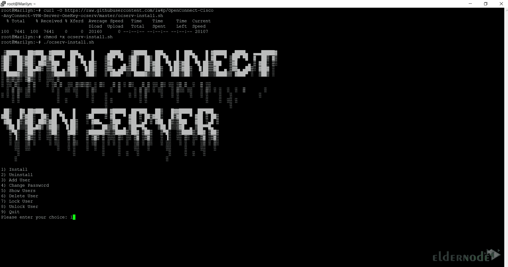
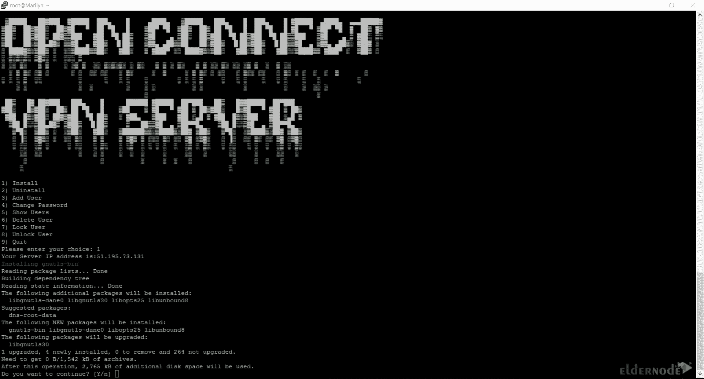
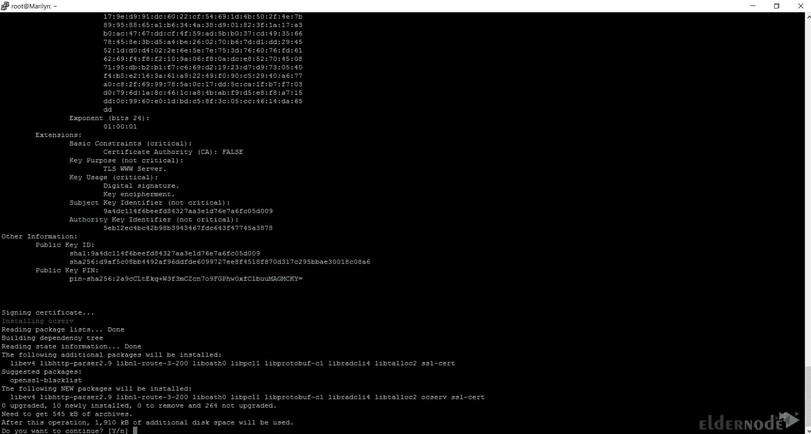
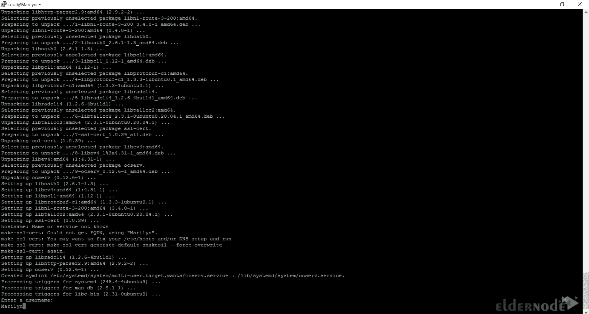
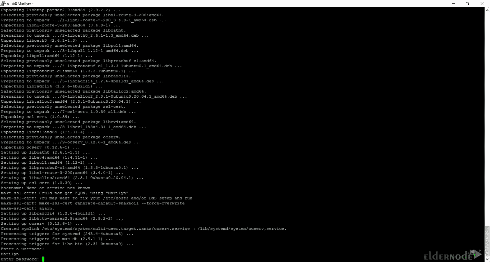
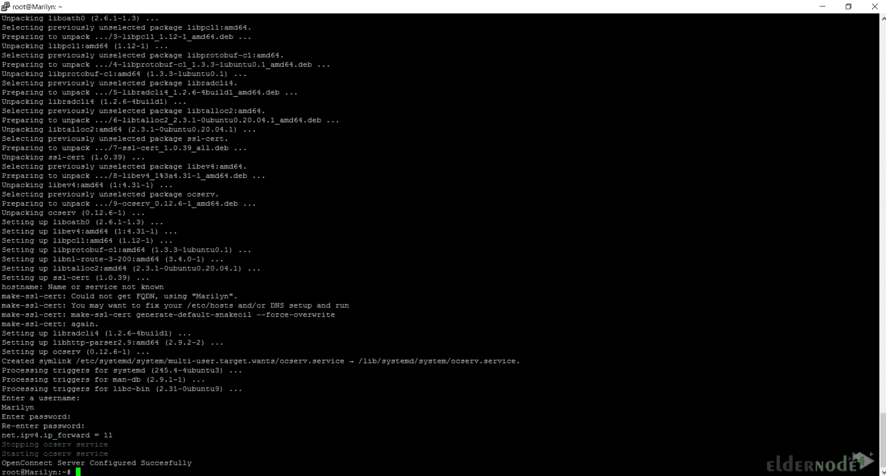

# 教程在 Ubuntu 20.04 上安装 open connect-[Top Way]

> 原文：<https://blog.eldernode.com/install-openconnect-on-ubuntu-20-04/>


VPN 客户端是基于软件的工具，用于在客户端和 VPN 服务器之间建立安全连接。它们为工具提供了用户和设备之间的交互接口，因此设备可以与安全 VPN 服务器进行通信。OpenConnect 是一个 VPN 客户端，这篇文章将教你如何在 Ubuntu 20.04 上安装 OpenConnect。如果你想购买一台 [**Ubuntu VPS**](https://eldernode.com/ubuntu-vps/) 服务器，你可以查看 [Eldernode](https://eldernode.com/) 网站上提供的套装。

## **什么是 OpenConnect？**

OpenConnect VPN server 是一款开源、跨平台、多协议的 SSL VPN 客户端。它支持 Cisco AnyConnect、Array Networks AG SSL VPN、Juniper SSL VPN、Pulse Connect Secure、Palo Alto Networks global protect SSL VPN、F5 Big-IP SSL [VPN](https://blog.eldernode.com/vps-vs-vpn/) 和 Fortinet Fortigate SSL VPN 协议。它是为需要具有企业用户管理和控制的远程访问 VPN 的组织而设计的。

在这篇来自 [Ubuntu 培训](https://blog.eldernode.com/tag/ubuntu/)系列的文章的续篇中，我们将教你如何在 Ubuntu 20.04 上安装 OpenConnect。

## **如何在 Ubuntu 20.04 上安装 open connect**

在这一步，我们将解释 OpenConnect 在 Ubuntu 20.04 上的安装过程。

首先，以 root 用户身份登录，并在提示时提供您的密码。

现在使用下面的命令更新您的系统软件包:

```
sudo apt update
```

然后升级您的系统软件包:

```
sudo apt upgrade
```

现在是时候在你的 Ubuntu 20.04 上下载 OpenConnect 了。要做到这一点并将脚本保存在您的服务器上，只需运行以下命令:

```
curl -O https://raw.githubusercontent.com/iw4p/OpenConnect-Cisco-AnyConnect-VPN-Server-OneKey-ocserv/master/ocserv-install.sh
```

要使脚本可执行，请使用以下命令:

```
chmod +x ocserv-install.sh
```

您可以通过输入以下命令在 Ubuntu 20.04 上安装 OpenConnect:

```
./ocserv-install.sh
```

您将看到以下屏幕。选择第一个选项，按**键进入**:



键入 **Y** 并按**回车**:



然后它会再次询问你是否要继续，输入 **Y** 并点击**回车**:



输入您想要的**用户名**并按**进入**:



提供密码并按**进入**:



最后，您应该看到以下屏幕，确认 OpenConnect 服务器已成功配置:



## **在 Ubuntu 20.04 上使用 OpenConnect 连接 SSL VPN 服务器**

在本节中，您将学习如何在 Ubuntu 20.04 上使用 OpenConnect 连接到 SSL VPN 服务器。

### **用 OpenConnect 手动连接 SSL VPN 服务器**

您可以使用以下命令连接到 SSL VPN:

```
sudo openconnect -u user --passwd-on-stdin vpnserver
```

并在提示时输入您的密码。

### **使用 Bash 脚本** 通过 OpenConnect 连接 SSL VPN 服务器

下面的 bash 脚本简化了连接，以方便连接到 [Cisco](https://blog.eldernode.com/troubleshoot-cisco-vpn-in-windows-10/) Autoconnect SSL VPN 服务器。可以放到~/。zshrc 或者~/。bashrc 取决于您的 shell:

```
myvpn () {      local vpn_server="vpnserver"      local vpn_username="user"      local vpn_password="password"      # try connect      while true; do          retry_time=$(($(date +%s) + 30))          sudo openconnect \              -u $vpn_username $vpn_server --non-inter --passwd-on-stdin <<< "$vpn_password"          current_time=`date +%s`          if [ $current_time -lt retry_time ]; then              sleep $(( $retry_time - $current_time ))          fi      done  }
```

记得提供正确的变量并保存文件。如果您想要连接到 VPN，您可以通过名称调用该函数:

```
myvpn
```

你应该知道 Pulse Connect Secure 的 SHA-1，要连接它:

```
openconnect --servercert=sha1:<HASH> \  --authgroup="single-Factor Pulse Clients" \  --protocol=nc <VPN_SERVER_ADDRESS>/dana-na/auth/url_6/welcome.cgi \  --pid-file="/var/run/work-vpn.pid" --user=<USERNAME>
```

就是这样！您已经在 Ubuntu 20.04 上成功安装了 OpenConnect。

## 结论

在本文中，我们教你如何在 Ubuntu 20.04 上安装 OpenConnect。我希望这篇文章对你有用，并帮助你在 Ubuntu 20.04 服务器上安装 Openconnect。如果您有任何问题或建议，可以在评论区联系我们。