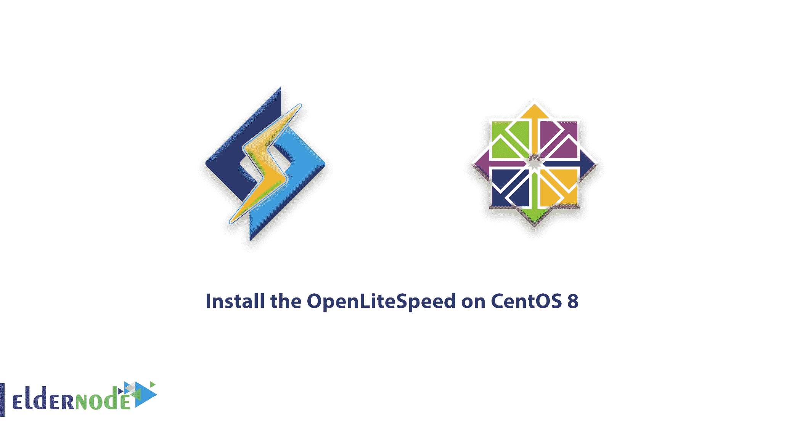
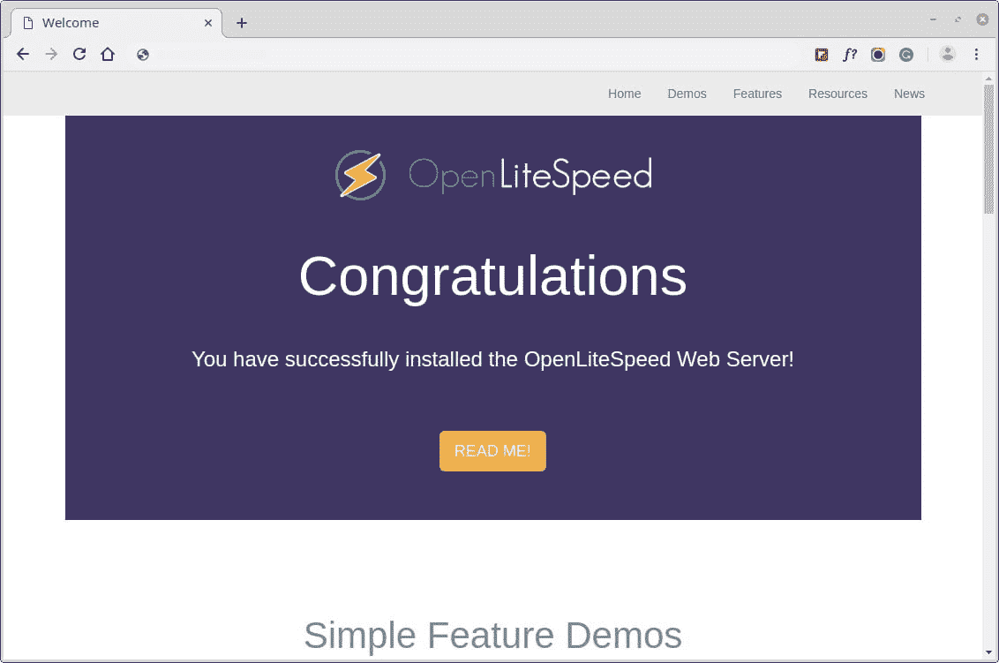
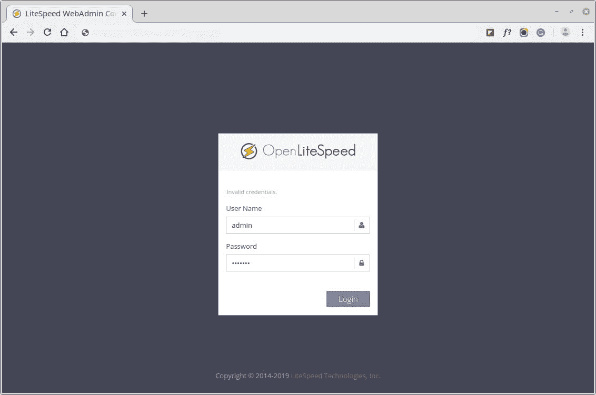
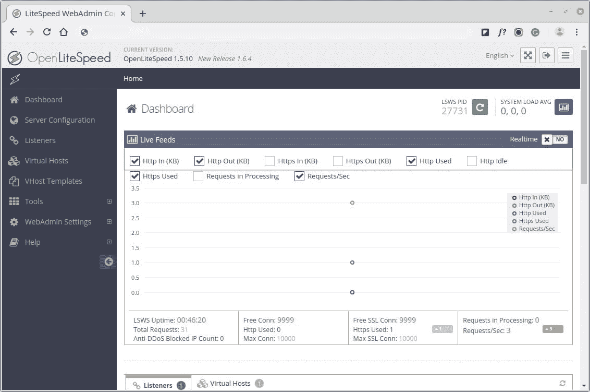

# 如何在 CentOS 8 - Eldernode 上安装 OpenLiteSpeed

> 原文：<https://blog.eldernode.com/install-openlitespeed-centos-8/>



OpenLiteSpeed 是一个开源、高性能、轻量级的 HTTP web 服务器。使用 web 管理界面来管理和服务网站是一个不错的选择。此外，您可以找到一些令人印象深刻的特性，这些特性使它成为许多安装的首选，因为它附带了 Apache 兼容的重写规则和针对服务器的优化 PHP 处理，可以处理数千个并发连接，而 CPU 和内存消耗很低。为了让你的研究更有用，联系 Eldernode 团队作为 [VPS](https://eldernode.com/centos-vps/) 提供商来拥有你自己的 Linux 虚拟服务器。

## 如何在 CentOS 8 上安装 OpenLiteSpeed

让我们从这个教程开始，看看在 CentOS 8 服务器上安装和配置 OpenLiteSpeed 的过程，使用 PHP 处理器和 [MariaDB](https://eldernode.com/whats-mariadb-how-it-works/) 数据库管理系统。

### 步骤 1:如何添加 OpenLiteSpeed 库

首先，通过运行将官方存储库信息添加到我们的系统中，以安装最新版本的 OpenLiteSpeed。

```
# rpm -Uvh http://rpms.litespeedtech.com/centos/litespeed-repo-1.1-1.el8.noarch.rpm 
```

**点**:上面的 rpm 命令将更新我们在系统上搜索和安装软件包时引用的 yum 库列表。

### 第二步:如何安装 OpenLiteSpeed Web 服务器

一旦在系统上启用了 OpenLiteSpeed 存储库，就可以通过运行以下命令来安装最新版本的 OpenLiteSpeed web 服务器。

```
# yum install openlitespeed 
```

**注意**:默认的 OpenLiteSpeed 安装目录是/usr/local/lsws。

### 第三步:如何安装和保护 MariaDB 数据库系统

是时候通过运行以下命令来安装 **MariaDB** 数据库管理系统了。

```
# yum install mariadb-server 
```

现在，启动并启用 MariaDB 数据库系统，以便它在我们的服务器启动时自动启动。

```
systemctl start mariadb  systemctl enable mariadb
```

之后，您可以运行一个简单的安全脚本来保护 MariaDB 的安装。通过设置新的管理密码和锁定一些不安全的默认设置。

```
# mysql_secure_installation 
```

要安装最新版本的 PHP 7.x，您需要启用 [EPEL 库](https://eldernode.com/how-fix-epel-repository-error-centos-7/)，它将从 OpenLiteSpeed 库中安装 PHP 7.3，其中包含所有常用的 PHP 包，足以运行最常用的 web 应用程序。

```
# yum install epel-release  # yum install lsphp73 lsphp73-common lsphp73-mysqlnd lsphp73-gd lsphp73-process lsphp73-mbstring lsphp73-xml lsphp73-mcrypt lsphp73-pdo lsphp73-imap lsphp73-soap lsphp73-bcmath  # ln -sf /usr/local/lsws/lsphp73/bin/lsphp /usr/local/lsws/fcgi-bin/lsphp5
```

### 步骤 4:如何更改 OpenLiteSpeed 默认管理员密码

默认密码设置为“123456”。您需要通过运行以下脚本来更改 OpenLiteSpeed 的默认密码。

```
# /usr/local/lsws/admin/misc/admpass.sh
```

或者，您可以为管理帐户设置一个不同的用户名，或者只需按 ENTER 键来保留默认值“admin”。然后，为管理用户设置一个[强密码](https://eldernode.com/how-to-create-strong-password/)，用于从 web 界面管理 OpenLiteSpeed。

### 第五步:如何测试 OpenLiteSpeed 网页和管理界面

OpenLiteSpeed 已经启动并运行。但是如果您想要启动、停止、重启或验证服务器的状态，请使用标准的 service 命令。

```
# service lsws status 
```

如果您在系统上运行防火墙，请确保打开系统上的端口 8088 和 7080。

```
# firewall-cmd --zone=public --permanent --add-port=8088/tcp  # firewall-cmd --zone=public --permanent --add-port=7080/tcp  # firewall-cmd --reload
```

现在打开你的网络浏览器，导航到默认的 OpenLiteSpeed 的网页，在你的服务器的域名或 IP 地址，然后是 **8088** 端口。

```
http://server_domain_or_IP:8088 
```



一旦你对默认的 OpenLiteSpeed 网页感到满意，你现在就可以在 7080 端口使用 HTTPS 访问你的管理界面。

```
https://server_domain_or_IP:7080
```



一旦你通过认证，你将被授予 OpenLiteSpeed 管理界面。



## 结论

在本文中，您学习了如何安装 OpenLiteSpeed。使用 PHP 的优化版本和 CentOS 8 服务器上的 MariaDB。OpenLiteSpeed 提供了高性能、易于使用的管理界面和预配置的选项，用于无任何错误地运行脚本。建议您查看 CentOS 8 上[安装灯组的相关文章。](https://blog.eldernode.com/install-lamp-stack-on-centos-8/)