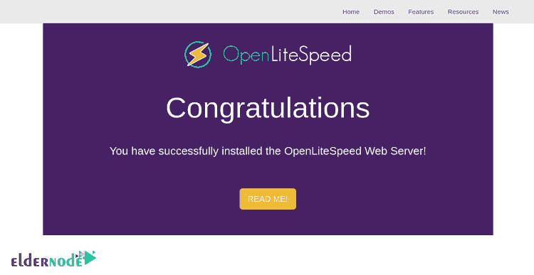

# 教程在 Debian 10 上安装 OpenLiteSpeed(buster)-elder node 博客

> 原文：<https://blog.eldernode.com/install-openlitespeed-on-debian-10/>


之前，您已经了解了 CentOS 8 上的 [OpenliteSpeed 安装。OpenLiteSpeed 是一个开源、免费、轻量级、高性能的 HTTP web 服务器。它由 LiteSpeed 技术公司开发。它的一个出色的特性是与 Apache 兼容的重写规则和优化的服务器 PHP 处理，可以在低 CPU 和内存消耗的情况下处理数千个并发连接。加入我们的教程**在 Debian 10** (buster)上安装和配置 OpenLiteSpeed。如果你正在寻找一个完美但便宜的](https://blog.eldernode.com/install-openlitespeed-centos-8/) [Linux VPS](https://eldernode.com/linux-vps/) ，Eldernode 提供了各种 [VPS](https://eldernode.com/vps/) 包，可能会令人满意。**不要错过** 2021 年新优惠！

为了让本教程更好地发挥作用，请考虑以下**先决条件**:

拥有 sudo 权限的非 root 用户。

要进行设置，请按照 Debian 10 的[初始设置进行。](https://blog.eldernode.com/initial-setup-with-debian-10/)

## **在 Debian 10**T3 上安装配置 OpenLiteSpeed

OpenLiteSpeed 支持很多操作系统，比如 Ubuntu、Debian、Mac OS、FreeBSD 等等。使用 OpenLiteSpeed 为您提供基于 web 的界面，因此您将能够从 web 浏览器管理 web 服务器。它还可以帮助您轻松创建和管理网站。

让我们**开始**更新您的软件包。使用下面的命令来完成此操作:

```
apt-get update -y  apt-get upgrade -y
```

更新软件包时，记得重启系统。它会导致应用配置更改。然后，要安装所需的依赖项，请键入:

```
apt-get install install build-essential libexpat1-dev libgeoip-dev libpcre3-dev libudns-dev zlib1g-dev libssl-dev libxml2 libxml2-dev rcs libpng-dev libpng-dev openssl autoconf g++ make openssl libssl-dev libcurl4-openssl-dev libcurl4-openssl-dev pkg-config libsasl2-dev libzip-dev
```

### **如何在 Debian 10 上安装 OpenLiteSpeed**

Debian 10 默认储存库默认不包含 OpenliteSpeed。所以，你应该从源码安装 OpenLiteSpeed。在此之前，要下载最新版本的 OpenLiteSpeed，请运行:

```
wget https://openlitespeed.org/packages/openlitespeed-1.5.2.tgz
```

下载完成后，通过运行以下命令提取下载的文件:

```
tar -xvzf openlitespeed-1.5.2.tgz
```

然后，您必须将目录更改为 openlitespeed-1.5.2 并安装 openlitespeed。所以键入:

```
cd openlitespeed-1.5.2  sh install.sh
```

现在应该已经安装了 OpenLiteSpeed，所以您需要为 web 界面配置管理密码。使用以下命令来完成此操作:

```
/usr/local/lsws/admin/misc/admpass.sh
```

然后，您应该创建管理员用户和密码，如下所示:

```
Please specify the administrator's password.  This is the password required to login the administration Web interface.
```

```
Password:   Retype password:   Administrator's username/password is updated successfully!
```

然后，要启动 OpenLiteSpeed web 服务，请键入:

```
/etc/init.d/lsws start
```

这样，OpenLiteSpeed 现在运行在端口 8088 上。如果您在 web 浏览器中键入 URL HTTP://your-server-ip:98088，您将被重定向到以下页面:



### 如何为 OpenLiteSpeed 安装 MariaDB】

由于 [MariaDB](https://blog.eldernode.com/mariadb-installation-on-debian-10/) 在 Debian 10 默认存储库中可用，所以使用下面的命令来安装它。

```
apt-get install mariadb-server mariadb-client -y
```

然后，尝试启动 MariaDB，并使其在安装完成后重新启动系统后启动。所以，运行:

```
systemctl start mariadb  systemctl enable mariadb
```

是时候保护你的玛丽雅迪了。为此，请运行以下脚本:

```
mysql_secure_installation
```

使用这个脚本，将设置 root 密码，匿名用户将被删除。此外，它不允许 root 用户远程登录，并删除测试数据库。

```
mysql_secure_installation
```

如下图所示，试着回答所有问题。

```
Enter current password for root (enter for none):  Set root password? [Y/n]: N  Remove anonymous users? [Y/n]: Y  Disallow root login remotely? [Y/n]: Y  Remove test database and access to it? [Y/n]: Y  Reload privilege tables now? [Y/n]: Y
```

当 MariaDB shell 受到保护时，您可以安全地登录到它。所以，运行:

```
mysql -u root
```

然后，使用下面的命令禁用插件验证。

```
MariaDB [(none)]>use mysql;  MariaDB [(none)]>update user set plugin='' where User='root';
```

接下来，运行下面的命令来刷新特权并退出 MariaDB shell。

```
MariaDB [(none)]>flush privileges;  MariaDB [(none)]>exit;
```

### 如何为 OpenLiteSpeed 安装 PHP

默认情况下，OpenLiteSpeed 存储库中没有 PHP。因此，运行以下命令从 OpenLiteSpeed web 接口编译 PHP。打开您的 web 浏览器并键入 URL HTTP://your-server-ip:7080，以访问 OpenLitePanel，如下所示:


提供您最近创建的管理员用户名和密码，然后单击登录按钮。然后，您将看到如下所示的 OpenLiteSpeed 仪表板:


接下来，要看到下面的页面，点击工具>编译 PHP。


此时，您可以选择想要安装的 PHP 版本，然后单击 Next 按钮。因此，将显示以下页面:


现在，要开始下载 PHP，选择构建选项，然后单击 Next 按钮。如果一切顺利，下面的页面将会出现。


点击“下一步”按钮，您将看到以下页面:


现在，您可以从终端登录到您的服务器，并运行预先生成的脚本，如下所示:

```
/usr/local/lsws/phpbuild/buildphp_manual_run.sh
```

上面的脚本会将 PHP 和相关模块下载并编译到您的系统中。使用下面的命令检查安装过程。

```
tail -f /usr/local/lsws/phpbuild/buildphp_1563016683.8.log
```

安装完成后，您会看到下面的输出:
将编译好的 php 二进制文件复制到 litespeed 目录

```
cd /usr/local/lsws//fcgi-bin
```

```
ln -sf lsphp-7.3.6 lsphp7
```

```
==============================================  Finished building PHP 7.3.6 with LSAPI  ==============================================  Sat 13 Jul 2019 08:07:36 AM EDT
```

```
**DONE**
```

就是这样！一旦您看到“Done ”,这意味着一切正常，您已经成功地通过了所需的步骤。

## 结论

在本文中，我们介绍了在 Debian 10 上安装和配置 OpenLiteSpeed 的教程。从现在起，您可以轻松地使用 OpenLiteSpeed 托管您的网站。OpenLiteSpeed 是一个强大的模块化 HTTP 服务器，能够处理成千上万的并发连接。