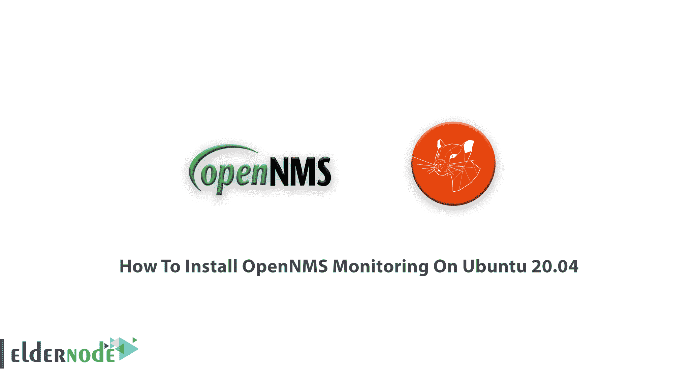
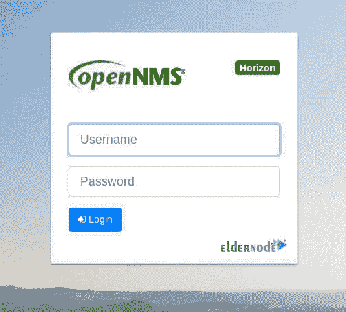
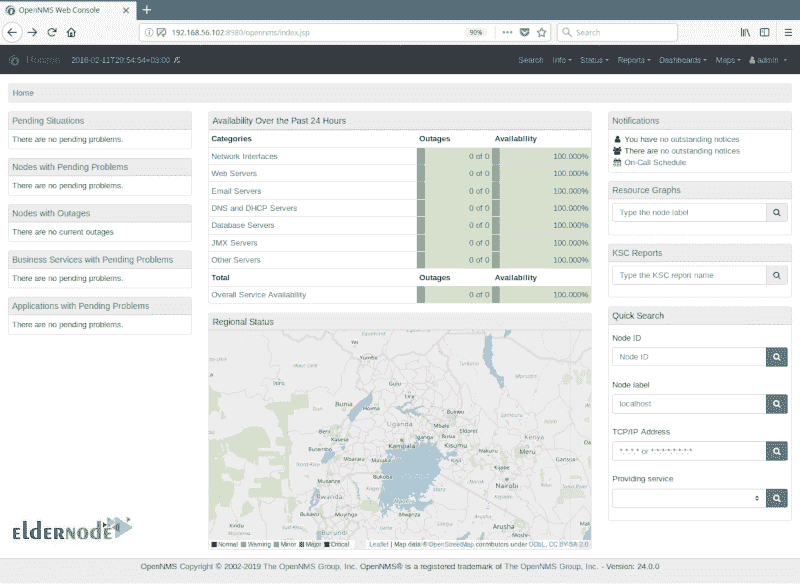

# 如何在 Ubuntu 20.04 - Eldernode 博客上安装 OpenNMS 监控

> 原文：<https://blog.eldernode.com/install-opennms-monitoring-on-ubuntu-20-04/>



之前给大家介绍过 [OpenNMS](https://blog.eldernode.com/opennms-monitoring-for-linux/) (开放 **N** 网络 **M** 管理 **S** 系统)。作为管理员或用户，您需要检测设备和网络节点。由于所有 Java 编写的软件都适用于大多数 [Linux](https://blog.eldernode.com/tag/linux/) 发行版，在本文中，您将学习如何**在 Ubuntu 20.04** 上安装 OpenNMS Monitoring。要开始安全和经济的网络监控，请购买您自己的 [Ubuntu VPS](https://eldernode.com/ubuntu-vps/) 并享受我们完美的软件包和支持。

## **教程在 Ubuntu 20.04 上安装 OpenNMS 监控**

为了让本教程更好地发挥作用，请考虑以下**先决条件**:

**1-** 拥有 sudo 权限的非 root 用户。

**2-** 要进行设置，请遵循我们在 Ubuntu 20.04 上的[初始服务器设置。](https://blog.eldernode.com/initial-server-setup-on-ubuntu-20/)

**3-** 已安装 OpenJDK 11 开发套件

**4-** 2 个 CPU，2 GB 内存，20 GB 磁盘

**5-** [PostgreSQL](https://blog.eldernode.com/tutorial-postgresql-installation-ubuntu-20/) 数据库

## 在 Ubuntu 20.04 上安装 OpenNMS 监控

与我们一起阅读本指南，了解 OpenNMS 网络监控平台的安装。您可以在 Ubuntu 16.04 LTS 或更高版本上安装 OpenNMS。让我们通过本指南的 7 个步骤来学习并完成它。

### 第一步:如何更新 Ubuntu 服务器

一如既往，我们开始安装的第一个建议是考虑安全性并更新您的系统。应该运行以下命令:

```
apt-get update -y
```

```
apt-get upgrade -y
```

一旦所有包的更新完成，使用下面的命令安装其他依赖项。

```
apt-get install apt-transport-https ca-certificates curl gnupg-agent software-properties-common -y
```

### 第二步:如何在 Ubuntu 20.04 中安装 Java–open JDK 11

作为安装的先决条件，您可以通过键入以下命令来安装 OpenJDK 11:

```
sudo apt-get install openjdk-11-jdk
```

现在，您可以验证您安装的 **Java** 的版本。

```
java -version
```

在 **/etc/profile** 文件中添加以下行，以便为所有用户设置 Java 环境变量。

```
export JAVA_HOME=/usr/lib/jvm/java-1.11.0-openjdk-amd64
```

然后，您可以保存文件，并读取 **/etc/profile** 文件，运行:

```
source /etc/profile
```

### 第三步:如何在 Ubuntu 服务器上安装 Docker

在这一步中，您将安装 Docker 和 Docker Compose，由于 Ubuntu 20.04 的默认库中没有 Docker 的最新版本，所以您需要安装它。使用下面的命令让它从 Docker 的官方仓库安装。

```
curl -fsSL https://download.docker.com/linux/ubuntu/gpg | apt-key add -
```

现在添加了 GPT 键。现在，通过键入以下命令，尝试将 Docker 存储库添加到您的系统中:

```
add-apt-repository "deb [arch=amd64] https://download.docker.com/linux/ubuntu $(lsb_release -cs) stable"
```

添加存储库后，您可以安装 Docker 和 Docker compose:

```
apt-get install docker-ce docker-ce-cli containerd.io docker-compose -y
```

当您确保安装了以上所有软件后，您可以通过运行以下命令来验证 Docker 的状态:

```
systemctl status docker
```

此外，您还可以查看已安装的 Docker 和 Docker compose 版本:

```
docker -v
```

```
docker-compose -v
```

### 第四步:如何下载和安装 OpenNMS

使用以下命令安装 OpenNMS 软件包。该命令将安装所有依赖项，例如( **opennms-core** 和 **opennms-webapp-jetty** )以及所有内置依赖项( **jicmp6** 和 **jicmp** 、 **postgresql** 和 **postgresql-libs** )。

```
mkdir opennms
```

然后，要安装 opennms，您需要创建一个新的 docker-compose.yml fil，并将目录更改为 OpenNMS。

```
cd opennms
```

```
nano docker-compose.yml
```

如果您希望停止允许 OpenNMS Horizon apt 存储库在运行时升级，您应该通过键入以下命令来禁用它:

```
sudo apt-mark hold libopennms-java libopennmsdeps-java opennms-common opennms-db
```

现在，您可以保存并关闭该文件，并运行以下命令为 OpenNMS 准备一个容器:

```
docker-compose up -d
```

当您确保下载 OpenNMs 容器时，请使用以下命令来验证正在运行的容器:

```
docker ps -a
```

### 第五步:如何初始化和设置 PostgreSQL

因为你是在一个 Ubuntu 服务器上设置的，你需要知道一旦安装完成，安装程序就会初始化 **Postgres** 数据库，并使它在系统启动时自动启动。因此，您可以轻松地检查服务的运行状态:

要检查服务是否已启动并正在运行，请运行以下命令:

```
sudo systemctl status postgresql
```

现在，您已经准备好通过切换到 **postgres** 用户帐户来创建一个带有[密码](https://blog.eldernode.com/how-to-create-strong-password/)的 opennms 数据库用户:

```
sudo su - postgres
```

```
createuser -P opennms
```

```
createdb -O opennms opennms
```

正如我们提到的，您需要考虑一个密码，使用下面的命令和

通过设置合适的密码来保护 **postgres** 默认/超级用户帐户:

```
psql -c "ALTER USER postgres WITH PASSWORD 'YOUR-POSTGRES-PASSWORD';"
```

运行以下命令，在 **OpenNMS Horizon** 配置文件中设置数据库访问:

```
sudo vim /usr/share/opennms/etc/opennms-datasources.xml
```

### 步骤 6:如何初始化和启动 OpenNMS Horizon

初始化 OpenNMS 需要与 Java 集成，因此要检测 Java 环境并保存在**/usr/share/OpenNMS/etc/Java . conf**配置文件中，您需要运行下面的命令:

```
sudo /usr/share/opennms/bin/runjava -s
```

一旦初始化了 OpenNMS，就需要对数据库重复这一步，并检测保存在**/opt/OpenNMS/etc/libraries . properties/opt/OpenNMS/etc/libraries . properties**中的系统库。为此，请作为 OpenNMS 安装程序运行以下命令:

```
sudo /usr/share/opennms/bin/install -dis 
```

您可以使用 systemd 来启动 OpenNMS 服务，并让它使用自动启动模式，您需要在系统启动时启用它，并通过运行以下命令来检查其状态:

```
sudo systemctl start opennms
```

```
sudo systemctl enable opennms
```

```
sudo systemctl status opennms
```

最后，对于这一步，如果您的系统上运行了 [UFW 防火墙](https://blog.eldernode.com/setup-firewall-ufw-ubuntu-20/)，请打开防火墙中的端口 8980:

```
sudo ufw allow 8980/tcp
```

```
sudo ufw reload
```

### 步骤 7:如何访问 OpenNMS Web 控制台并登录

在最后一步，您会看到访问 OpenNMS web 控制台是多么容易。你只需要打开一个网页浏览器，指向以下网址。

```
http://SERVER_IP:8980/opennms 
```

运筹学

```
http://FDQN-OF-YOUR-SERVER:8980/opennms
```

登录界面显示后，使用默认登录凭据并输入用户名和密码。将他们两人都视为管理员



第一次成功登录后，您就可以访问管理控制面板了。



正如您所猜测的，在使用 OpenNMS 的后续步骤中，您将需要更改默认的管理员密码。

## 结论

在这篇文章中。你已经学会了如何在 Ubuntu 20.04 上安装 OpenNMS Monitoring。使用此软件，您可以提供一个不需要操作员来管理和配置网络设备的环境。