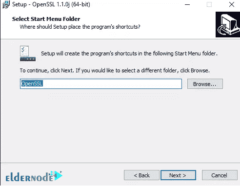

# 教程在 Windows Server 2019 上安装 OpenSSL-elder node

> 原文：<https://blog.eldernode.com/install-openssl-on-windows-server-2019/>


OpenSSL 是一个全面的加密库，它使用 TLS 协议，这是一个开源应用程序。OpenSSL 于 1998 年首次发布，可用于 Linux、Windows、macOS 和 BSD 系统。这允许用户执行各种任务，包括创建 CSR、生成私钥以及使用 SSL 安装 SSL 认证。大多数 Linux 发行版都是用 OpenSSL 复合草案完成的，但是如果您使用的是 Windows，请遵循下面的教程。在本文中，我们将向您介绍**教程在 Windows Server 2019 上安装 OpenSSL**。你可以从 [Eldernode](https://eldernode.com/) 中选择你最完美的 [**Windows VPS**](https://eldernode.com/windows-vps/) 服务器包。

## **如何在 Windows Server 2019 上安装 OpenSSL**

### **OpenSSL 简介**

OpenSSL 是 SSL 领域中使用最广泛的工具之一。SSL 证书现在需求量很大。自从 HTTPS 无处不在的推出以来，加密领域发生了巨大的变化。首先，他们引入 SEO 作为安装数字证书的激励，后来，他们强制所有网站安装 Chrome HTTPS。如果您不使用 SSL 证书，Chrome 和 Firefox 等流行浏览器不会将您的网站视为“安全”网站。

在本文的续篇中，加入我们，一步步教你如何在 [Windows Server](https://blog.eldernode.com/tag/windows/) 2019 上安装 OpenSSL。

## **在 Windows Server 2019 上安装 OpenSSL**

在这一节，我们想教你如何在 Windows Server 2019 上安装 OpenSSL。首先，您需要通过输入您的用户名和密码进入您的 Windows 服务器。然后你需要打开一个你想要的浏览器。

现在，你应该下载了 OpenSSL 的[最新版本。根据 CPU 架构，您可以下载 64 位、轻量级或完整版。](https://www.openssl.org/source/)

您可以使用下面的命令行下载 OpenSSL:

```
 curl.exe -L -o Win64OpenSSL.exe https://slproweb.com/download/Win64OpenSSL-1_1_0j.exe 
```


文件下载完成后，**双击**并运行。

您可以通过在 PowerShell 中输入以下命令来运行 OpenSSL:

```
.\Win64OpenSSL.exe 
```

查看下图后，点击**我接受协议**。然后点击**下一个**:


在下一步中，指定 OpenSSL 安装路径。然后点击**下一个**:


*



选择应用程序快捷方式的目录:


接下来，点击**安装**开始 OpenSSL 安装:


等待安装完成，最后点击**完成**。

最后，将 ***C:\OpenSSL-Win64*** 添加到 **Windows 环境**路径中。

```
$userenv = [System.Environment]::GetEnvironmentVariable("Path", "User") 
```

```
[System.Environment]::SetEnvironmentVariable("PATH", $userenv + "C:\OpenSSL-Win64\bin", "User") 
```

***注意:*** 如果你的系统是 **32 位**，在上面的代码中你应该键入 win32 而不是 win64。


**通过输入以下命令开始**执行 OpenSSL:

```
set OPENSSL_CONF=C:\OpenSSL-Win64\bin\openssl.cfg 
```

您可以通过输入下面的命令行来检查安装 OpenSSL 的准确性:

```
openssl.exe req -new -nodes -keyout server.key -out server.csr -newkey rsa:2048 
```

## 结论

在本文中，我们试图在介绍 OpenSSL 之后，教大家如何在 Windows Server 2019 上安装 OpenSSL。我们希望你会喜欢这个教程，你可以在评论区提出关于这个培训的问题，或者要解决其他问题，请参考[社区](https://community.eldernode.com/)区，并尽快提出你的问题。