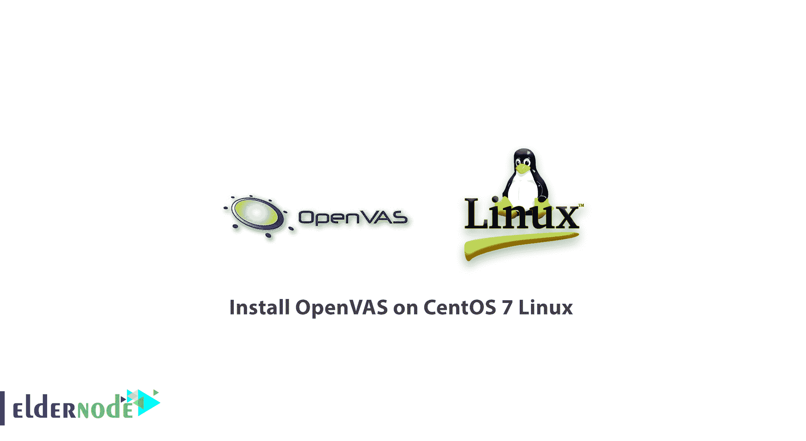
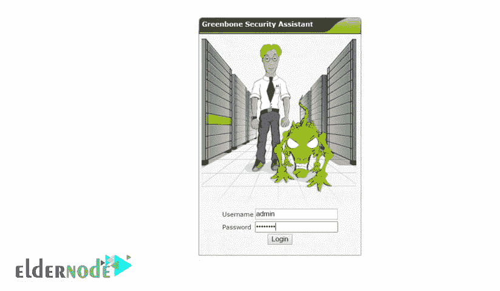
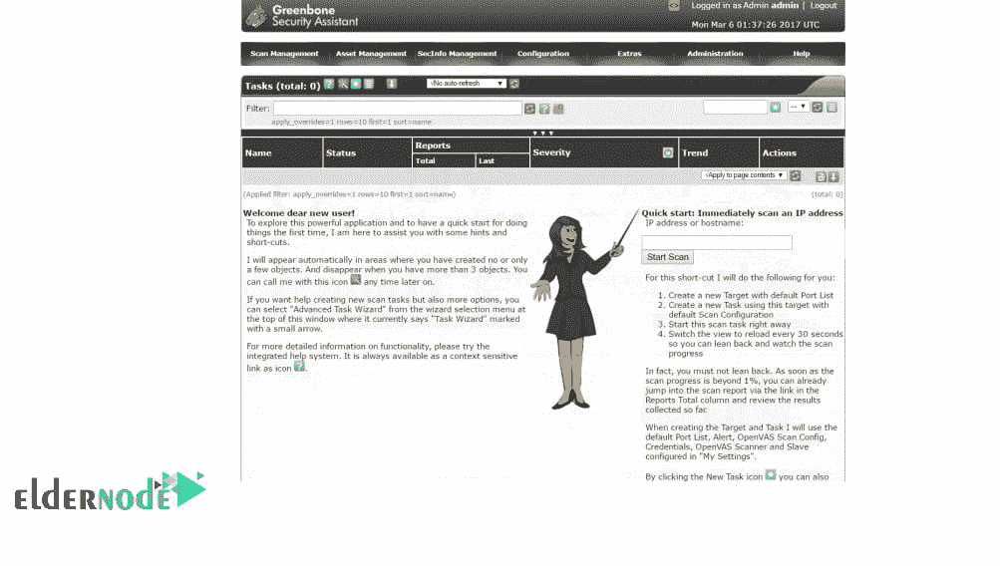

# 在 CentOS 7 Linux 上安装 open vas-open vas 软件管理

> 原文：<https://blog.eldernode.com/install-openvas-centos-7/>



我们带着另一篇 [CentOS 7 Linux](https://eldernode.com/linux-vps/) 文章**回来了。**今天你将学习如何在 CentOS 7 Linux 上安装 **OpenVAS** 。它是免费软件，基本上使用 **Nessus** 软件引擎来检查和测试安全漏洞。

自 2005 年 Nessus software 从开源模式转为闭源版本(带激活许可)以来， [GreenBone](https://www.greenbone.net/) 继续其开源项目，并初步开发了一款名为 GNessUs 的易受攻击的扫描仪软件，后来更名为 OpenVAS。OpenVAS 代表开放漏洞评估系统，现在可以免费扫描您的整个网络并识别安全漏洞。安装 OpenVAS 的步骤非常简单，您所要做的就是运行一些 Linux 命令。

**你可能感兴趣:**

[如何在 Ubuntu 20.04 上安装和配置 node . js](https://eldernode.com/install-and-config-node-js-on-ubuntu-20-04/)

[如何在 CentOS 7 Linux 上安装 VNC](https://eldernode.com/install-vnc-centos-7/)

和

[如何在 Windows 上安装 node . js](https://eldernode.com/install-node-js-on-windows/)

## 在 CentOS 7 Linux 上安装 open vas

**1-** 首先，连接你的 CentOS 7 终端环境。

**2-** 输入以下命令下载 OpenVAS 存储库。

```
wget -q -O - http://www.atomicorp.com/installers/atomic |sh
```

下载许可证后，将向您显示协议。

**3-** 输入以下命令启动 **OpenVAS。**

```
yum -y install openvas
```

**4-** 安装软件后，输入以下命令设置并启动 OpenVAS。

```
openvas-setup
```

**请注意**:在安装过程中，您需要输入您的用户名和密码来连接到 OpenVAS 界面。完成安装步骤后，将显示类似下面的短语。

```
Setup complete, you can now access GSAD at:  https://<IP>:939
```

**5-** 完全停止您的防火墙，以免在安装过程中遇到任何问题。

5.1 如果您的 CentOS 7 Linux 使用 **Iptables** ，请输入以下命令。

```
systemctl stop iptables.service
```

5.2 如果您的 CentOS 7 Linux 操作系统使用 **Firewalld** ，请输入以下命令。

```
systemctl stop firewalld
```

**6-** 停止防火墙后，前往 **OpenVAS** 管理界面安装个人证书。

输入以下命令开始证书安装过程。

```
openvas-mkcert-client -n om -i
```

您**不需要**在此阶段输入任何信息。

**7-** 分配证书后，使用以下命令重建 OpenVAS 数据库。

```
openvasmd --rebuild
```

**8-** 完成恢复命令后，输入以下命令启动 OpenVAS 服务。

```
openvasmd
```

**9-** 完全启动后，在浏览器中输入服务器的 IP 地址和端口 9392。

##### 您正在学习如何在 CentOS 7 Linux 上安装 open vas

例如，想要的 IP 地址是 192.168.1.10，您应该在浏览器中按如下方式输入地址。

https://192 . 168 . 1 . 10:9392



**10-** 输入地址后，打开 OpenVAS 管理页面，输入安装时输入的用户名和密码即可连接到 **OpenVAS** 软件管理环境。

**11-** 进入后会看到如下页面。



亲爱的用户，我们希望这篇教程能对你有所帮助，如果你有任何问题或想查看我们的用户关于这篇文章的对话，请访问[提问页面](https://eldernode.com/ask)。也为了提高你的知识，这里有很多关于[老年节点训练](https://eldernode.com/blog/)的有用教程。