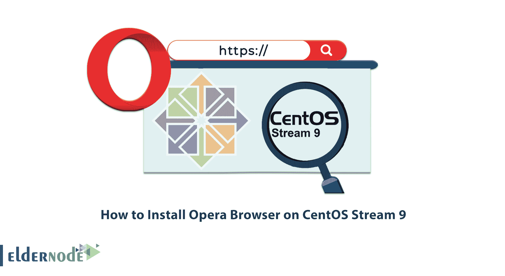
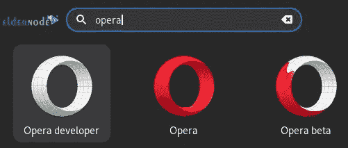

# 如何在 CentOS Stream 9 - Eldernode 博客上安装 Opera 浏览器

> 原文：<https://blog.eldernode.com/install-opera-browser-on-centos-stream-9/>



Opera browser 于 1995 年进入浏览器世界，并因其向用户提供的服务而获得了很多关注。这款浏览器在支持其用户方面非常强大，可以安装在 Mac、Linux、Windows 等所有操作系统上。在本文中，我们将介绍 Opera 浏览器，您将了解如何在 CentOS Stream 9 上安装 Opera 浏览器。您可以访问 [Eldernode](https://eldernode.com/) 网站查看提供的套餐并选择自己的 [**CentOS VPS**](https://eldernode.com/centos-vps/) 。

## **教程在 CentOS Stream 上安装 Opera 浏览器 9**

### **Opera 浏览器简介**

Opera 浏览器是我们这个时代最强大和最快的浏览器之一。这款内置广告拦截器、免费 VPN、集成信使、加密钱包等功能的浏览器，提供了 Chrome、Safari、Edge 等系统默认无法获得的完整网络体验。Opera 还为用户提供了最高级别的安全性、隐私性和在线灵活性。

在本文的其余部分，从 [CentOS 教程](https://blog.eldernode.com/tag/centos/)系列开始，我们将一步一步地教你如何在 CentOS Stream 9 上安装 Opera 浏览器。

## **在 CentOS Stream 上安装 Opera 浏览器 9**

开始安装之前，如果您收到消息“**此系统未向授权服务器注册。您可以使用 subscription-manager 来注册**，运行以下命令来删除 subscription manager:

```
sudo dnf erase subscription-manager -y
```

然后**使用以下命令升级所有系统包**:

```
sudo dnf upgrade --refresh -y
```

要使 Opera 浏览器默认包含在标准程序中，首先使用以下命令**创建并打开存储库文件**:

```
sudo nano /etc/yum.repos.d/opera.repo
```

现在，您应该将下面的说明复制并粘贴到配置文件中:

```
[opera]  name=Opera packages  type=rpm-md  baseurl=https://rpm.opera.com/rpm  gpgcheck=1  gpgkey=https://rpm.opera.com/rpmrepo.key  enabled=1
```

然后按“ **Ctrl+O** 保存文件，按“ **Ctrl+X** 退出。

使用以下命令**手动输入 GPG 键**:

```
sudo rpm --import https://rpm.opera.com/rpmrepo.key
```

要开始安装 Opera，首先运行下面的命令**来更新存储库列表**:

```
sudo dnf update --refresh
```

然后运行下面的命令来**安装软件**:

```
sudo dnf install opera-stable -y
```

要确认 Opera 浏览器的版本，请运行以下命令:

```
opera --version
```

**注意**:如果你愿意，你可以安装 Opera Beta 或者开发者版本，但是这些版本不会取代你的稳定版，会单独安装。不建议在主桌面或生产服务器上同时使用这两个版本。

### **如何在 CentOS Stream 9 上安装 Opera 浏览器 Beta 和 Developer**

按照以下命令安装并验证 **Opera 浏览器测试版**:

```
sudo dnf install opera-beta -y
```

```
opera-beta --version
```

要安装并验证 **Opera 浏览器开发者**，运行以下命令:

```
sudo dnf install opera-developer -y
```

```
opera-developer --version
```

### **如何在 CentOS 上启动 Opera 浏览器**

为了**启动 Opera 浏览器**，首先在您的终端中运行以下命令:

```
opera
```

然后使用以下命令释放终端:

```
opera &
```



您也可以使用桌面上的以下路径来查找软件:

**活动>展示申请>戏曲**

现在 Opera 浏览器已经为您安装好了，当您打开它时，您会看到登录页面。

为了**更新 Opera 浏览器**，运行以下命令:

```
sudo dnf upgrade --refresh
```

### **如何从 CentOS Stream 卸载 Opera 浏览器 9**

运行以下命令**删除 Opera 浏览器** **稳定**:

```
sudo dnf remove opera-stable -y
```

使用以下命令删除 Opera 浏览器测试版:

```
sudo dnf remove opera-beta -y
```

运行下面的命令**删除 Opera 浏览器开发者**:

```
sudo dnf remove opera-developer -y
```

要**卸载所有三个版本**，运行以下命令:

```
sudo dnf remove opera* -y
```

运行以下命令**删除存储库文件**:

```
sudo rm /etc/yum.repos.d/opera.repo
```

## 结论

Opera 浏览器是我们这个时代最强大、最快速的浏览器之一，为您提供最高级别的安全性、隐私性和在线灵活性。在本文中，我们介绍了 Opera 浏览器及其特性，并且您了解了如何在 CentOS Stream 9 上安装 Opera 浏览器。