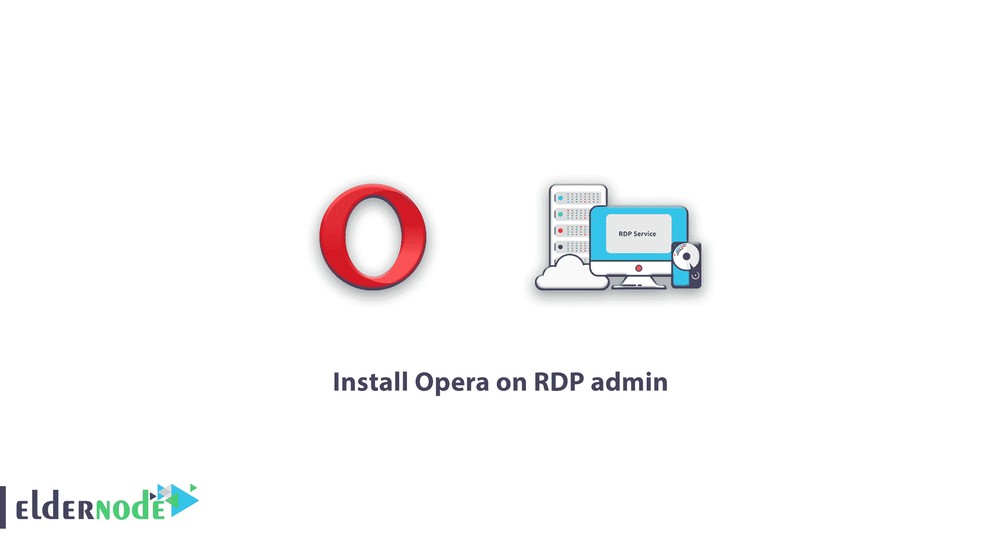
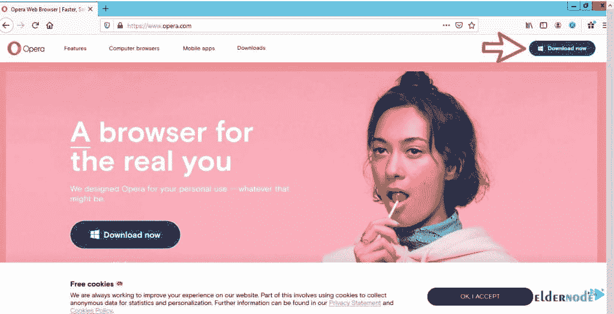
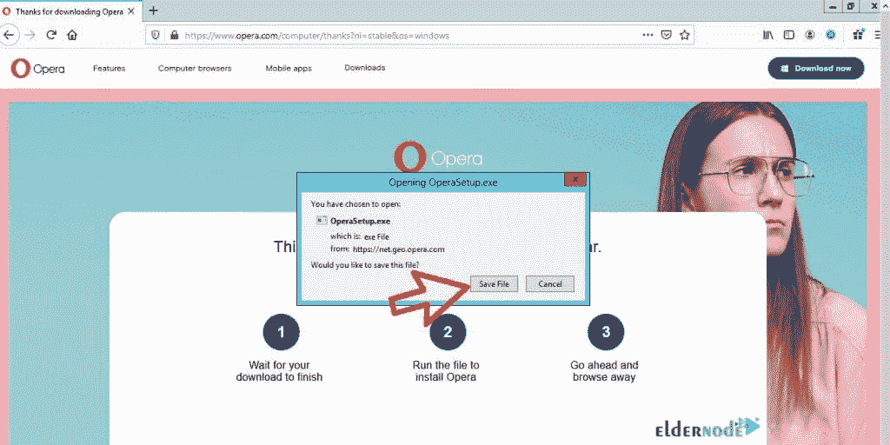
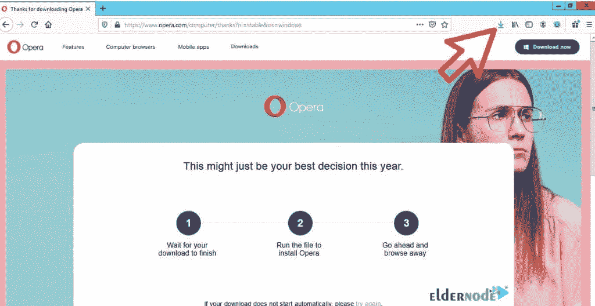
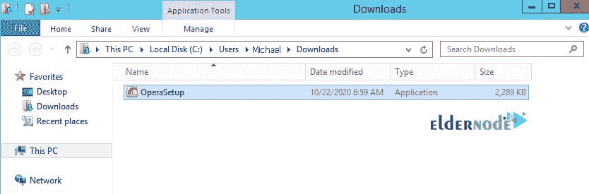
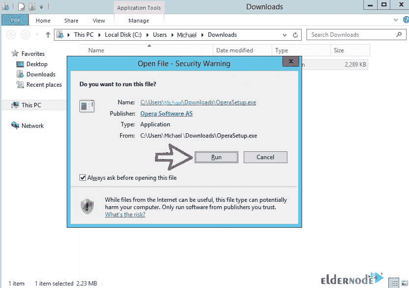
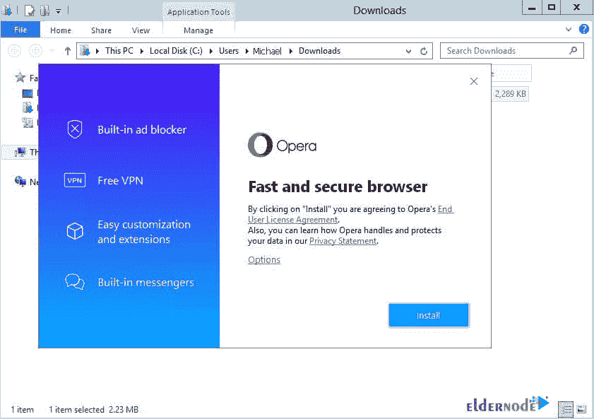

# 如何在 RDP 管理员的博客上安装 Opera

> 原文：<https://blog.eldernode.com/install-opera-on-rdp-admin/>

[更新时间:2021-01-06] Opera 浏览器软件如今被认为是一款强大而快速的浏览器。据统计，Opera 浏览器软件是已知最快的浏览器。这款浏览器打开网页速度快，用户界面非常吸引人。Opera 浏览器软件以令人难以置信的速度为你加载网页。在 Opera 浏览器软件中，首先加载站点文本，然后一点一点上传照片。此外，照片首先完全以低质量出现，然后逐渐提高照片的质量。Opera 浏览器软件没有右键屏蔽、屏蔽页面查看、屏蔽文本选择等限制。这就是为什么我们决定在这篇文章中向您学习如何在 RDP 管理员上安装 Opera。您还可以在 [Eldernode](https://eldernode.com/) 查看购买 [RDP 管理](https://eldernode.com/buy-rdp/)套餐，使用 VPS 服务。

## 在 RDP 管理员上安装 Opera

总共有三种安装方法适用于不同的情况。我们建议您熟悉所有选项，并选择一个最适合您的选项。在这篇文章中，我们将向你学习在 RDP 管理官方 Opera 浏览器安装方法。加入我们继续本教程。

### Opera 浏览器软件的特点

在众多的网页浏览软件中选择哪一个似乎有点困难。这些软件中的每一个都有可能成为其优势的原因。但是每个用户都根据他们的目标使用网络浏览器。在这些浏览器中，有一些是最受欢迎和最著名的。其中一个流行的浏览器叫做 Opera。

Opera 浏览器软件于 1995 年正式加入浏览器世界，完成了一个始于 1994 年的项目。现在几年过去了，用户用的都是性能最高的最新版本。歌剧越来越受欢迎有几个主要原因。

打开网页，尤其是图像的速度很快，这使得关心上网时间的用户开始使用这种浏览器。简单而美丽是吸引用户的重要因素，Opera 能够以简单而美丽的设计巩固其地位。

### RDP 管理官方 Opera 浏览器安装程序

按照以下步骤安装 Opera 浏览器:

**1。**通过可用的浏览器之一进入[歌剧院官方网站](https://www.opera.com/)。我们这里用的是火狐浏览器。

**2。**点击页面右上角的**立即下载**开始下载。

**3。**点击**保存文件**。

**4。**点击下图中的**箭头**进入文件存储位置。

**5。**在打开的窗口中，找到 **OperaSetup** 文件并双击它。

**6。**点击**运行**如下图所示。

**7。**最后点击**安装**开始安装浏览器。

***注意:*** 等待安装过程完成。

干得好！现在 Opera 浏览器已经准备好了，可以直接使用了。

### Opera 浏览器功能

**1-** 提供便捷搜索的能力

**2-** 在全球各大搜索引擎中提升搜索可能性

**3-** 能够定制网页内容的智能阻止

**4-** 阻止弹出广告

**5-** 在浏览器中收发电子邮件的高级功能，支持 POP / IMAP 系统

**6-** 能够读取 RSS / Atom 格式的数据

**7-** 能够单独定制每个 URL 的设置

**8-** 能够通过将鼠标指针停留在任何 URL 上来查看每个页面的预览

**9-** 减少系统闸板上的额外压力

**10-** 能够下载大于 4 GB 的文件

**11-** 能够使用 Opera 专用网站提高安全性并防止间谍软件渗透

**12-** 具有选项卡式浏览或选项卡中选项卡的相同视图的能力

**13-** 消除 Opera 浏览器中的 FTP PASV 等问题

**14-** 拥有美丽多变的皮肤

**15-** 能够识别密码并以极高的安全性存储密码

**16-** 轻松下载 Opera，安装快捷简单

**17-** 高速浏览器在执行

**18-** 与其他浏览器相比，能够减少系统 RAM 的额外开销

在新版 Opera 中增加了对新网页设计标准的支持

**20-** 使用用户语音打开应用程序的能力

**21-** 与其他不具备此功能的浏览器相比，能够下载大量文件

**22-** 能够使用快速拨号功能尽快访问您最喜爱的页面

**23-** 能够使用快速查找，这是一种通过下载 Opera 浏览器设计的功能，可以更容易地找到想要的页面

**24-** 能够通过下载 Opera 浏览器定制皮肤

## 结论

Opera 浏览器软件现在被认为是一个强大而快速的浏览器。在本文中，我们试图学习如何在 RDP 管理中下载和安装 Opera 浏览器软件。还解释了 Opera 浏览器软件的显著特征。也可以参考文章[在 RDP 管理员](https://blog.eldernode.com/install-google-chrome-on-rdp-admin/)上安装谷歌 Chrome 和[如何在 RDP 管理员](https://blog.eldernode.com/install-firefox-on-rdp-admin/)上安装火狐。