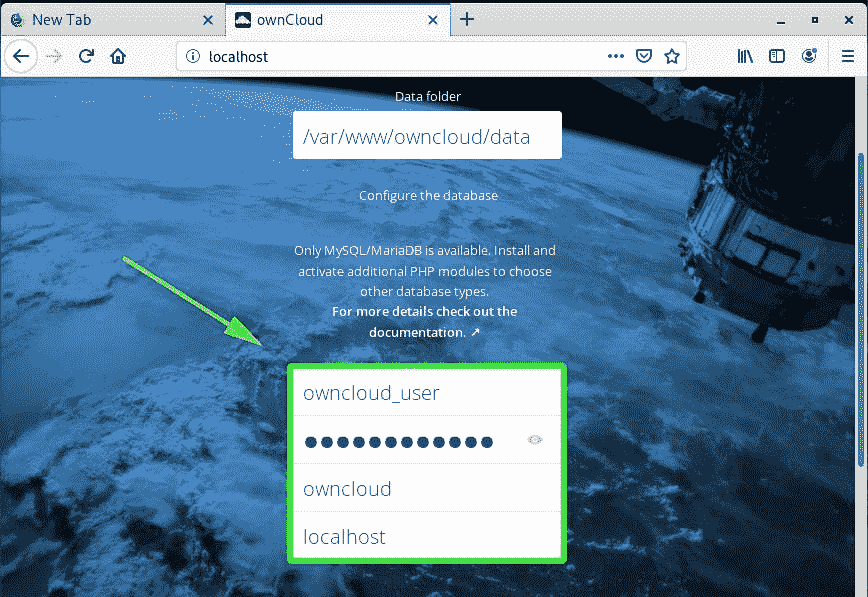

# 如何在 Debian 10 - Eldernode 中安装 OwnCloud

> 原文：<https://blog.eldernode.com/install-owncloud-debian-10/>


如果你不是 DropBox 或 Google Drive 的粉丝， **OwnCloud** 是一个很酷的选择。在这篇文章中，你将学习**如何在 Debian 10** 中安装 OwnCloud。如果你需要一个市场领先的在线文件共享系统，让你轻松备份和共享文件， [Owncloud](https://en.wikipedia.org/wiki/OwnCloud) 是一个不错的选择。

## 如何在 Debian 10 中安装 own cloud

让我们回顾一下在 Debian 10 中安装 OwnCloud 的 5 个步骤。

### 1-在 Debian 上安装灯栈

首先，你应该安装 LAMP 栈，因为 **OwnCloud** 通过将数据存储在数据库上而运行在浏览器和后端上。

若要继续，请更新您的系统存储库。

```
sudo apt update && sudo apt upgrade  
```

现在，运行下面的命令来安装**Apache**web 服务器和 **MariaDB** 数据库服务器。

```
sudo apt install apache2 mariadb-server mariadb-client  
```

然后，在安装完成后，启用 repository.proceed 并安装 **PHP 7.2** 。

```
sudo wget -O /etc/apt/trusted.gpg.d/php.gpg https://packages.sury.org/php/apt.gpg sudo echo "deb https://packages.sury.org/php/ $(lsb_release -sc) main" > /etc/apt/sources.list.d/php.list
```

此外，您应该更新您的系统包和存储库，以便新的 PHP 存储库在您创建 PHP 存储库时生效。

```
sudo apt update
```

现在可以安装 PHP 和所需的依赖项了。

```
sudo apt install php7.2 libapache2-mod-php7.2 php7.2-{mysql,intl,curl,json,gd,xml,mb,zip} 
```


安装后检查 PHP 版本。

```
php -v 
```

另外，如果您想检查 Apache 服务器，可以使用下面的命令。

```
systemctl status apache2
```

然后，如果 Apache 启动并运行，您将得到下面的输出。


如果 **Apache** 没有启动，确保在引导时启动并启用它。使用下面的命令。

```
systemctl start apache2  systemctl enable apache2
```

**不要错过**

[如何在 Debian 10 上安装 Joomla](https://eldernode.com/install-joomla-on-debian-10/)

[How to install Joomla on Debian 10](https://eldernode.com/install-joomla-on-debian-10/)

2-为 OwnCloud 文件创建数据库

### 为了在安装期间和安装之后处理 OwnCloud 的文件，您需要创建一个数据库。所以，登录 MariaDB 服务器。

登录后，开始为 OwnCloud 创建数据库。

```
mysql -u root -p
```

现在，为 OwnCloud 数据库创建一个用户，并授予该用户所有权限。

```
**MariaDB [(none)]>** CREATE DATABASE owncloud; 
```

```
**MariaDB [(none)]>** GRANT ALL ON owncloud.* TO 'owncloud_user'@'localhost' IDENTIFIED BY '[[email protected]](/cdn-cgi/l/email-protection)'; 
```

```
**MariaDB [(none)]>** FLUSH PRIVILEGES;  **MariaDB [(none)]>** EXIT  
```

**[购买 Linux 虚拟专用服务器](https://eldernode.com/linux-vps/)**

3-在 Debian 安装 own cloud

### `虽然您在 Debian 10 的存储库中没有 OwnCloud，并且 OwnCloud 为每个发行版维护了一个存储库，但是您可以使用 Debian 9 的存储库。`

`但是首先，安装 PGP 签名密钥。`

`安装签名密钥后，启用 OwnCloud 的存储库。`

```
`sudo curl https://download.owncloud.org/download/repositories/10.2.1/Debian_9.0/Release.key | apt-key add -` 
```

`然后，要重新同步系统软件包并安装 Owncloud，请再次更新您的系统。`

```
`sudo echo 'deb http://download.owncloud.org/download/repositories/10.2.1/Debian_9.0/ /' > /etc/apt/sources.list.d/owncloud.list` 
```

`4-为 OwnCloud 配置 Apache`

```
`sudo apt update  sudo apt-get install owncloud-files`
```

### ``最好知道， **OwnCloud** 将其文件存储在 **/var/www/owncloud** 目录下。所以你需要配置我们的网络服务器来服务 OwnCloud 的文件。为此，为 Owncloud 创建一个虚拟主机文件。``

``添加以下配置并保存。``

```
``sudo vim /etc/apache2/sites-available/owncloud.conf`` 
```

``就像对待任何虚拟主机一样，通过键入以下命令来启用 OwnCloud 站点。``

```
``Alias / "/var/www/owncloud/" <Directory /var/www/owncloud/> Options +FollowSymlinks AllowOverride All <IfModule mod_dav.c> Dav off </IfModule> SetEnv HOME /var/www/owncloud SetEnv HTTP_HOME /var/www/owncloud </Directory>``
```

``接下来，Owncloud 可能需要额外的 Apache 模块，您应该启用它们。此外，要重新加载配置并使更改生效，请重新启动 Apache 服务器。``

```
``sudo ln -s /etc/apache2/sites-available/owncloud.conf /etc/apache2/sites-enabled/`` 
```

```
``sudo a2enmod rewrite mime unique_id  sudo systemctl restart apache2``
```

``5-完成 OwnCloud 安装``

### ``浏览服务器的 sIP 地址，完成 OwnCloud 设置。``

``如下所示，将会询问用户名和密码。``

```
``http://server-ip``
```

````

``然后，通过单击“**存储和数据库**”，提供数据库详细信息，如数据库用户、数据库名称和密码。``

````

``很明显，您将点击“**完成设置**”。``

````

``输入您的用户名和密码，然后点击回车键，进入登录页面。``

````

``开始时，你会看到一个弹出窗口，显示关于 OwnCloud 的桌面、Android 和 iOS 应用程序的信息，你可以在你的设备上安装这些应用程序。这使您可以随时随地访问数据。``

````

``这是仪表板。``

````

``总之，``

``您现在可以使用 **OwnCloud** 轻松保存和共享您的文件。``

``亲爱的用户，我们希望本教程如何在 Debian 10 、、中安装 OwnCloud 对你有所帮助，如有任何问题或查看我们用户关于本文的对话，请访问 [提问页面](https://eldernode.com/ask) 。也为了提高自己的见识，准备了这么多有用的教程 [Eldernode 培训](https://eldernode.com/blog/) 。``

``Dear user, we wish this tutorial How to install OwnCloud in Debian 10, would be helpful for you, to ask any question or review the conversation of our users about this article, please visit [Ask page](https://eldernode.com/ask). Also to improve your knowledge, there are so many useful tutorials ready for [Eldernode training](https://eldernode.com/blog/).``