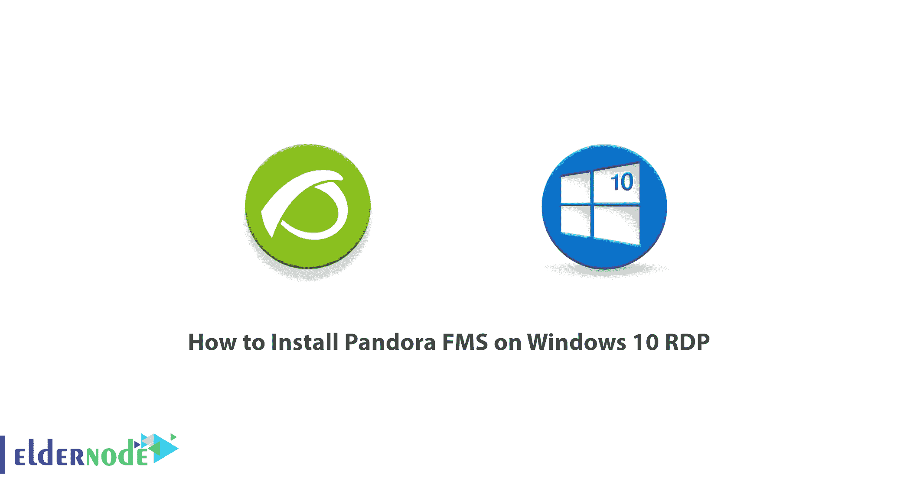
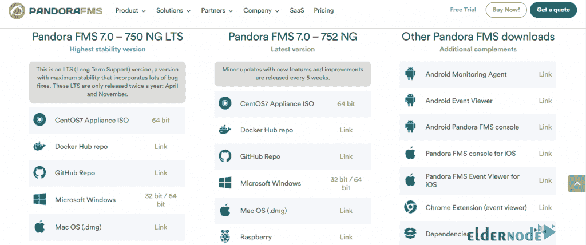
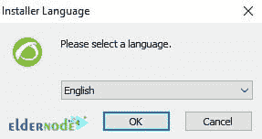
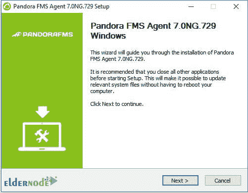
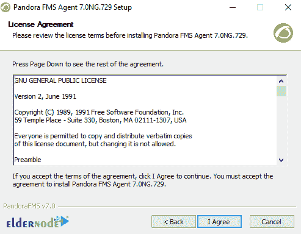
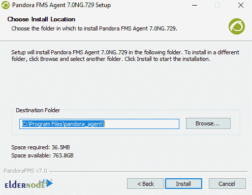
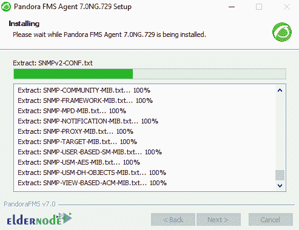
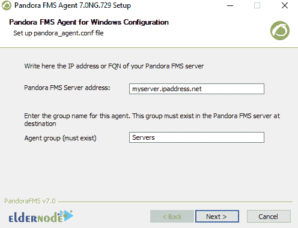
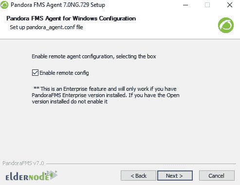
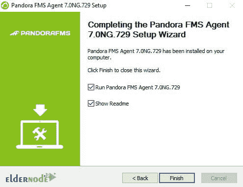

# 如何在 Windows 10 上安装 Pandora FMS RDP-elder node 博客

> 原文：<https://blog.eldernode.com/install-pandora-fms-on-windows-10/>



Pandora FMS 是一个为各种环境设计的网络监控软件包。该软件旨在适应任何角色和组织，其主要目的是提供足够的灵活性来管理和完全控制基础架构，而无需在另一个监控工具上投入更多时间或资金。FMS 代表柔性监控系统。FMS 的目标是能够控制下一代复杂的工具和系统，这些工具和系统具有难以访问和兼容性差的过时元素。在本文中，我们试图教你如何在 Windows 10 RDP 上安装 Pandora FMS。需要注意的是，如果你想购买一台 **[Windows 10 RDP](https://eldernode.com/windows-10-rdp/)** 服务器，可以访问 [Eldernode](https://eldernode.com/) 中提供的软件包。

## **教程在 Windows 10 上安装潘多拉 FMS RDP**

潘多拉灵活监控解决方案(FMS)是一款多功能监控软件。这意味着它可以控制网络设备、 [Linux](https://blog.eldernode.com/tag/linux/) 和 [Windows](https://blog.eldernode.com/tag/windows/) 服务器、虚拟环境、程序、数据库等等。它可以执行远程监控和基于服务器上安装的代理的监控。如果出现问题，您可以检索报告和图表中收集的数据，并增加警报。在下一节中，我们将提到潘多拉 FMS 的一些特性。然后我们会一步步教你如何在 Windows 10 RDP 上安装潘多拉 FMS。

### **潘多拉 FMS 的特点**

在本节中，我们将回顾 Pandora FMS 的 7 个最重要的特性。这 7 个特征是:

**1-控制**

代理可以启用服务、删除临时文件或运行进程。还应该注意，命令可以通过控制台远程执行，比如停止或启动服务。此外，可以安排需要定期执行的任务。

**2-库存**

与其他以 CMDB 思想为基础的解决方案不同，在潘多拉 FMS 中这是一个选项。它是一种灵活而充满活力的生物。这意味着它可以自动检测、接受远程输入等等。它可以通知变化或者简单地用于创建列表。

**3-自动监控**

Pandora FMS 默认监控允许您识别硬盘、分区或数据库服务器上的数据库等。

**4-自动发现**

使用网络，您可以远程识别所有网络元素。您还可以根据您的操作系统索引网络元素，并对它们进行配置，以便您可以控制它们。甚至可以确定网络拓扑并根据其路由创建网络规划。

**5-分析和显示**

在 Pandora FMS 环境中，监控是提供预测报告、收集的长期数据的相关摘要图表和生成用户门户、将报告委托给第三方或定义您自己的图表和表格的一种方式。Pandora FMS 将所有这些工具放在一个 web 界面中。

**6-警告和通知**

通知和故障排除一样重要。潘多拉 FMS 给你几乎无穷无尽的信息方法和格式。这包括强化、关联警告以及预防和减轻紧急情况。

**7-监控**

潘多拉 FMS 的代理商是市面上最厉害的。它们能够获得关于 Windows API 的信息:事件、日志、数字数据、进程阶段、内存和 CPU 消耗。

## **在 Windows 10 上安装潘多拉 FMS**

在这一节，我们想告诉你如何在 Windows 10 RDP 上安装潘多拉 FMS。为此，你需要在第一步访问[潘多拉 FMS 网站](https://pandorafms.com/community/get-started/)。然后你需要下载 Windows 版的潘多拉 FMS。



在下一步中，您需要转到下载文件的位置。双击下载文件。看到以下窗口后，您必须选择想要的**语言**并点击**确定**。



然后点击**下一步**继续安装过程。



点击**我同意**批准许可协议。



在此步骤中，您必须指定程序的安装路径。完成后，点击**安装**开始安装 Pandora FMS。



*



在下一步中，您需要将数据配置为接收操作数据的 Pandora FMS 服务器的 IP 地址(或名称)。请注意，您必须手动编辑代理配置才能更改其他参数，如代理名称或临时文件路径。完成这些步骤后，点击**下一个**:



在下一步中再次点击**下一步**。



如果您想在安装后立即运行程序，选择**运行 Pandora FMS 代理**复选框。最后，点击**完成**，成功完成安装过程。



### 如何安装无人值守的 Windows 代理

请注意，从版本 5.1 开始，安装程序支持无人值守模式。要进行安装，只需遵循以下步骤:

```
"Pandora FMS Windows Agent v7.0NG.VERSION-BUILD_ARCH.exe" /S
```

如果要在不同于默认路径的方向上安装代理，必须执行以下操作:

```
"Pandora FMS Windows Agent v7.0NG.VERSION-BUILD_ARCH.exe" /S /D=C:\Agent_Pandora
```

您可以传递要写入创建的代理配置文件中的某些参数。请注意，在这些选项的帮助下，Pandora FMS 代理的部署更加可定制。每个受支持的命令行上的选项如下:

–IP:对应于令牌 server_ip。

–group:对应于标记组。

–别名:对应于令牌代理别名。

### **如何使用潘多拉 FMS Windows 代理作为进程**

如果要在“处理”模式下运行代理以进行调试、测试和其他异常情况，必须通过从命令行运行以下命令来实现:

```
pandoraagent.exe --process
```

重要的一点是，流程模式的执行有一些限制。因为潘多拉 FMS 是作为服务运行的，在用户系统下。如果您与另一个用户一起运行它而没有积分，有些功能将无法正常工作。

## 结论

Windows 代理支持获取服务状态和进程、执行本地命令以获取信息、获取 Windows 事件、本地 WMI 调用、直接从系统获取性能计数器，以及提供比基本 CPU/RAM/磁盘更多的信息。在这篇文章中，我们试图让你熟悉如何在 Windows 10 RDP 上安装潘多拉 FMS。