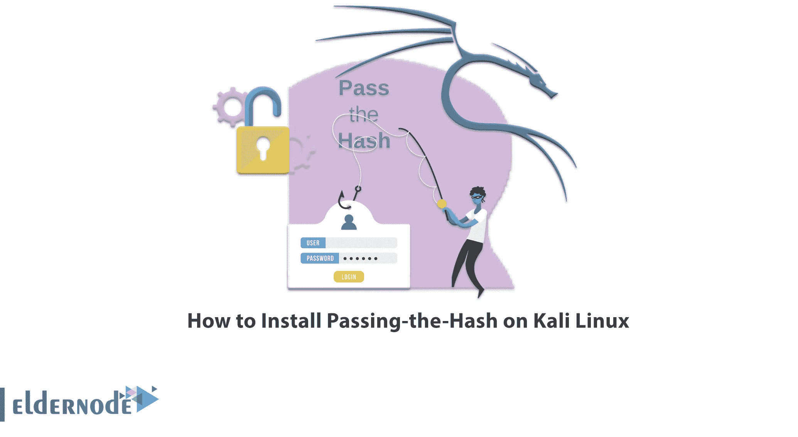

# 如何在 Kali Linux - Eldernode 博客上安装传递散列

> 原文：<https://blog.eldernode.com/install-passing-the-hash-on-kali-linux/>



如果黑客能够在网络中获得立足之地，他就会破坏其他系统并试图获得特权。哈希传递攻击是一种利用漏洞的攻击，攻击者窃取经过哈希处理的用户凭据，在不破坏它的情况下，使用它来欺骗身份验证系统在同一网络上创建新的身份验证会话。在本文中，我们将介绍传递散列，然后您将学习如何在 Kali Linux 上安装传递散列。如果你想购买 [**Linux VPS**](https://eldernode.com/linux-vps/) 服务器，你可以在 [Eldernode](https://eldernode.com/) 中看到可用的软件包。

## **教程在 Kali Linux 上安装 Hash 函数**

### **传杂凑**简介

传递哈希(PtH)攻击是一种技术，在这种技术中，攻击者接收密码哈希(与密码字符相对)并将其传递给其他网络系统进行身份验证和可能的横向访问。通过在设备和帐户之间横向移动，攻击者可以使用传递哈希来获得适当的凭据，最终提升他们的域权限，并获得对更有影响力的系统(如域控制器上的管理员帐户)的访问权限。在哈希攻击中，使用远程软件程序，如恶意软件。pass Hash 攻击可能发生在 Linux、Unix 和其他平台上，但在 Windows 系统上最为常见。

在 Kali [Linux 培训](https://blog.eldernode.com/tag/kali-linux/)系列的这篇文章的继续中，我们打算教你如何在 [Kali Linux](https://blog.eldernode.com/install-and-configure-kali-linux-on-vps/) 上安装 Passing-the-Hash。

## **在 Kali Linux 上安装 Hash 函数**

您可以使用以下命令安装传递散列:

```
sudo apt install passing-the-hash
```

接下来，我们将检查如何安装作为可执行文件安装的 PtH 的修改版本。

### **如何在 Kali Linux 上安装 PtH-curl**

运行以下命令来安装 PtH-curl:

```
pth-curl -h
```

### **如何在卡莉 Linux 上安装 PtH 网**

您可以通过运行以下命令来安装 PtH 网络:

```
pth-net -h
```

### **如何在卡莉 Linux** 上安装 PtH-rpcclient

**使用以下命令安装 PtH-rpcclient:**

```
`pth-rpcclient --help`
```

### ****如何在卡莉 Linux** 上安装 PtH-smbclient**

****运行以下命令安装 PtH-smbclient:****

```
**`pth-smbclient --help`**
```

### ******如何在卡莉 Linux** 上安装 PtH-smbget****

******使用以下命令安装 PtH-smbget:******

```
****`pth-smbget --help`****
```

### ********如何在卡莉 Linux**T5 上安装 PtH-怀恩克斯 ******

****运行以下命令安装 PtH-winexe:****

```
**`pth-winexe -h`**
```

### ******如何在卡莉 Linux** 上安装 PtH-wmic****

******您可以使用下面的命令来安装 PtH-wmic:******

```
****`pth-wmic --help`****
```

### ********如何在卡莉 Linux** 上安装 PtH-wmis******

******您可以使用以下命令安装 PtH-wmis:******

```
****`pth-wmis --help`****
```

## ******常见问题解答******

******[sp _ easy agreement]******

## ******结论******

******在本文中，我们介绍了 PtH，在这种技术中，攻击者接收散列密码，并将其发送到其他网络系统进行身份验证和可能的侧面访问。您还了解了如何在 Kali Linux 上安装传递散列，我们还了解了如何安装 PtH 的修改版本。******