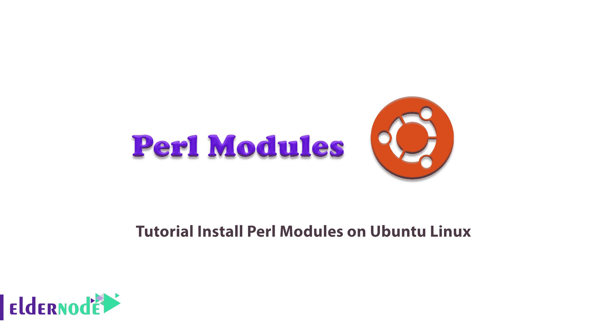

# 教程在 Ubuntu Linux - Eldernode 博客上安装 Perl 模块

> 原文：<https://blog.eldernode.com/install-perl-modules-on-ubuntu/>



Perl 模块是一组执行一组编程任务的相关变量和子程序。有趣的是，在全面的 Perl 存档网络(CPAN)中有许多 Perl 模块可用。所以你可以在不同的类别中找到不同的模块，比如网络、XML 处理、CGI、数据库接口等等。在本文中，我们试着处理一下**教程在 Ubuntu Linux 上安装 Perl 模块**。你可以在 [Eldernode](https://eldernode.com/) 看到购买 [Ubuntu VPS](https://eldernode.com/ubuntu-vps/) 服务器的套餐。

## 如何在 Ubuntu Linux 上安装 Perl 模块 

CPAN(Comprehensive Perl Archive)是一个用 Perl 编写的模块库。在基于 [Linux](https://blog.eldernode.com/tag/linux/) 的系统上，有几种方法可以从全面的 Perl 存档网络安装 [Perl 模块](https://blog.eldernode.com/perl-module-required-for-movable-type/)。安装 Perl 模块最简单的方法是使用我们将要讨论的 CPAN 模块。请继续关注我们的这篇文章。

### **在 Ubuntu Linux 上安装 make 软件包**

在这一节中，我们试图学习如何在 [Ubuntu](https://blog.eldernode.com/tag/ubuntu/) Linux 上安装 make 包。许多 Perl 安装工具和模块都是可用的。在本文中，我们将尝试两个工具 **cpan** 和 **cpanm** 来完成这项工作。在你开始做任何事情之前，你需要确保你的 Ubuntu 上已经安装了" **make** "包。

***注:***“make”是构建 Perl 模块的基本工具。

大多数 Linux 发行版的默认存储库中都有“ **make** ”包。您可以使用以下命令在 Ubuntu 上安装“make ”:

```
sudo apt install make
```

在下一节中，我们将以不同的方式安装 Perl 模块。和我们在一起。

### **如何使用 CPAN** 安装 Perl 模块

CPAN 是 CPAN 库的命令行客户端，默认情况下随所有版本的 Perl 一起分发。

```
sudo cpan
```

例如，要安装 **Net::DNS** 模块，您必须在 CPAN 提示符下使用以下命令:

```
install Net::DNS
```

您也可以使用以下命令直接安装该模块:

```
sudo cpan Net::DNS
```

### **如何使用** Cpanminus 安装 Perl 模块

Cpanminus 或 Cpanm 是 CPAN 客户端，用于接收、打开包、构建和安装来自 CPAN 存储库的模块。Cpanm 是一个独立的脚本，不需要任何配置。应该注意的是，许多专业开发人员更喜欢 Perl Cpanm，而不是 CPAN。Cpanminus 可以用 3 种方法安装，我们将在下面的章节中讨论。

#### **使用 Perl 安装 cpanmus**

您可以很容易地使用下面的命令在 Ubuntu 上安装最新的 Cpanm 版本。应该注意，这个命令在系统级安装 Cpanm。它还将 Cpanm 二进制文件安装在您的 bin 目录中，如 **/usr/local/bin** 。

```
curl -L https://cpanmin.us | perl - --sudo App::cpanminus
```

#### **使用发行版的包管理器安装 cpanmus**

Cpanm 可以在默认的 Ubuntu 发行库中找到。这是一个稳定的版本，但有点旧。要在 Ubuntu 上安装 cpanminus，只需运行以下命令:

```
sudo apt install cpanminus
```

#### **手动安装 cpanmus**

在本节中，您可以使用以下命令手动下载最新的 cpanm 二进制文件，并将其插入到您的 **$PATH** 中。您必须首先通过运行以下命令下载最新版本的 cpanmin:

```
curl -L https://cpanmin.us/ -o cpanm
```

然后运行以下命令来安装 cpanmin:

```
chmod +x cpanm
```

```
sudo mv cpanm /usr/local/bin/cpanm
```

在这一步中，您可以通过运行以下命令来安装任何 Perl 模块，例如， **Net::DNS** :

```
sudo cpanm Net::DNS
```

### **如何安装缺失的 Perl 模块**

有趣的是，许多 Perl 模块都是打包提供的。您可以使用分发包管理器来安装这些模块:

```
apt-cache search 'perl$' | grep Net::DNS
```

## 结论

Perl 是一种解释性的、高级的、面向对象的编程语言，用于服务器端编码。这种语言在其结构中使用 Sed、Shell 脚本和 C，并有自己的属性。Perl 是世界上第十大最流行的编程语言，已经能够吸引许多粉丝。在本文中，我们试图向您介绍在 Ubuntu Linux 上安装 Perl 模块的教程。