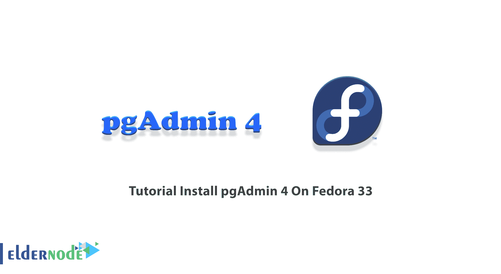
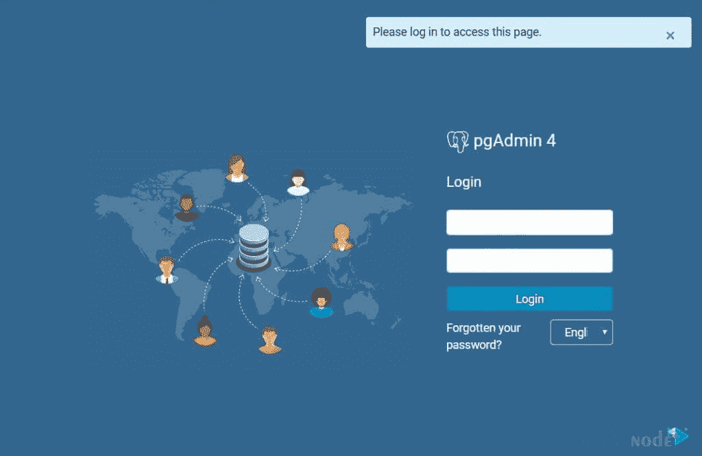
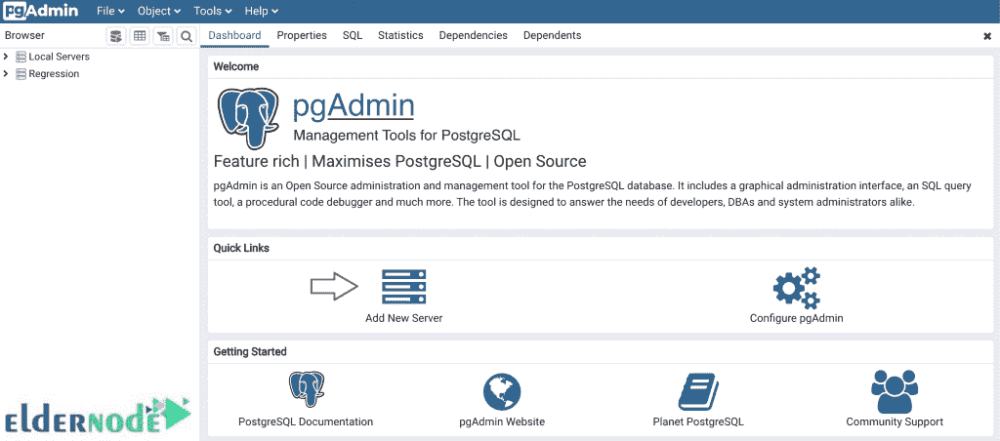
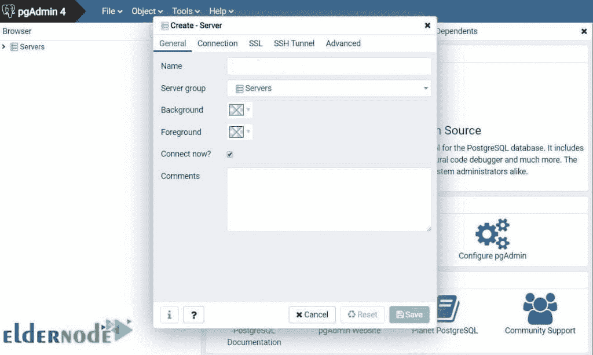
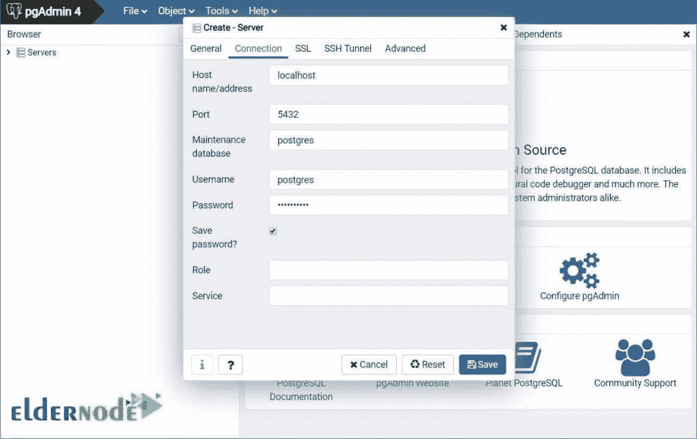
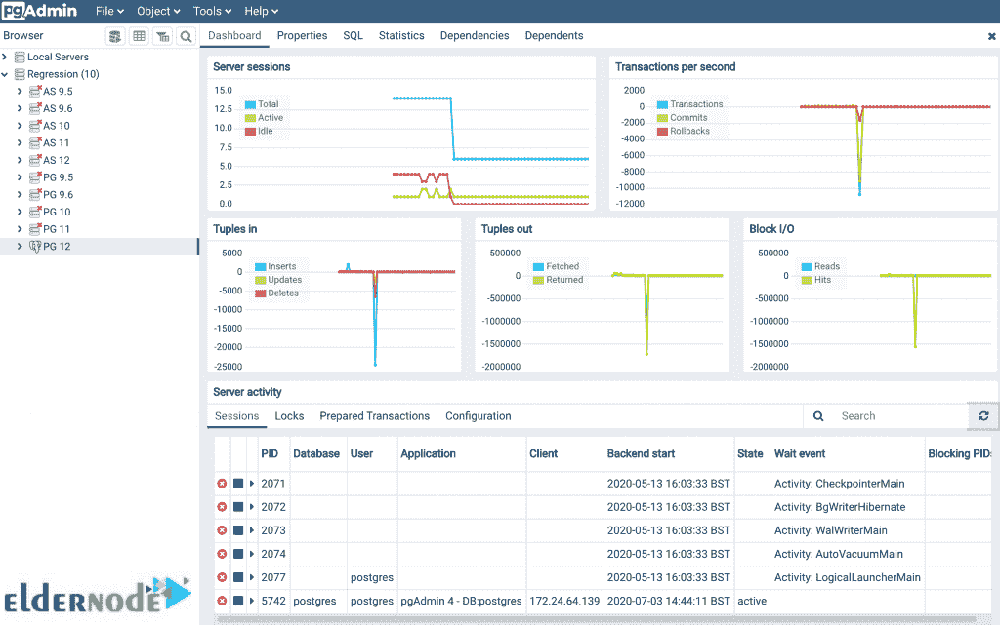

# 教程在 Fedora 33 - Eldernode 博客上安装 pgAdmin 4

> 原文：<https://blog.eldernode.com/install-pgadmin-4-on-fedora-33/>



pgAdmin 是 PostgreSQL 最流行的免费开源管理工具。pgAdmin 是一个功能丰富的 PostgreSQL 管理和开发平台。它可以安装在多个操作系统平台上，如 Linux、Unix、Mac OS X 和 Windows。pgAdmin 也可以作为 web 或桌面应用程序运行。数据库开发人员完全理解管理数据库的工具的重要性。本文介绍了在 Fedora 33 上安装 pgAdmin 4 的教程**。要购买自己的 **[Linux VPS](https://eldernode.com/linux-vps/)** ，请访问 [Eldernode](https://eldernode.com/) 上的可用软件包并选择您需要的。**

## **如何在 Fedora 33 上安装 pgAdmin 4【循序渐进】**

pgAdmin 打包了一组丰富的功能来管理数据库，包括一个简单易用的连接向导，一个内置的 SQL 编辑器来导入 SQL 脚本。通过使用该软件，不同类型的数据库操作可以很容易地从浏览器中完成。这个 PostgreSQL 管理和开发平台可以在 Linux、Unix、Mac OS X 和 Windows 上运行。在本指南的以下内容中，您将了解更多关于 pgAdmin 的信息，并回顾 Fedora 33 上的 pgAdmin 4 安装。

### **什么是 pgAdmin 4，它是如何工作的？**

pgAdmin 在 PostgresDB 社区中用作数据库管理工具。数据库工具可以帮助您创建模式、即席查询、备份或更深入地解决数据库问题，并最终提高您的工作效率。pgAdmin 提供了一个干净而直观的用户界面来简化数据库对象的创建、维护和使用。

正如您所阅读的，pgAdmin 可以作为 web 或桌面应用程序运行。**服务器部署** (web 应用)和**桌面部署**(桌面应用)是 pgAdmin 的部署方式。

服务器部署是作为一个 web 应用程序部署在作为反向代理或使用 WSGI 接口运行的 web 服务器后面。

桌面部署是通过利用桌面运行时来托管应用程序，从而部署为在桌面模式下运行。

### **pgAdmin 特性:**

pgAdmin 有大量的特性。这里有一个简短的列表，让您了解它的功能:

–多平台

–专为多个 PostgreSQL 版本和衍生版本而设计

–大量文件

–多种部署模式

–强大的查询工具，带有彩色语法高亮显示

–用于显示/输入数据的快速数据网格

–图形化查询计划显示

–授权向导可快速更新 ACL

–过程语言调试器(支持 pl/pgsql 和 edb-spl)

–模式差异工具，用于管理模式之间的差异

–多字节支持

–创建、查看和编辑所有通用 PostgreSQL 对象

### **在 Fedora 33** 上安装 pgAdmin 4 的先决条件

_ 拥有 Sudo 权限的非 root 用户。

_ 安装了 PostgreSQL 服务器。

首先，您的系统上必须安装了 PostgreSQL。如果你还没有安装，下面是在 [Fedora](https://blog.eldernode.com/tag/fedora/) 33 上安装 PostgreSQL 的过程。但是如果您的系统上安装了 PostgreSQL，请转到下一节并继续。

第一步:

要开始安装，你应该像往常一样**更新你的系统**。所以，运行:

```
sudo dnf install -y vim bash-completion wget
```

```
sudo dnf update -y
```

您可能有内核更新，因此，建议您在升级后**重启**您的系统:

```
sudo reboot
```

第二步:

是时候将 **PostgreSQL Yum 存储库**添加到 Fedora 系统中了。来做这个。使用以下命令:

```
sudo dnf install https://download.postgresql.org/pub/repos/yum/reporpms/F-33-x86_64/pgdg-fedora-repo-latest.noarch.rpm
```

然后，当提示确认安装时，按下 ***y*** 键。

第三步:

将 PostgreSQL 存储库添加到 Fedora 系统后，运行下面的命令**安装 PostgreSQL** 12 服务器/客户端包:

```
sudo dnf install postgresql12-server postgresql12
```

第四步:

在这一步中，您将初始化数据库并启用自动启动。因此，键入:

```
sudo /usr/pgsql-12/bin/postgresql-12-setup initdb
```

要启动并使服务能够在引导时启动，请运行:

```
sudo systemctl enable --now postgresql-12
```

***注意* :** 如果您有正在运行的防火墙服务，并且远程客户端应该连接到您的数据库服务器，请允许 PostgreSQL 服务。

```
sudo firewall-cmd --add-service=postgresql --permanent
```

```
sudo firewall-cmd --reload
```

因为您的系统上已经安装了 PostgreSQL，所以您已经准备好在 Fedora 33 上启动 pgAdmin 安装过程。

## **在 Fedora 33 上安装 pg admin 4 | Fedora 32**

pgAdmin 是一个在 PostgreSQL/Artistic 许可下发布的自由软件项目。pgAdmin 4 是对 pgAdmin 的完全重写，使用 Python 和 Javascript/jQuery 构建。让我们通过本指南的步骤来了解如何在 Fedora 33 上安装 pgAdmin4。

第一步:

安装 PostgreSQL 之后，就可以开始在 Fedora 33 上安装 pgAdmin 4 了。首先，您需要添加 PostgreSQL RPM 存储库，这应该在安装 PostgreSQL 时完成:

```
sudo yum -y install epel-release
```

```
sudo yum -y install https://download.postgresql.org/pub/repos/yum/reporpms/EL-7-x86_64/pgdg-redhat-repo-latest.noarch.rpm
```

接下来，使用以下命令安装 pgAdmin 包:

```
sudo yum -y update
```

```
sudo yum -y install pgadmin4
```

第二步:

现在，要安装 pgAdmin Fedora，通过运行以下命令将 **PostgreSQL Yum Repository** 添加到 Fedora 33 系统中:

```
sudo dnf install https://download.postgresql.org/pub/repos/yum/reporpms/F-33-x86_64/pgdg-fedora-repo-latest.noarch.rpm
```

添加存储库后，您可以更新系统软件包，然后安装 pgadmin4:

```
sudo dnf -y update && sudo dnf -y install pgadmin4
```

### **如何在 Fedora**T3 上配置 pgAdmin 4】

一旦 pgAdmin 4 安装到 Fedora 33 上，您就可以开始配置它了。要启动 httpd 服务并使其在引导时启动，请运行:

```
sudo systemctl start httpd && sudo systemctl enable httpd
```

此外，您可以通过运行以下命令来确认服务状态:

```
sudo systemctl status httpd
```

现在，使用下面的命令重命名 pgAdmin Apache 配置示例:

```
sudo cp /etc/httpd/conf.d/pgadmin4.conf.sample /etc/httpd/conf.d/pgadmin4.conf
```

要确认配置语法以防止任何错误并重新启动 httpd 服务，请运行:

```
sudo httpd -t
```

```
sudo systemctl restart httpd
```

然后使用以下命令创建 pgAdmin 数据目录:

```
sudo mkdir -p /var/lib/pgadmin4/ /var/log/pgadmin4/
```

### **如何在 Fedora 上配置 SELinux 33**

对于本节，如果您有 SELinux 在强制模式下运行，那么创建并应用一个策略，允许 Apache 用户访问 pgAdmin 目录:

```
sudo semanage fcontext -a -t httpd_sys_rw_content_t "/var/lib/pgadmin4(/.*)?"
```

```
sudo semanage fcontext -a -t httpd_sys_rw_content_t "/var/log/pgadmin4(/.*)?"
```

```
sudo restorecon -R /var/lib/pgadmin4/
```

```
sudo restorecon -R /var/log/pgadmin4/
```

然后，使用下面的命令**重启**httpd 服务:

```
sudo systemctl restart httpd
```

### **如何在 fedora 33** 上访问 pgAdmin 4 Web 界面

如果您有活动的防火墙服务，请允许 http 端口:

```
sudo firewall-cmd --permanent --add-service=http
```

```
sudo firewall-cmd --reload
```

### **如何在 fedora 上使用 pg admin 4 Web 33**

如果您已经正确地通过了上述所有步骤，现在您应该能够登录到 pgAdmin 并开始使用它了。所以，开*http://pgadmin.example.com/pgadmin4*。

登录到 pgAdmin 4 web 界面:



如果您成功登录，将显示 pgAdmin 4 界面。



正如您在快速链接字段中看到的，要管理 PostgreSQL 服务器，您需要**添加新服务器**。因此，添加一个 PostgreSQL 服务器来管理 pgAdmin。这可以是本地或远程 PostgreSQL 服务器。让我们回顾一下 pgAdmin 4 上可用的不同选项卡，以便能够正确地使用和设置它们。

**常规页签:**

名称:命名您的 PostgreSQL 服务器



**连接标签:**

在那里，您将看到以下字段。完成更改后，点击**保存**。

*主机名/地址*:PostgreSQL 服务器的主机名或 IP 地址

*端口* : 5432(保留默认值)–如果需要，请更改

*用户名:*您正在连接的用户名。对我来说，是 Postgres。

*密码*:用户的密码



最后，如果与 PostgreSQL 服务器的连接成功，您应该会看到以下页面:



## 结论

在本文中，您了解了如何在 Fedora 33 上安装 pgAdmin 4。然后，您回顾了在 Fedora 33 上配置和开始使用 pgAdmin 4 的方法。如果您正在使用 pgAdmin，或者您已经找到了更好的替代方案，请向您在 [Eldernode Community](https://community.eldernode.com/) 上的朋友发送反馈。