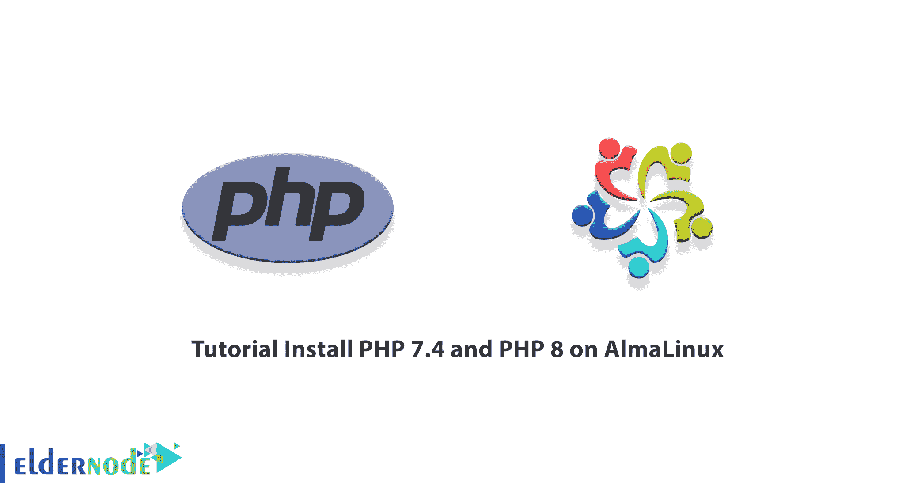

# 教程在 AlmaLinux - Eldernode 博客上安装 PHP 7.4 和 PHP 8

> 原文：<https://blog.eldernode.com/install-php-7-4-and-php-8-on-almalinux/>



PHP 是一种编程语言，但它不是一种完整的语言，它是一种所谓的脚本语言。PHP 最早来源于其创造者引入的个人主页一词。但是随着时间的推移，缩写超文本预处理器的意思就是超文本预处理器。用于网站设计的 web 编程语言中的 PHP 创建了一个方法，web 设计人员可以通过在 HTML 代码中调用它来使用该方法。在这篇文章中，我们将教你如何在 AlmaLinux 上分别安装 PHP 7.4 和 PHP 8。如果你想购买一台 [**VPS 服务器**](https://eldernode.com/vps/) ，你可以访问 [Eldernode](https://eldernode.com/) 中提供的软件包。

## **如何在 AlmaLinux 上安装 PHP 7.4 和 PHP 8**

### **PHP 及其特性介绍**

使用 PHP 最重要的原因是它是免费的，它的代码是开放的。在专业的网页设计中，网页设计者关闭他们的代码，这样他们的网页设计就不会被窃取，也不会被其他人使用。但是用 PHP 编写的网站从网站设计者那里获得了这种可能性，并向用户提供了所有代码。

以下是使用 PHP 的最重要的原因:

1.网站在不被网络攻击者攻击方面的高速性和安全性

2.连接到所有可用的数据库，并快速轻松地与它们通信

3.PHP 中的代码是免费的，源代码是完全开放的

4.学习 PHP 更容易，用它编程也非常简单

5.网站设计者可以根据自己的需要配置它，它的灵活性很高

6.许多人使用这个软件来设计网站，这有助于许多人开发它

7.在所有现有操作系统上运行

## **在 AlmaLinux 上安装 PHP 7.4**

在这一节中，我们想教你如何在 AlmaLinux 上安装 PHP 7.4。为此，您必须按顺序执行以下步骤。第一步是使用以下命令更新系统:

```
sudo dnf update
```

在下一步中，您必须使用以下命令**启用 EPEL 和 Remi 库**:

```
rpm -Uvh https://dl.fedoraproject.org/pub/epel/epel-release-latest-8.noarch.rpm
```

```
dnf install -y https://rpms.remirepo.net/enterprise/remi-release-8.rpm
```

最后，您可以使用以下命令**安装 PHP 7.4** :

```
sudo dnf module reset php
```

```
sudo dnf module install php:remi-7.4
```

***注意:*** 对于 Nginx Web 服务器，必须使用以下命令安装 **php-fpm** :

```
sudo apt install php-fpm
```

现在，您可以使用以下命令来验证版本:

```
php -v
```

## **在 AlmaLinux 上安装 PHP 8**

第一步是使用以下命令安装并**启用 EPEL 存储库**:

```
sudo yum -y install epel-release
```

然后，您需要运行以下命令来**启用 powertools 存储库**:

```
sudo yum -y install yum-utils
```

```
sudo yum-config-manager --enable powertools
```

在最后一步中，您必须使用下面的命令和**将 Remi 存储库**添加到 AlmaLinux:

```
sudo yum -y install https://rpms.remirepo.net/enterprise/remi-release-8.rpm
```

要在 AlmaLinux 上安装 PHP 8.0，您必须首先使用以下命令**重置默认的 PHP 模块**:

```
sudo dnf module reset php
```

现在在这一步，您必须通过运行以下命令来**启用 PHP 8 的 Remi 库**:

```
sudo yum module install php:remi-8.0
```

按下 **y** 键，可以确认软件包的依赖关系并继续安装。

成功完成上述步骤后，您现在应该使用以下命令**安装附加包**:

```
sudo yum install php php-cli php-fpm php-mysqlnd php-zip php-devel php-gd php-mcrypt php-mbstring php-curl php-xml php-pear php-bcmath php-json
```

您必须再次按下“ **y** 继续安装，并确认安装成功。

使用以下命令**检查安装版本**:

```
php --version
```

## 结论

如前所述，PHP 是一种用于制作基于网络的软件和网站的编程语言。PHP 是一种服务器端处理语言。即网站的外观是由 HTML、CSS 等设计的。，处理部分由 PHP 执行。在本文中，我们试图教你如何在 AlmaLinux 上安装 PHP 7.4 和 PHP 8。