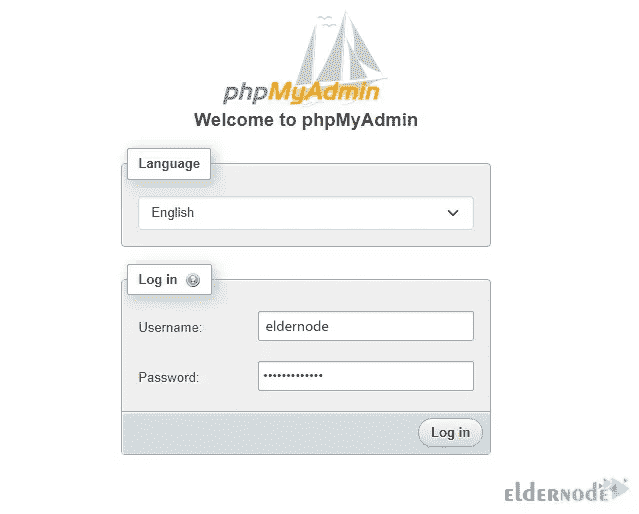
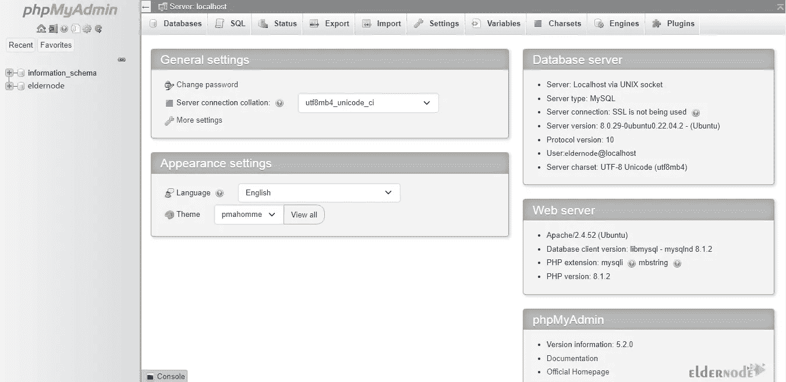

# 在 Ubuntu 22.04 上安装 PHPMyAdmin 的 3 个简单步骤

> 原文：<https://blog.eldernode.com/install-phpmyadmin-on-ubuntu-22-04/>


PHPMyAdmin 是一个管理 MySql 数据库的免费软件。PHPMyAdmin 是用 PHP 语言编写的。使用该软件，您可以对数据库执行各种操作。任务，如:改变或删除数据库，表格，字段等。在本文中，我们将教你在 Ubuntu 22.04 上安装 PHPMyAdmin 的 3 个简单步骤。需要注意的是，如果你想[购买 Ubuntu VPS](https://eldernode.com/ubuntu-vps/) ，可以访问 Eldernode 网站上提供的计划。

## **如何在 Ubuntu VPS 上安装 PHPMyAdmin**

PHPMyAdmin 软件有许多特性，其中一些是:

1-创建或删除数据库

2—[Mysql 和 MariaDB](https://blog.eldernode.com/why-you-should-switch-from-mysql-to-mariadb/) 数据库管理

3-创建表格

4-以压缩格式导出或导入数据库

5–以 csv、xml、sql、pdf 格式备份数据库的可能性

6-用户管理

7–管理多台服务器的能力

8–在所有数据库中进行全国性搜索的可能性

在本文的剩余部分，和我们一起教你 3 种在 Ubuntu 22.04 上安装 PHPMyAdmin 的方法。

### 1)安装 Apache 和 PHP

第一步，需要[在 Linux Ubuntu](https://blog.eldernode.com/install-mysql-on-linux-ubuntu-20-04/) 上安装 MySQL。

现在，您可以通过运行以下命令来安装 Apache :

```
sudo apt install apache2 wget unzip
```

然后，您需要使用以下命令安装 PHP :

```
sudo apt install php php-zip php-json php-mbstring php-mysql
```

完成上述步骤后，您可以通过运行以下命令来启动 Apache :

```
sudo systemctl start apache2
```

还需要**启用 Apache** :

```
sudo systemctl enable apache2
```

在安装了本节中所需的先决条件之后，在下一节中，我们将教您如何安装 PHPMyAdmin。

### T1)2)安装 PHPMyAdmin

在第一步中，需要使用以下命令**下载 PHPMyAdmin** :

```
wget https://files.phpmyadmin.net/phpMyAdmin/5.2.0/phpMyAdmin-5.2.0-all-languages.zip
```

下载完文件后，您必须通过运行以下命令来**解压缩**:

```
unzip phpMyAdmin-5.2.0-all-languages.zip
```

现在，您可以借助以下命令将 PHPMyAdmin 文件移动到所需的路径:

```
sudo mv phpMyAdmin-5.2.0-all-languages /usr/share/phpmyadmin
```

使用以下命令运行 tmp 目录:

```
sudo mkdir /usr/share/phpmyadmin/tmp
```

您可以借助以下命令设置适当的必需权限:

```
sudo chown -R www-data:www-data /usr/share/phpmyadmin
```

```
sudo chmod 777 /usr/share/phpmyadmin/tmp
```

### **3)配置并访问**

您可以很容易地按照下面的步骤来配置 PHPMyAdmin。

第一步，在所需文本编辑器的帮助下打开配置文件:

```
sudo nano /etc/apache2/conf-available/phpmyadmin.conf
```

将以下命令添加到配置文件中，然后保存并退出:

```
Alias /phpmyadmin /usr/share/phpmyadmin  Alias /phpMyAdmin /usr/share/phpmyadmin  <Directory /usr/share/phpmyadmin/>  AddDefaultCharset UTF-8  <IfModule mod_authz_core.c>  <RequireAny>  Require all granted  </RequireAny>  </IfModule>  </Directory>  <Directory /usr/share/phpmyadmin/setup/>  <IfModule mod_authz_core.c>  <RequireAny>  Require all granted  </RequireAny>  </IfModule>  </Directory>
```

借助以下命令启动 Apache 服务以重新加载设置:

```
sudo a2enconf phpmyadmin
```

```
sudo systemctl restart apache2
```

与配置 PHPMyAdmin 相关的下一部分是 FirewallD 设置。因此，您需要运行以下命令来允许从防火墙访问 HTTP 服务:

```
sudo firewall-cmd --permanent --add-service=http
```

重新加载防火墙以应用更改:

```
sudo firewall-cmd --reload
```

要创建 mysql 数据库和用户，请运行 MySQL 命令:

```
mysql
```

现在，您需要依次运行以下命令:

```
CREATE DATABASE eldernode;
```

```
CREATE USER 'eldernode'@'localhost' IDENTIFIED BY 'Pa$$w0rd';
```

```
GRANT ALL ON eldernode.* TO 'eldernode'@'localhost';
```

```
FLUSH PRIVILEGES;
```

在您仔细遵循了本教程中提到的所有步骤之后，您最终可以通过在浏览器中运行以下地址来**访问 PHPMyAdmin** :

```
http://your-server-ip-domain/phpmyadmin
```



注意，您可以使用您在命令行中键入和创建的 MySQL 用户名和密码来登录 PHPMyAdmin :



## 结论

PHPMyAdmin 附带了大量的文档。为了方便广大用户使用，PHPMyAdmin 已被翻译成 72 种语言，并支持 LTR 和 RTL 语言库。PHPMyAdmin 是最可靠和用户友好的数据库管理器，主要用于基于 web 的应用程序或应用程序。在本文中，我们试图教你在 Ubuntu 22.04 上安装 PHPMyAdmin 的 3 个简单步骤。如果你有任何问题，可以在评论区和我们分享。