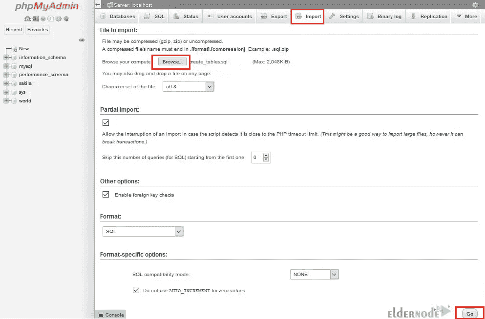

# 在 Windows 10 上安装 PHPMyAdmin 的 5 种方法

> 原文：<https://blog.eldernode.com/install-phpmyadmin-on-windows-10/>


每个网站都需要与数据管理系统或数据本身进行交互，因此需要使用数据库。PHPMyAdmin 已经成为最流行的软件平台之一，通过 MySQL 和 MariaDB 数据库管理网络上的分类数据。本文将教你 5 种在 Windows 10 上安装 PHPMyAdmin 的方法。如果你打算购买一台 [Windows VPS](https://eldernode.com/windows-vps/) 服务器，你可以查看 [Eldernode](https://eldernode.com/) 网站上提供的软件包。

## **如何在 Windows 10 上安装 PHPMyAdmin**

### **PHPMyAdmin 是什么？**

PHPMyAdmin 是一个用 PHP 编写的开源、免费的第三方软件工具，用于管理 web 上的 MySQL 数据库。它允许你通过用户界面管理数据库、表格、列、关系、列表、用户、权限等。该软件是数据库控制软件，支持 MySQL 和 MariaDB 中的多种操作。

### **Windows 10 上安装 PHPMyAdmin 的要求**

1- [在 Windows 上安装 Apache web 服务器](https://blog.eldernode.com/install-apache-on-windows-server/)

2- [在 Windows 上安装 MySQL 数据库管理器](https://blog.eldernode.com/install-mysql-on-windows-server/)

3- [在 Windows 上安装 PHP](https://blog.eldernode.com/installing-php-on-windows-server/)

### **在 Windows 10 上下载 PHPMyAdmin**

在本节中，您将学习如何在 Windows 10 上下载 PHPMyAdmin。为此，请遵循以下步骤。

导航到 PHPMyAdmin 官方网站在你的 Windows 10 系统上下载想要的 PHPMyAdmin 版本。点击**下载 5.2.0** :


下载完成后，转到下载文件夹并**解压**下载的文件。然后将其移动到 **C:\Apache24\htdocs** 路径。

为了让该工具正常工作，您需要设置几个 PHPMyAdmin 文件。在程序的文件夹中找到**config.sample.inc.php**文件，并将其重命名为【config.inc.php 。

现在使用您想要的文本编辑器编辑文件。为此，请选择以下代码行:

```
cfg['blowfish_secret'] = ''; /* YOU MUST FILL IN THIS FOR COOKIE AUTH! */
```

然后你应该输入你想要的值。请注意，该值必须至少有 32 个字符长:

```
cfg['blowfish_secret'] = ''; /* k7b862qwq4ygj8a2hkczmd6spqsnspnkd */
```


记得保存配置文件。

拆下**；**扩展名的开头，并打开 php 文件夹中的 php.ini 文件。您应该启用工具操作所需的以下扩展:

```
extension=php_mbstring.dll  extension=mysqli
```

记得保存配置。

最后，通过按 Win+R 并运行下面的命令来重新启动 Apache 服务器:

```
services.msc
```

### **如何在 Windows 10 上登录 PHPMyAdmin**

首先，在 web 浏览器中打开以下 URL，并输入您的 MySQL 用户名和密码:

```
http://localhost/phpmyadmin/
```


现在您应该可以看到仪表板了。如果您向下滚动页面，将会出现警告标志:


出现警告的原因是该工具需要一个数据库才能工作。您可以从同一个安装文件夹导入它。所以点击**导入**菜单，转到**C:\ Apache 24 \ htdocs \ phpMyAdmin \ SQL**路径，选择 **create_tables.sql** :



您应该看到一个名为 [PHPMyAdmin](https://blog.eldernode.com/install-the-latest-phpmyadmin-on-ubuntu-20/) 的数据库。

创建数据库后，单击所示图标退出工具:


在这一步中，修改提交给操作数据库的用户的值。它将启用数据库和表存储参数，并消除它们前面的双斜线。此外，它在对应于用户控件的行中添加 localhost，并用 MySQL 的用户和密码修改值 controluser 和 controlpass。

最后，保存配置并返回 PHPMyAdmin。

## 结论

PHPMyAdmin 方便了 MySQL 的管理。在这篇文章中，我们教了你 5 种在 Windows 10 上安装 PHPMyAdmin 的方法。我希望这篇教程对你有用，帮助你在 Windows 10 上安装 PHPMyAdmin。如果您有任何问题或建议，可以在评论区联系我们。