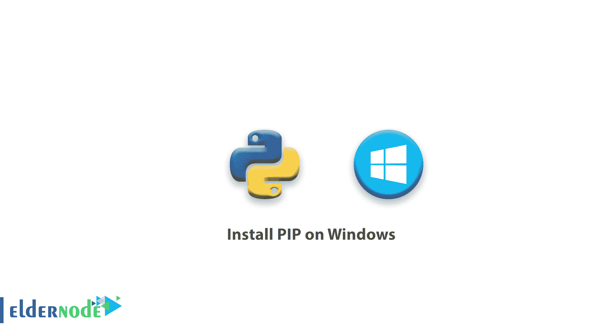

# 教程在 Windows 上安装 PIP-elder node

> 原文：<https://blog.eldernode.com/install-pip-on-windows/>



教程在 Windows 上安装 PIP。Python 有很多库可以帮助我们编程。事实上，您不需要编写大量代码，并且可以使用现成的库。我们需要使用 PIP 来安装 Python ready 库。

在这篇文章中，我们将教你如何在 Windows 上安装 PIP。

您也可以从 eldernode 购买并使用 [Windows VPS 服务器](https://eldernode.com/windows-vps/)。

Python 是什么？

## Python 是一种脚本语言，可以在 Linux、Windows、Macintosh、移动操作系统甚至 PlayStation 平台上运行。由于 Python 的许多功能，它已经成为 web 开发人员最喜欢的语言之一。像谷歌、雅虎、Instagram、NASA、YouTube 和……这样的大公司都在高水平地使用它。

Python 是跨平台的，这意味着你可以在许多不同的操作系统上运行它，包括 [Windows VPS Server](https://eldernode.com/windows-vps/) 。

Python 中的 pip 是什么？

### PIP 是一个软件包管理器，用于安装和管理用 python 编写的程序。例如，您可以使用 pip install PACKAGE_NAME 命令来安装 Python 包。Pip 还可以帮助您卸载或更新。 PyPI (Python 软件源码)里有很多 Python 软件包，可以通过 pip 安装。

在您的服务器上安装 Pip 之前，您需要确认 Python 已经安装。

要测试在 Windows 服务器上安装 Python，按下 **Windows 键**并键入 cmd 。命令提示符窗口打开后，键入单词 python 并点击回车。如果 Python 安装正确，您应该会看到如下所示的输出:

```
 Python 3.7.0 (v3.7.0:1bf9cc5093, Jun 27 2018, 04:59:51) [MSC v.1914 64 bit (AMD64)] on win32 Type "help", "copyright", "credits" or "license" for more information. 
```

**注意:** 如果收到类似下图的消息，说明 Python 没有安装:

有关安装和使用 python 的更多信息，请参阅我们的文章[如何在 windows](https://eldernode.com/install-python-on-windows/) 上安装 Python。

```
 Python is not recognized as an internal or external command, operable program or batch file. 
```

在 Windows 上安装 Pip

确保 Python 安装正确后，就可以安装 PIP 了。按照以下步骤安装 PIP。

## **1。** 下载 [get-pip.py](https://bootstrap.pypa.io/get-pip.py) 到你电脑上的一个文件夹里。

**2。** 打开命令提示符。然后导航到包含 get-pip.py 安装程序的文件夹。

**3。** 运行以下命令安装 PIP。

**4。** 要确认 PIP 在 Windows 中的正确运行，可以打开命令提示符并输入以下命令:

```
 python get-pip.py 
```

上述命令的输出如下所示:

```
 pip -V 
```

**5。** 要获得 Pip 可用命令和语法的简要概述，请打开命令提示符并输入以下命令:

```
 pip 18.0 from c:\users\administrator\appdata\local\programs\python\python37\lib\site-packages\pip (python 3.7) 
```

**尊敬的用户**，我们希望您能喜欢这个[教程](https://eldernode.com/category/tutorial/)，您可以在评论区提出关于本次培训的问题，或者解决[老年人节点培训](https://eldernode.com/blog/)领域的其他问题，请参考[提问页面](https://eldernode.com/ask)部分，并尽快提出您的问题。腾出时间给其他用户和专家来回答你的问题。

```
 pip help 
```

好运。

**亦作，见**

[如何在 Ubuntu 18.04 上安装 Django](https://eldernode.com/install-django-ubuntu-18/)

[教程在 Centos/RHEL 8 Linux 上安装 Python 3.8](https://eldernode.com/install-python-3-8-on-centos/)

**Also, see**

[How To Install the Django on Ubuntu 18.04](https://eldernode.com/install-django-ubuntu-18/)

[Tutorial Install Python 3.8 on Centos/RHEL 8 Linux](https://eldernode.com/install-python-3-8-on-centos/)