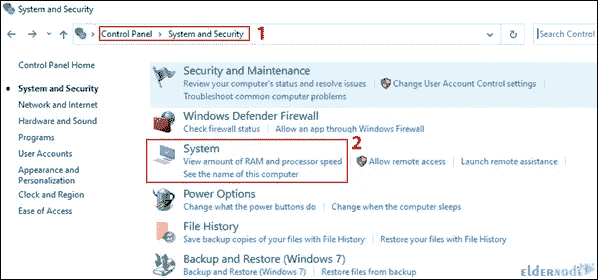
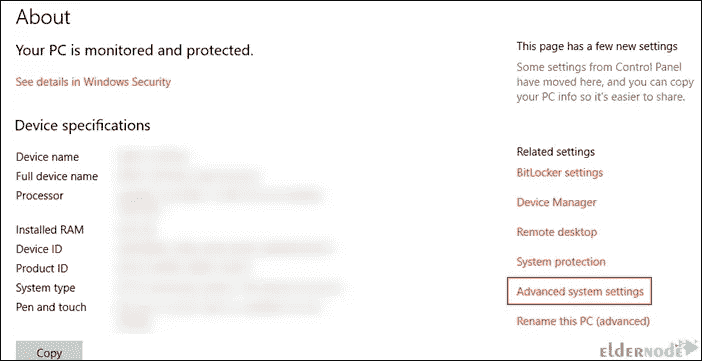
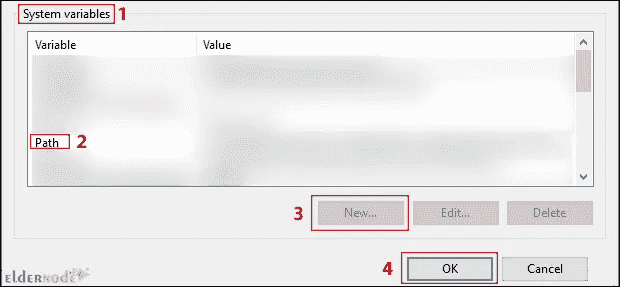

# 如何通过几个简单的步骤在 Windows 上安装 Pip3

> 原文：<https://blog.eldernode.com/install-pip3-on-windows/>


Python 是一种强大的编程语言，具有很高的代码可读性。它附带了不同的编程、数据科学和许多其他东西的包。由于 Python 没有针对开发者的包和库，所以你应该单独安装它们。你可以用 Pip3 做到这一点。本文将教你如何通过几个简单的步骤在 Windows 上安装 Pip3。

## **教程在 Windows 服务器上安装 pip 3**

PIP 代表 [Pip 安装](https://blog.eldernode.com/install-pip-on-windows/)软件包或首选安装程序，是一个命令行，用于从命令行管理 PyPI 软件包安装。其实就是一个包管理系统，用来管理用 Python 写的第三方包。Pip3 是 Pip 的更新版本。该实用程序用于组合两个或多个命令。然而，一个命令的输出充当另一个命令的输入。从而该命令的输出也可以作为下一个命令的输入。

### **下载 get-pip . py**

首先在 Windows 搜索栏搜索 cmd，打开。另外，如果你愿意，你可以[购买 Windows VPS](https://eldernode.com/windows-vps/) ，然后在上面运行这些命令。

现在**使用下面的命令下载 get-pip.py** :

```
curl https://bootstrap.pypa.io/get-pip.py -o get-pip.py
```

### **在 Windows** 上安装 pip 3

要在 [Windows](https://blog.eldernode.com/tag/windows/) 上安装 Pip3，您只需运行以下命令:

```
python get-pip.py
```

如果找不到文件，您应该检查保存文件的文件夹路径。以下命令显示当前目录的内容:

```
dir
```

### **检查 Windows 上 Pip3 的安装**

您可以使用以下命令检查 Pip3 是否安装成功:

```
pip help
```

一旦您成功地在 Windows 上安装了 Pip3，您将看到软件包的位置和可以与 Pip3 一起使用的命令列表。

### **给 Windows 环境变量添加 pip 3**

之后，按照以下步骤将 Pip3 添加到 Windows 环境变量中:

打开**控制面板**，导航到**系统和>安全系统**路径:



选择**高级系统设置**:



打开**环境[变量](https://blog.eldernode.com/set-system-variable-path-for-python/)T3，在**系统变量**部分选择**路径**。**

点击 **New** ，选择安装 Pip3 的目录，将其添加到 Windows 环境变量中。

最后点击**确定**保存更改。



## 结论

Python 编程语言附带了不同的包。您可以使用 Pip3 来管理用 Python 编写的软件包。在本文中，我们向您介绍了 Pip3，并教您如何通过几个简单的步骤在 Windows 上安装它。如果你面临任何问题或者有任何疑问，可以在评论区联系我们。我希望这篇教程能帮助你在 Windows 上安装 Pip3，你会发现它很有用。