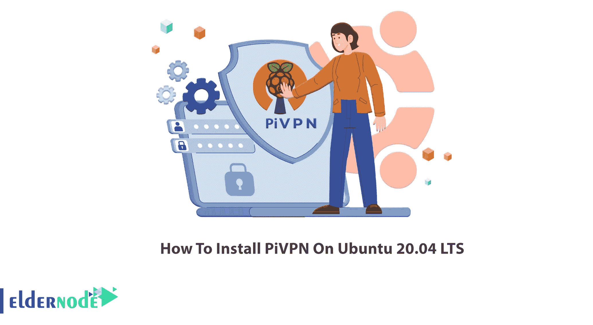

# 如何在 Ubuntu 20.04 上安装 PIV pn LTS-elder node 博客

> 原文：<https://blog.eldernode.com/install-pivpn-on-ubuntu/>



要在您的设备和互联网之间建立安全连接，需要虚拟专用网络。VPN 是一个简单的软件，它可以让你的互联网保持活跃和私密，将你的私人局域网扩展到互联网上。对于没有经验的人来说，设置 VPN 可能很复杂。PiVPN 是一种设置 VPN 服务器的简单方法，因为它消除了他们的 Raspberry Pi 的复杂性。所以，如果你需要这个解决方案，请加入我们这篇文章来学习如何在 Ubuntu 20.04 LTS 上安装 PiVPN。高级用户也可以使用本指南，因为 PiVPN 命令将启动一个配置界面来提供他们的独特要求。要购买你自己的即时廉价的 [Ubuntu VPS](https://eldernode.com/ubuntu-vps/) ，在 [Eldernode](https://eldernode.com/) 上订购你需要的东西。

## **教程在 Ubuntu 20.04 上安装 PIV pn LTS**

要在您的 Raspberry Pi 上安装和配置 OpenVPN 服务器，您需要使用 PiVPN 程序。在下一节中，我们将向您介绍 PiVPN。然后我们会一步步教你如何在 [Ubuntu](https://blog.eldernode.com/tag/ubuntu/) 20.04 上安装 PiVPN。在 Ubuntu 上成功安装 PiVPN 后，我们想教你如何使用。最后，我们将解释如何连接。请加入我们。

### **PIV pn 是什么，为什么需要它？**

要在 [Ubuntu](https://en.wikipedia.org/wiki/Ubuntu) 上设置 VPN 服务器，你可以使用 PiVPN 作为 [OpenVPN](https://blog.eldernode.com/set-up-openvpn-debian-10/) 的安装器和包装器。与连接到家庭网络的设备进行通信是一个好主意。此外，您可以在办公室设置它，并在家里通过 VPN 使用办公室中的所有工具和服务。在下面，您将看到它创建的简单命令来控制您的 VPN 服务器。使用这些命令可以帮助您安装和配置 OpenVPN。

## **在 Ubuntu 20.04 上安装 PIV pn |**Ubuntu 18.04

我们保证这需要几分钟。让我们看看在这个快速的过程中应该做些什么。

第一步:

首先。您需要**创建一个新用户**。您的用户可以使用任何名称。在这个例子中，我们将使用“ **vpn** ”。

```
adduser vpn
```

第二步:

要开始在 Ubuntu 20.04 上安装 PiVPN，请以 root 用户身份运行 PiVPN 网站上的命令:

```
curl -L https://install.pivpn.io | bash
```

在安装过程中，尽量保持默认设置。然后，它会自动找到您的**新用户**，并将其添加为 VPN 配置文件的默认存储。

### **如何在 Ubuntu 20.04 上使用 PIV pn**

成功安装后，您就可以**添加和删除 VPN 配置文件**了。使用下面的命令给**添加一个轮廓**:

```
pivpn add
```

然后，输入您想要的个人资料的名称和密码。然后，该配置文件被存储在“ **vpn** 用户的主目录中。您也可以添加没有密码的用户:

```
pivpn add nopass
```

然后，它会询问一个名字。输入客户端的名称并继续。要查看配置文件列表，请键入:

```
pivpn list
```

任何时候你决定撤销一个用户，只需使用下面的命令。

```
pivpn revoke example
```

***注意:*** 不要忘记将示例替换为您希望删除的用户。

此外，您可以运行以下命令来看看 PiVPN 能做些什么:

```
pivpn — help
```

## 结论

在本文中，您了解了如何在 Ubuntu 20.04 LTS 上安装 PiVPN。我们很确定你在安装过程中不会遇到任何问题。享受这个简单、灵活、可管理且安全的计划。该解决方案允许您停止支付昂贵的 VPN 服务，按月订购。PiVPN 是一种廉价而安全的替代品。将您的反馈发送给 [Eldernode Community](https://community.eldernode.com/) 上的朋友，或者询问他们是否正在使用。