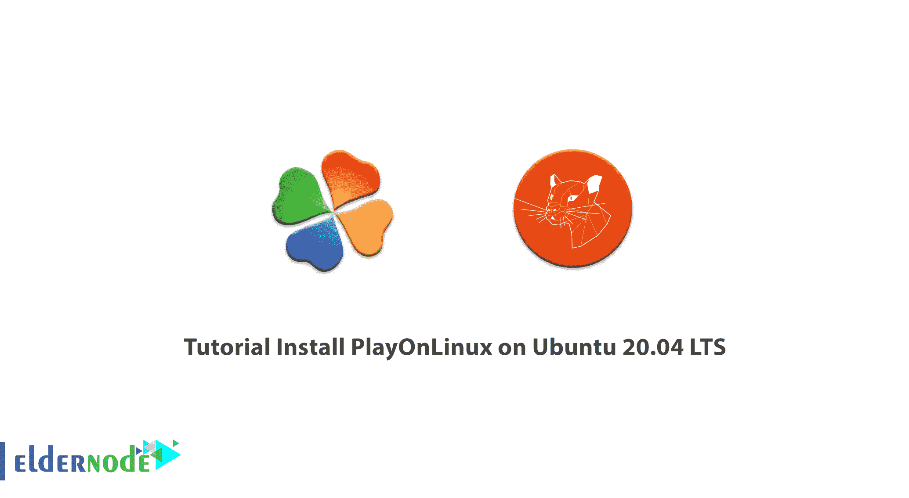

# 在 Ubuntu 20.04 上安装 PlayOnLinux 的教程 LTS - Eldernode 博客

> 原文：<https://blog.eldernode.com/install-playonlinux-on-ubuntu-20-04/>



PlayOnLinux 是对 Linux 中 wine 程序的补充，它允许您在其他操作系统上轻松运行为 Microsoft Windows 设计的程序和游戏。大型游戏公司现在正在发布与 Linux 兼容的世界级游戏。这导致了用户从微软视窗系统向 Linux 系统的迁移。但是，一些公司生产的游戏不能安装在 Linux 上。这就是为什么 wine emulator 是为 Linux 设计的，但它并不单独支持所有的 Windows 程序和游戏。因此，playonlinux 程序被设计为以最佳方式运行和安装这些程序和游戏。在这篇文章中，我们试图向你学习如何**在 Ubuntu 20.04 LTS** 上安装 PlayOnLinux。你可以在 [Eldernode](https://eldernode.com/) 看到可以购买 [Ubuntu VPS](https://eldernode.com/ubuntu-vps/) 服务器的包。

## **如何在 Ubuntu 20.04 上安装 playon Linux LTS**

要安装 playonLinux，你不需要像 Windows 一样拥有使用许可，因为这个软件是完全免费的。在这篇文章的续篇中，请加入我们，一步一步地学习如何在 [Ubuntu](https://blog.eldernode.com/tag/ubuntu/) 20.04 LTS 上安装 PlayOnLinux。

## **在 Ubuntu 20.04 上安装 playon Linux**

请注意，您可以很容易地从默认的 Ubuntu 20.04 软件包库中安装 PlayOnLinux。PlayOnLinux 基于 Wine 系统，除了提供程序列表之外，还会简化安装过程。也就是说，通过安装 PlayOnLinux，Wine 工具同时安装在系统上。

PlayOnLinux 位于 Ubuntu Linux 发行版存储库中，因此您可以从 Ubuntu 软件中心或通过运行以下命令来安装该软件。

要安装 PlayOnLinux，请打开 Ubuntu 20.04 终端。然后键入并运行以下命令:

```
$ sudo apt install playonlinux
```

输入上述命令后，必须输入字母 **S** 确认下载安装 PlayOnLinux。

重要的是要知道，为了保持这个程序的最新版本，你可以在不同版本的 Ubuntu 中运行下面的命令。这样，Repository 会将 PlayOnLinux 软件添加到您的系统中，其新版本将始终通过 Update Manager 显示给您。

#### 如何在宇宙版上安装和更新 PlayOnLinux

要在 Cosmic 版本上安装和更新 PlayOnLinux，必须按顺序键入并运行以下命令:

```
wget -q "http://deb.playonlinux.com/public.gpg" -O- | sudo apt-key add -
```

```
sudo wget http://deb.playonlinux.com/playonlinux_cosmic.list -O /etc/apt/sources.list.d/playonlinux.list
```

```
sudo apt-get update
```

```
sudo apt-get install playonlinux
```

#### 如何在仿生版上安装和更新 PlayOnLinux

您可以通过运行以下命令在 Bionic 版本上安装和更新 PlayOnLinux:

```
wget -q "http://deb.playonlinux.com/public.gpg" -O- | sudo apt-key add -    sudo wget http://deb.playonlinux.com/playonlinux_bionic.list -O /etc/apt/sources.list.d/playonlinux.list    sudo apt-get update    sudo apt-get install playonlinux
```

#### 如何在 Xenial 版本上安装和更新 playon Linux

运行以下命令，以便在 Xenial 版本上安装和更新 PlayOnLinux:

```
wget -q "http://deb.playonlinux.com/public.gpg" -O- | sudo apt-key add -    sudo wget http://deb.playonlinux.com/playonlinux_xenial.list -O /etc/apt/sources.list.d/playonlinux.list    sudo apt-get update    sudo apt-get install playonlinux
```

#### 如何在可信版本上安装和更新 playon Linux

在本节中，您可以通过运行以下命令在可信版本上安装和更新 PlayOnLinux:

```
wget -q "http://deb.playonlinux.com/public.gpg" -O- | sudo apt-key add -    sudo wget http://deb.playonlinux.com/playonlinux_trusty.list -O /etc/apt/sources.list.d/playonlinux.list
```

```
sudo apt-get update
```

```
sudo apt-get install playonlinux
```

#### 如何在 Saucy 版本上安装和更新 PlayOnLinux

如果要在 Saucy 版本上安装和更新 PlayOnLinux，必须运行以下命令:

```
wget -q "http://deb.playonlinux.com/public.gpg" -O- | sudo apt-key add -    sudo wget http://deb.playonlinux.com/playonlinux_saucy.list -O /etc/apt/sources.list.d/playonlinux.list
```

```
sudo apt-get update
```

```
sudo apt-get install playonlinux
```

#### 如何在精确版上安装和更新 playon Linux

最后，运行以下命令在精确版本上安装和更新 PlayOnLinux:

```
wget -q "http://deb.playonlinux.com/public.gpg" -O- | sudo apt-key add -    sudo wget http://deb.playonlinux.com/playonlinux_precise.list -O /etc/apt/sources.list.d/playonlinux.list
```

```
sudo apt-get update
```

```
sudo apt-get install playonlinux
```

## 结论

PlayOnLinux 软件具有简单的图形界面，只需点击几下鼠标，即可轻松安装 Windows 程序。事实上，它的工作原理类似于软件包管理器程序，只不过这个工具用于安装各种 Windows 软件和游戏。在本文中，我们试图教你如何在 Ubuntu 20.04 LTS 版上安装 PlayOnLinux。我们还解释了安装和更新不同版本 Ubuntu 的说明。