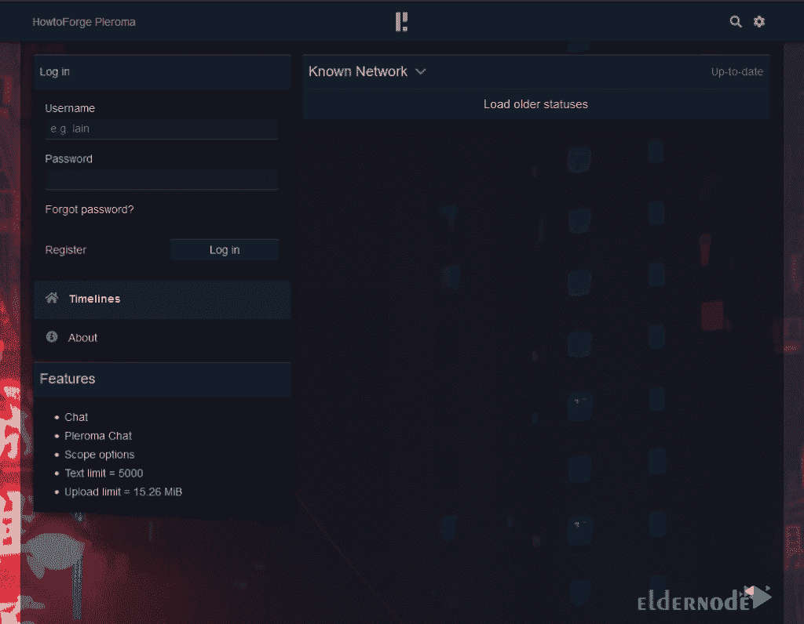

# 教程在 Ubuntu 20.04 上安装 ple Roma-elder node 博客

> 原文：<https://blog.eldernode.com/install-pleroma-on-ubuntu/>


Pleroma 是一个基于开放的 OStatus 和 ActivityPub 标准的社交网络微博服务器。使用 Pleroma 服务器软件的服务器可以根据这些标准与其他服务器交换用户消息和帖子。在这篇文章中，我们将一步一步地教你关于在 Ubuntu 20.04 上安装 Pleroma 的教程。如果你想购买一台 [Ubuntu VPS](https://eldernode.com/ubuntu-vps/) 服务器，你可以访问 [Eldernode](https://eldernode.com/) 中提供的软件包。

## **如何在 Ubuntu 20.04 上安装 Pleroma**

Pleroma 是一个联邦社交网络平台，兼容 Mastodon 和其他 ActivityPub 实现。在本文的第一部分，我们将提到在 Ubuntu 20.04 上安装 Pleroma 的先决条件。然后我们想教你如何配置防火墙。执行完这些步骤，就到了主要部分，也就是如何安装 Pleroma。在您完成安装 Pleroma 后，我们将对其进行配置，在最后一步，我们将教您如何一步一步地安装 Pleroma。请继续关注本文的其余部分。

### **在 Ubuntu 20.04 上安装 Pleroma 的先决条件**

在 Ubuntu 20.04 上安装 Pleroma 之前，您需要提供以下先决条件:

_ Ubuntu VPS 服务器

_ 非根 Sudo 用户

然后，您需要使用以下命令来确保一切都是最新的:

```
sudo apt update
```

```
sudo apt upgrade
```

您还需要使用以下命令并安装一些软件包和依赖项:

```
sudo apt install wget curl gnupg2 ca-certificates lsb-release gnupg zip libncurses5 libmagic-dev -y
```

下一步，你需要**安装 PostgreSQL** 。所以您可以**通过运行以下命令将官方 PostgreSQL 存储库**添加到 Ubuntu 资源列表中:

```
sudo sh -c 'echo "deb http://apt.postgresql.org/pub/repos/apt $(lsb_release -cs)-pgdg main" > /etc/apt/sources.list.d/pgdg.list'
```

然后，您需要添加存储库 GPG 键:

```
wget --quiet -O - https://www.postgresql.org/media/keys/ACCC4CF8.asc | sudo apt-key add -
```

现在，您需要通过运行以下命令来更新系统软件包列表:

```
sudo apt update
```

安装 Pleroma 之前必须安装的最后一个先决条件是 Nginx。您可以使用以下命令**安装 Nginx** :

```
sudo apt install nginx
```

### **如何配置防火墙在 Ubuntu 20.04 上安装 Pleroma**

准备好 Preroma 安装先决条件后，第二步是配置防火墙。需要注意的是，Ubuntu 默认自带 UFW。因此，您应该运行以下命令来检查防火墙是否正在运行:

```
sudo ufw status
```

**输出:**

```
Status: inactive
```

下一步是运行以下命令来允许 SSH 端口，以便防火墙不会通过启用它来中断当前连接:

```
sudo ufw allow OpenSSH
```

您还需要对 **HTTP** 和 **HTTPS** 端口进行同样的操作:

```
sudo ufw allow 80
```

```
sudo ufw allow 443
```

最后，您可以使用以下命令启用防火墙:

```
sudo ufw enable
```

```
Command may disrupt existing ssh connections. Proceed with operation (y|n)? y
```

您现在可以通过运行以下命令来检查防火墙的**状态:**

```
sudo ufw status
```

## **在 Ubuntu 20.04 上安装 Pleroma | Ubuntu 18.04**

成功完成前面的步骤后，现在我们来看看如何安装 Pleroma。按照下面的步骤一步一步来就可以了。在本文中，我们将从 **OTP 版本**安装 Pleroma。因此，在第一步中，您必须创建一个没有登录能力的 Pleroma 用户。还应该注意，下面的命令在 **/opt/pleroma** 中创建一个主目录。

```
sudo adduser --system --shell /bin/false --home /opt/pleroma pleroma
```

在转到 Pleroma 用户之前，您需要通过执行以下命令转到**根用户**:

```
sudo su
```

```
su pleroma -s $SHELL -l
```

现在是时候使用下面的命令将 Pleroma 下载到一个临时位置了

```
curl "https://git.pleroma.social/api/v4/projects/2/jobs/artifacts/stable/download?job=amd64" -o /tmp/pleroma_amd64.zip
```

然后，您必须使用以下命令**提取**下载的文件:

```
unzip /tmp/pleroma_amd64.zip -d /tmp/
```

现在您可以轻松地**安装 Pleroma** :

```
mv /tmp/release/* /opt/pleroma
```

在安装 Pleroma 后的下一步中，您需要**删除临时文件**:

```
rm -rf /tmp/pleroma_amd64.zip /tmp/release
```

现在，您可以通过执行 exit 命令切换到 root 用户:

```
exit
```

另一个要点是，下一步您需要**为上传和公共文件创建一个目录**:

```
mkdir -p /var/lib/pleroma/{uploads,static}
```

您可以使用以下命令**创建一个丛配置** **列表**:

```
mkdir -p /etc/pleroma
```

最后，您可以通过运行以下命令将 Pleroma 目录的所有权更改为 Pleroma 用户:

```
chown -R pleroma /var/lib/pleroma /etc/pleroma
```

### **如何在 Ubuntu 20.04 上配置 ple Roma**

在您完全熟悉如何安装上一节中的 Pleroma 后，我们现在要配置它。您必须首先使用以下命令返回到 Pleroma 用户:

```
su pleroma -s /bin/bash -l
```

使用以下命令生成 Pleroma 示例配置文件:

```
./bin/pleroma_ctl instance gen --output /etc/pleroma/config.exs --output-psql /tmp/setup_db.psql
```

你会被问到一些问题。如果没有错误发生，您可以忽略这些问题。注意，您需要为您的数据库选择一个强密码。如果您想从管理面板配置您的实例，为数据库中的配置存储问题选择“ **y** ”。

在此步骤中，您必须通过执行以下命令，转到安装 [PostgreSQL](https://blog.eldernode.com/install-postgresq-ubuntu-18-04/) 时创建的默认 **PostgreSQL 用户**:

```
exit
```

```
su postgres -s /bin/bash -l
```

然后**可以使用 SQL 文件创建一个数据库**:

```
psql -f /tmp/setup_db.psql
```

成功创建数据库后，您需要通过执行以下命令返回到 Pleroma 用户:

```
exit
```

```
su pleroma -s /bin/bash -l
```

最后，您可以运行以下命令**初始化我们刚刚创建的数据库**，并转到**根用户**:

```
./bin/pleroma_ctl migrate
```

```
exit
```

### **如何在 Linux Ubuntu 20.04 上设置 Roma**

在本节中，您需要在启动 Pleroma 之前配置 Nginx。您可以通过将 Nginx 移动到**/etc/Nginx/sites-available**目录来安装它。

```
mv /opt/pleroma/installation/pleroma.nginx /etc/nginx/sites-available/pleroma.conf
```

然后，在下一步中，您需要使用以下命令将所有的 **example.tld** 事件替换为您的域:

```
sed -i 's/example\.tld/example.com/g' /etc/nginx/sites-available/pleroma.conf
```

现在，您需要使用文本编辑器(如 nano)打开配置文件进行编辑:

```
nano /etc/nginx/sites-available/pleroma.conf
```

现在你应该**取消对位置**~/**的注释。知名/极致挑战**街区。配置文件的服务器块应该如下所示:

```
server {  server_name example.com;    listen 80;  listen [::]:80;    location ~ /\.well-known/acme-challenge {  root /var/lib/letsencrypt/;  }    location / {  return 301 https://$server_name$request_uri;  }  }
```

完成更改后，您可以使用 **Ctrl+X** 组合键**保存**文件并退出。

是时候通过运行以下命令来**启用 Pleroma** **Nginx** 配置了:

```
ln -s /etc/nginx/sites-available/pleroma.conf /etc/nginx/sites-enabled/pleroma.conf
```

您还必须使用以下命令**启用 Nginx 服务器**,以便在引导时启动它:

```
systemctl enable nginx
```

```
systemctl start nginx
```

注意，您需要在发行版中安装 Pleroma **systemd** 服务单元文件。为此，请使用以下命令:

```
mv /opt/pleroma/installation/pleroma.service /etc/systemd/system/pleroma.service
```

最后，您可以通过执行以下命令来**启用**和**启动**Pleroma 服务:

```
systemctl enable pleroma
```

```
systemctl start pleroma
```

完成本教程中提到的所有步骤后，你现在可以在你的网页浏览器中打开**https://example.com**来访问 Pleroma。



## 结论

在本文中，我们试图首先向您介绍 Pleroma。然后我们提到了安装 Pleroma 的先决条件。我们还配置了防火墙。完成所有这些步骤后，我们一步步教你如何在 Ubuntu 20.04 上安装 Pleroma。最后，介绍了如何配置和设置 Pleroma。如果您对本次培训有任何疑问，可以在本帖下方或在[社区](https://community.eldernode.com/)版块发表评论。