# 如何在 Windows 10 上安装 ple Roma-elder node 博客

> 原文：<https://blog.eldernode.com/install-pleroma-on-windows-10/>

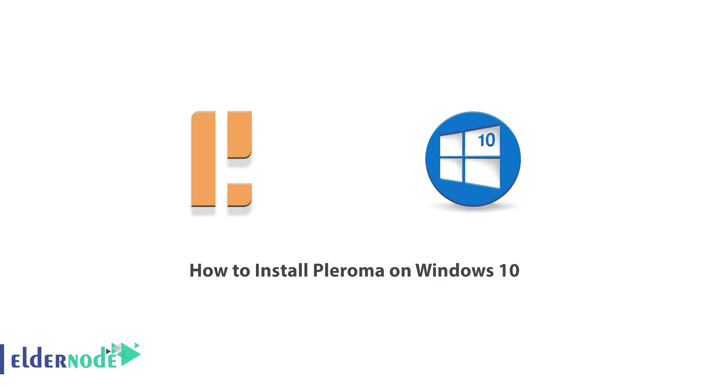

Pleroma 是一个免费的、联合许可的 AGPLv3 社交网络平台，兼容 Mastodon 和其他 ActivityPub 实现。应该注意的是，Pleroma 由两个组件组成，一个是后端的 Pleroma，另一个是面向用户的前端的 Pleroma-FE。它还包括乳齿象前端，如果那是你的东西。一个实例上的一个账号就足以和全世界对话！在这篇文章中，我们将一步一步地教你如何在 Windows 10 上安装 Pleroma。如果你想买一台 [Windows VPS](https://eldernode.com/windows-vps/) 服务器，你可以在 [Eldernode](https://eldernode.com/) 看到可用的软件包。

## **教程在 Windows 10 上安装 Pleroma**

在下一节中，我们将一步步教你如何在 [Windows](https://blog.eldernode.com/tag/windows/) 10 上安装 Pleroma。我们也将解释如何管理罗马。请继续关注本文的其余部分。

## **在 Windows 10 上安装 Pleroma**

在上一节熟悉了 Pleroma 之后，我们现在想教你如何在 Windows 10 上安装 Pleroma。为此，只需遵循以下步骤。

第一步是访问 [Pleroma 网站](https://docs.pleroma.social/backend/clients/)。然后，如下图所示，在打开的窗口中，点击**源代码**前面的链接。

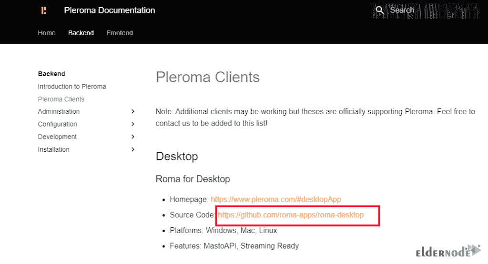

在打开的页面中，滚动到页面底部，点击**窗口**部分的**发布页面**。

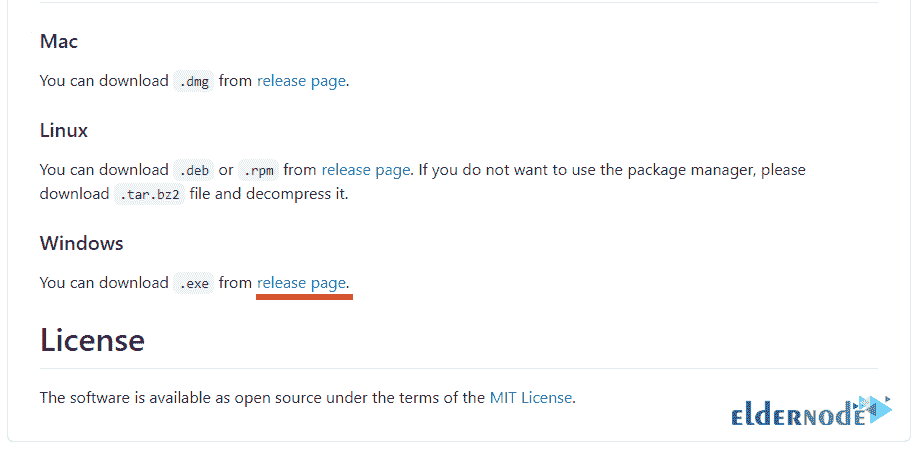

正如您在下图中看到的，Pleroma 的最新版本显示在页面顶部。

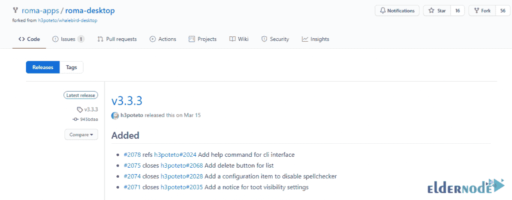

滚动到页面中间，单击要开始下载的平台:

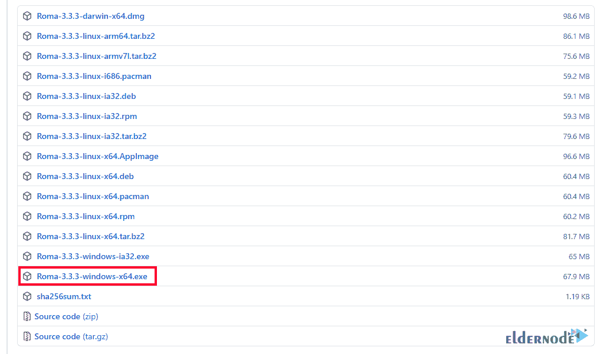

转到下载文件的位置。然后双击安装文件开始安装过程。在打开的窗口中，点击**运行**。

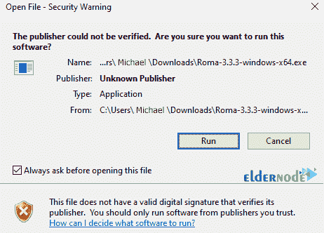

在下一部分，选择您想要的选项并点击**下一个**:

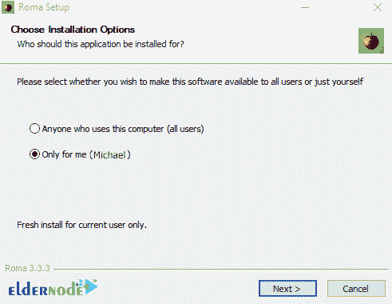

下一步是选择安装 Pleroma 的路径。选择该目的地路线后，点击下一个的**:**

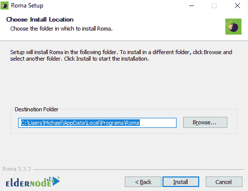

等待安装完成:

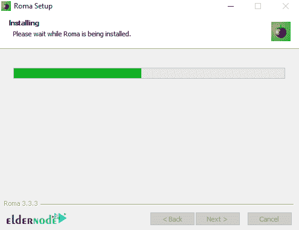

最后，点击**完成**，Pleroma 安装完成:

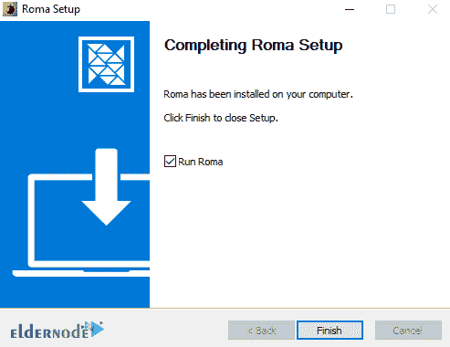

### **如何在 Windows 10 上使用 Pleroma**

当你按照上面的步骤完成了 Pleroma 的安装后，现在我们来看看如何运行它。为此，你可以在 Windows 的**开始菜单**搜索部分输入并运行 **Roma** 。

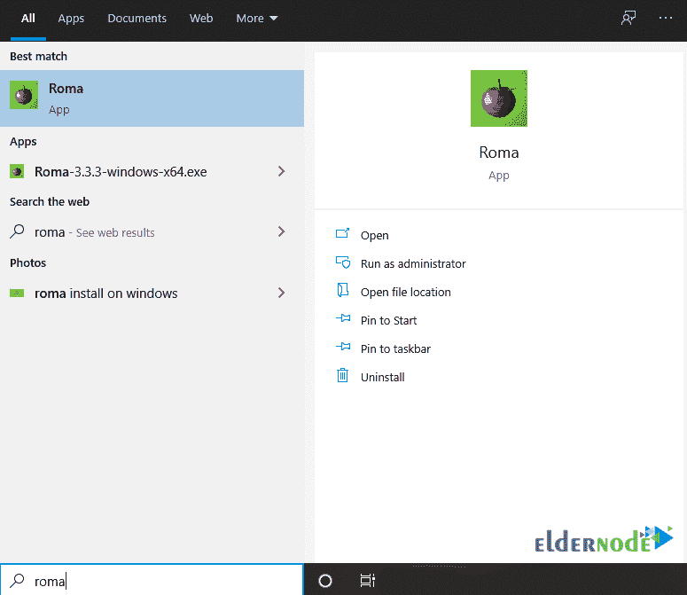

在下图中，你可以看到罗姆人的环境。在这个步骤中，需要输入一个**服务器域名**。然后，您就可以登录并使用它了。

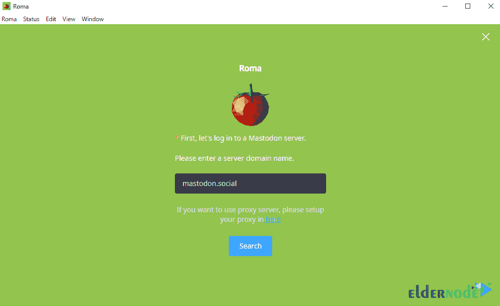

## 结论

在这篇文章中，我们试图教你如何一步一步地在 Windows 10 上安装 Pleroma。我们还解释了如何运行和设置 Roma。