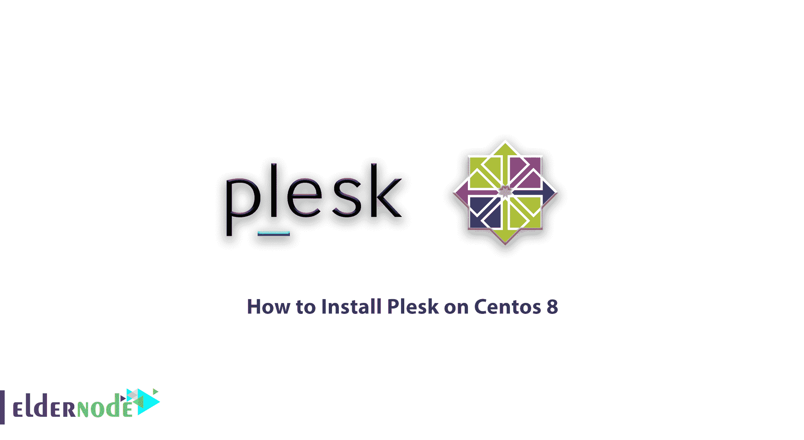
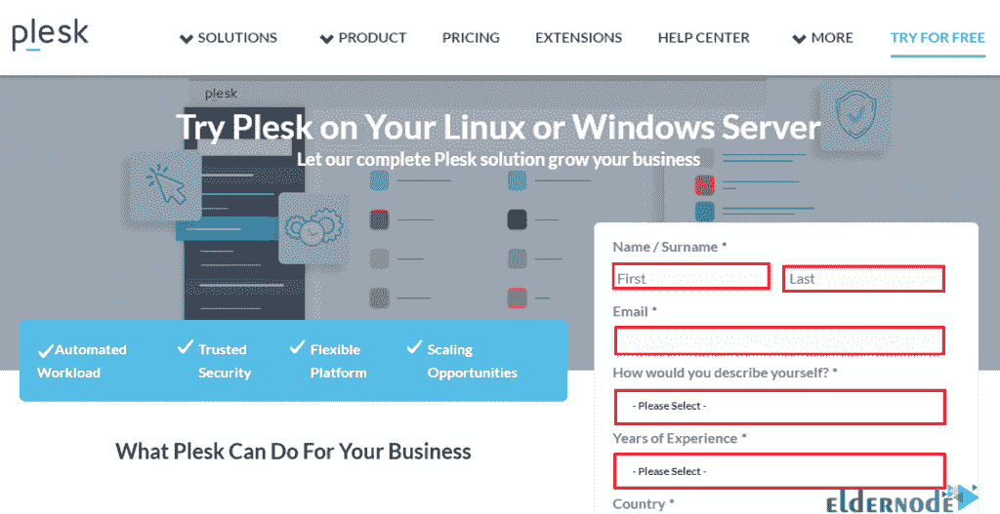
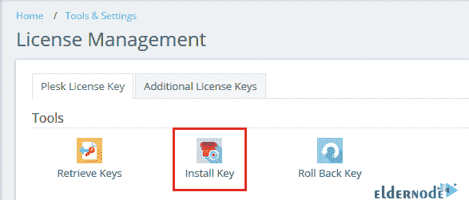
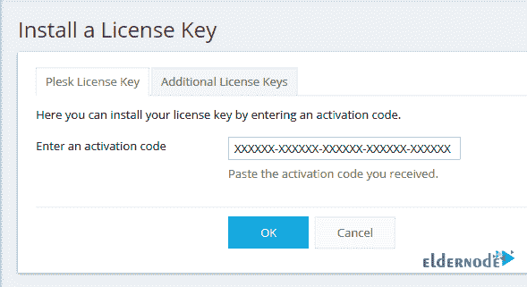

# 如何在 Centos 8[完整版] - Eldernode 博客上安装 Plesk

> 原文：<https://blog.eldernode.com/install-plesk-on-centos-8/>



逐步了解如何在 Centos 8 或 centos 7 Linux 服务器上安装 Plesk。 [Plesk](https://blog.eldernode.com/tag/plesk/) 是最流行的虚拟主机控制面板之一。此控制面板允许用户通过浏览器使用 web 控制面板轻松管理网站、数据库、电子邮件和域。该软件于 2001 年由 Plesk 在俄罗斯首次发布，并于 2003 年出售给 SWSoft，2008 年更名为 Parallels，2015 年 12 月成为一项独立业务。Plesk 是一款为基于 [Linux](https://blog.eldernode.com/tag/linux/) 和 [Windows](https://blog.eldernode.com/tag/windows/) 的虚拟主机提供商设计的商业虚拟主机自动化软件。它还允许服务器管理员通过图形用户界面控制新网站、经销商、电子邮件帐户和 DNS 记录。该控制面板设计用于在[专用服务器](https://eldernode.com/dedicated-server/)上安装和管理所需的虚拟主机系统和应用程序。管理员还可以为客户创建控制面板主机，或者为不同的域或客户设置资源分配参数。

在本文中，我们试图教你如何在 Centos 8 上安装 Plesk。你可以访问 [Eldernode](https://eldernode.com/) 提供的套装来购买 [CentOS VPS](https://eldernode.com/centos-vps/) 服务器。

## 如何在 Centos 8 上安装 Plesk

## 教程在 Centos 8 上安装 Plesk

最初，Plesk 控制面板是为 Windows 操作系统开发的，现在它被认为是 Windows 操作系统中最好和最受欢迎的控制面板之一。用户在 Linux 上安装一个控制面板有很多选择，比如 Cpanel 和 [DirectAdmin](https://blog.eldernode.com/tag/directadmin/) ，但是由于流畅度和一些特性，用户开始转向在 Linux 上安装 Plesk。这就是为什么我们决定在本教程中教你如何在 Centos 8 上安装 Plesk。请继续关注我们的这篇文章。

***注意:*** Plesk 控制面板是非免费面板，您必须获得相关许可证才能使用。但是安装使用 14 天，公司给你一个临时许可证，测试后买原来的许可证。

## 在 CentOS 上安装 Plesk 的步骤

在 CentOS Linux 上安装 Plesk 有 3 个主要步骤，如下所示:

**1-** 从 Plesk 网站获得为期 14 天的临时许可证

**2-** 安装先决条件并为安装 Plesk 准备空间

**3-** 在 CentOS 上安装 Plesk

### 如何从 Plesk 网站获得临时许可证

首先，进入 Plesk 网站，仔细输入要求的信息。

([获得 Plesk 控制面板的免费许可证](http://page.plesk.com/plesk-onyx-free-download))



注册后，激活序列将在有限的时间内发送到您的电子邮件。您将在安装和激活 Plesk 控制面板的最后需要它。

### 如何安装必备软件并准备安装 Plesk 的空间

***注意:*** 您必须有干净的 Linux 才能安装 Plesk 控制面板，否则您可能会在安装过程中遇到问题。

要准备和**清理**您的 **CentOS Linux** ，请按顺序输入以下命令:

```
package-cleanup --dupes
```

```
package-cleanup --cleandupes
```

然后使用下面的命令清理 **Yum** 并更新现有的包:

```
yum clean all
```

```
yum update -y
```

更新后输入以下命令清除 **Apache** 、 **MYSQL** 、 **Cyrus** 和 **php** 。

***注意:*** 注意，如果安装了 CentOS Linux 上列出的任何项目，您将会遇到安装错误。

```
yum remove http*
```

```
yum remove php*
```

```
yum remove cyrus*
```

```
yum remove mysql*
```

如果您使用的是 **CentOS 8** ，使用以下命令安装 **wget 包**:

```
yum install wget -y
```

执行上述命令后，使用 reboot 命令重新启动 CentOS Linux 一次:

```
reboot
```

CentOS 启动后，输入以下命令**禁用 SELinux** :

```
setenforce 0
```

## 了解如何在 Centos 8 上安装 Plesk

**A.** 首先输入以下命令下载 Plesk 文件:

```
wget http://autoinstall.plesk.com/plesk-installer
```

**C.** 您现在可以通过输入以下命令来授予脚本执行权限:

```
chmod 755 plesk-installer
```

**D.** 下载后，输入以下命令安装 Plesk 控制面板:

```
./plesk-installer
```

**E.** 现在你要等待 Plesk 被完全下载安装。完成 Plesk 的安装步骤后，会显示如下图所示的信息。复制链接并使用浏览器打开它:

***注意:*** 如果进入以上链接后无法打开页面，请停止您的防火墙服务。

**F.** 您可以使用以下命令让**停止 **CentOS 8** 中的防火墙**服务:

```
systemctl stop firewalld
```

**G.** 在**视图选择器**步骤中，选择您想要使用的 Plesk 和 shell 类型，点击**确定**。

**H.** 下一步，在**管理员偏好设置**部分，您需要为您的 Plesk 管理员用户输入一个**密码**。

**一、**在**管理员信息**部分，输入管理员用户的完整信息，然后点击**确定**。

**J.** 输入下一步的信息后，必须输入类似下图的**执照**。为此，点击**安装键**选项:



**K.** 在图片所示的字段中输入您从电子邮件中收到的许可证，然后单击**确定**:



**L.** 现在是时候在**创建你的网络空间**部分输入一个**用户名**和一个 [**密码**](https://blog.eldernode.com/password-protect-sites-in-plesk/) 使用 Plesk 了。

**M.** 片刻之后，您进入 **Plesk 控制面板**。

## 结论

Plesk 是当今世界上最流行的基于网络的控制面板之一，许多[托管](https://blog.eldernode.com/what-is-hosting-a-website-mean/)公司都使用这种控制面板。Plesk 中的简单配置使得虚拟主机提供商可以轻松管理一台服务器上的大量主机。Plesk 控制面板与 Cpanel 和 Direct Admin 等其他虚拟主机控制面板一样，有很多优点。在本文中，我们试图教你如何在 Centos 8 上安装 Plesk。