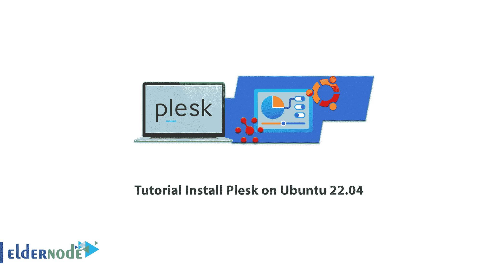
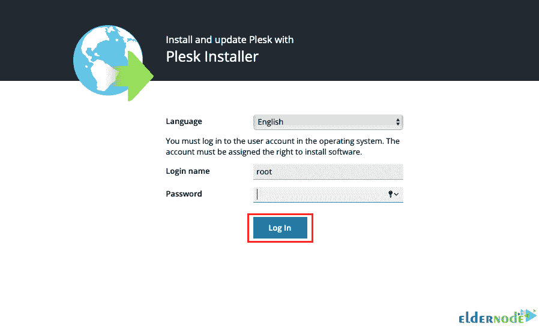
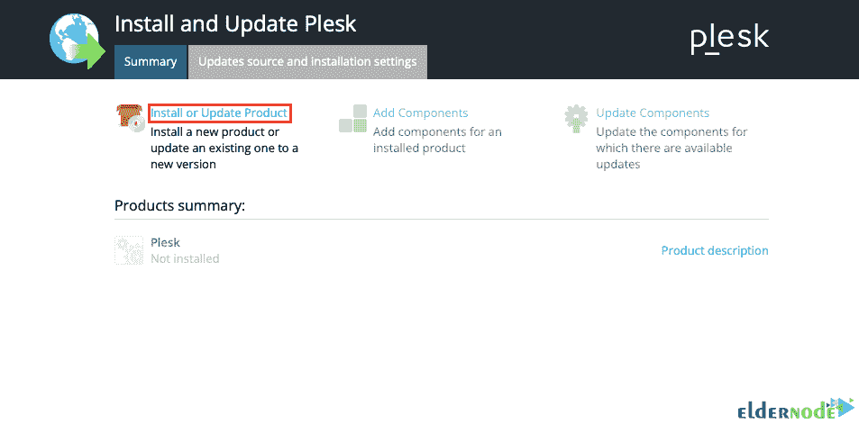
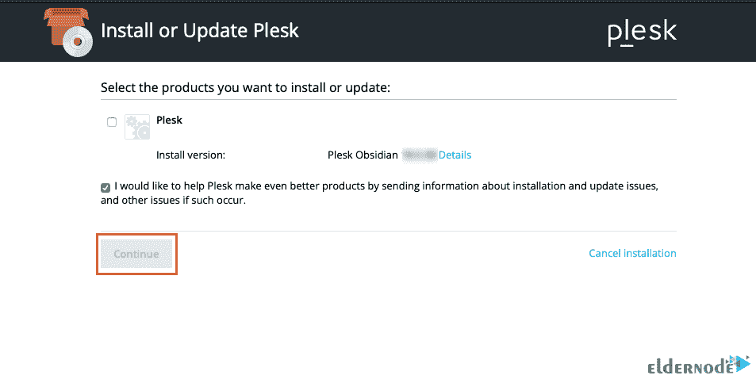
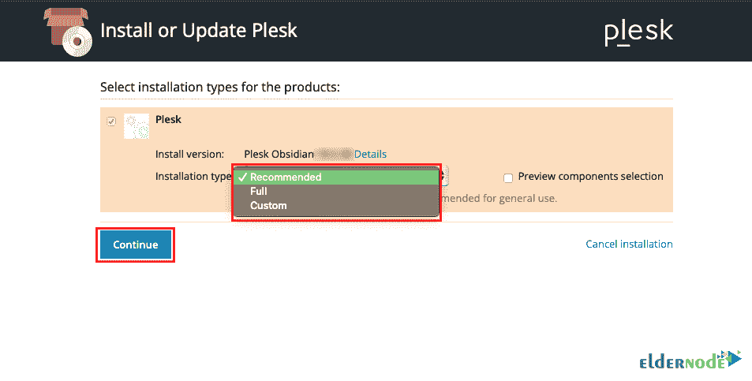
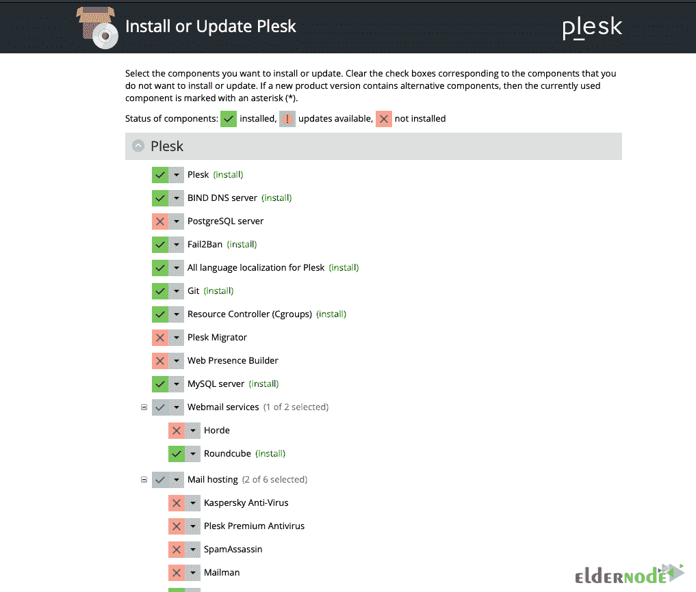
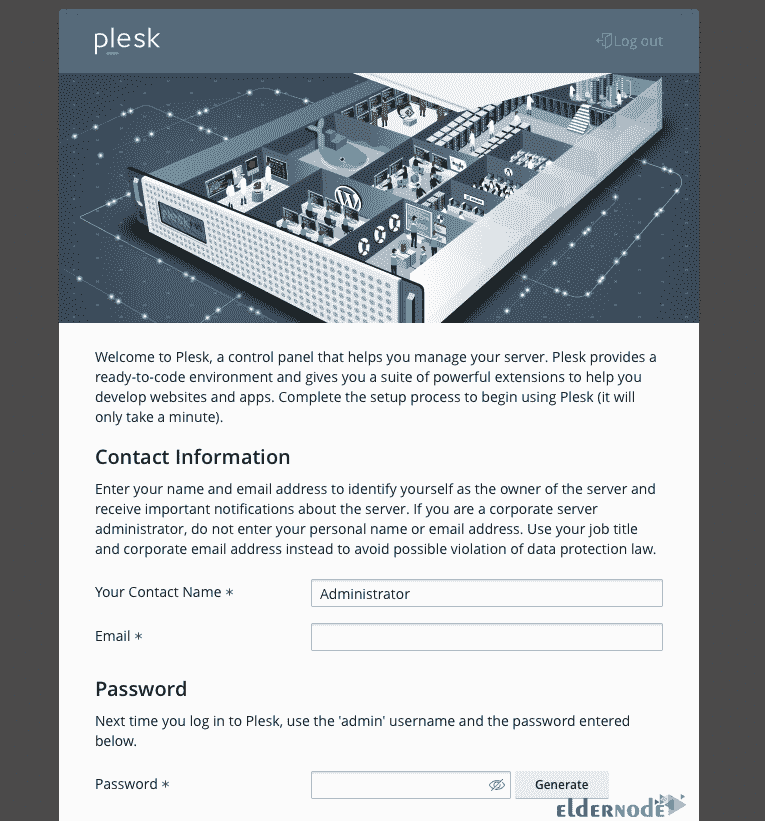
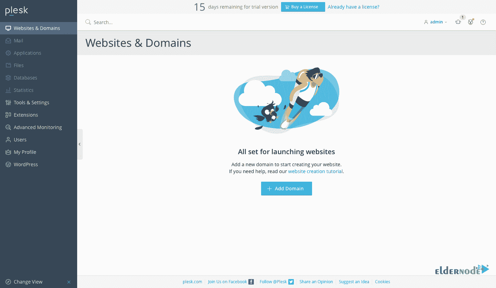

# 教程在 Ubuntu 22.04 上安装 Plesk-elder node 博客

> 原文：<https://blog.eldernode.com/install-plesk-on-ubuntu-22-04/>



如果你正在为你的 Linux 操作系统寻找一个功能控制面板， **Plesk** 可能是一个不错的选择。Plesk 控制面板是一个服务器软件，允许您共享服务器的物理资源，并通过图形 web 界面使用它们。加入我们这篇文章来学习**如何在 Ubuntu 22.04** 上安装 Plesk。你可以访问 [Eldernode](https://eldernode.com/) 中可用的包来购买一台 **[Ubuntu VPS](https://eldernode.com/ubuntu-vps/)** 服务器。

## **如何在 Ubuntu 服务器上设置 Plesk**

### **Plesk 控制面板介绍**

用户在 Linux 上安装控制面板有很多选择，如 cPanel 和 Direct Admin，但由于其流畅度， [Plesk](https://blog.eldernode.com/tag/plesk/) 控制面板被认为是 Linux 甚至 Windows 操作系统最好和最受欢迎的控制面板之一。

Plesk 的用户界面是常规的，使用起来更快更有效。这个控制面板也有一个强大的保护系统，以保护您的服务器免受垃圾邮件。

需要注意的是，Plesk 控制面板是非免费面板，您必须获得相关许可才能使用。你可以获得一个临时许可证，从公司购买原始许可证进行安装和使用 14 天。

### **如何从 Plesk 网站**购买临时许可证

您可以从 Plesk 网站获得 Plesk 控制面板 的免费许可证:


输入要求的信息并完成注册，然后您将通过电子邮件收到一个**激活序列**。您将在安装和激活 Plesk 控制面板的最后使用此序列号。

## **Plesk 在 Ubuntu 22.04 上的安装方法**

您可以通过两种方式在 Ubuntu 22.04 上安装 Plesk:

–>使用 Web 安装程序在 Ubuntu 22.04 上安装 Plesk

–>使用命令行在 Ubuntu 22.04 上安装 Plesk

### **如何在 Ubuntu 22.04 上使用 Web Installer 安装 Plesk**

首先登录到您的服务器，并通过以下命令**更新您的服务器**:

```
sudo apt-get update
```

使用以下命令**配置 UFW** 并允许 Plesk web 接口端口(80/tcp、443/tcp、8443/tcp 和 8880/tcp):

```
sudo ufw allow 80/tcp 
```

```
sudo ufw allow 443/tcp 
```

```
sudo ufw allow 8443/tcp 
```

```
sudo ufw allow 8880/tcp 
```

```
sudo ufw enable 
```

```
sudo ufw reload
```

现在，您应该通过以下命令**下载 Plesk 安装程序**:

```
wget https://autoinstall.plesk.com/plesk-installer
```

您可以使用以下命令在下载的脚本上启用读取、写入和执行选项:

```
sudo chmod 755 plesk-installer
```

运行以下命令**启动 Plesk** web 安装界面:

```
sudo ./plesk-installer --web-interface
```

**输出**将如下所示:

```
Web interface is now started.  Please visit <https://example.com:8447/> in your browser.
```

### **如何在 Ubuntu 22.04 上访问 Plesk**

打开网络浏览器，并在**端口 8447** 上进入**您的 IP 服务器**，然后进行如下操作:

```
https://example.com:8447/
```

然后，要开始安装 Plesk，请输入您的主服务器帐户的详细信息，开始 Plesk 安装过程:



点击**安装或更新产品**配置您的 Plesk 版本:



选择您想要的 **Plesk 版本**并点击**继续**:



安装选项如下:

–>**推荐**:安装 Plesk 默认组件。

–>**完全**:安装所有支持的应用程序和功能。

–>**自定义**:选择您想要安装在 plesk panel 上的**组件**。

选择相关选项后，点击**继续**:



选择**推荐**或**完全**选项将自动启动 Plesk 安装过程。

通过选择**自定义**选项，您将看到可在 Plesk 服务器上安装的组件列表:



选择组件后，点击**继续**开始安装过程。

一旦安装完成，进入终端会话并按下 **CTRL+C** 来停止脚本。

然后**重启**你的服务器:

```
sudo shutdown -r 0
```

使用 SSH 在终端中连接到服务器。您将看到以下消息:

```
This server is powered by Plesk.
```

```
Run the 'plesk login' command and log in by browsing either of the links received in the output.  Use the 'plesk' command to manage the server. Run 'plesk help' for more info.
```

要获得一次性登录链接，运行 **Plesk 登录**命令，然后创建一个 **Plesk 管理账户**并输入您的**许可密钥**。

完成所需信息并接受许可协议后，按**进入 Plesk** 。

您可以使用 HTTPS 在 8443 端口访问 Plesk 控制面板，或使用不安全的 HTTP 服务器在 8880 端口访问:

```
https://your.server.example.com:8443 
```

```
http://your.server.example.com:8880
```

### **如何在 Ubuntu 22.04 上使用命令行安装 Plesk**

首先通过以下命令下载 Plesk 安装程序脚本:

```
wget https://autoinstall.plesk.com/plesk-installer
```

使用以下命令授予脚本读取、写入和执行权限:

```
sudo chmod +x plesk-installer
```

然后通过以下命令运行脚本:

```
sudo ./plesk-installer
```

然后按照安装程序的要求去做:

–>键入 **"F"** 同意条款和条件。

–>键入 **"Y"** 发送有关 Plesk 出现的问题的信息，包括安装和升级问题。

–>键入 **"F"** 查看安装类型。

–>键入 **"S"** 查看要安装的软件包列表。

–>最后键入 **"F"** 继续。

完成 Plesk 安装过程后，**创建一个管理员帐户**。打开 web 浏览器，转到安装工具显示的一个网址。您还可以使用以下命令创建一组新的登录链接:

```
sudo plesk login
```

创建帐户后，输入 Plesk 许可证密钥:



如前所述，您可以按以下顺序访问 Plesk 控制面板:

```
https://your.server.example.com:8443 
```

```
http://your.server.example.com:8880
```

您可以免费试用 Plesk 15 天，但您可以通过点击**已经有许可证**选项卡输入您购买的许可证。



## 结论

正如我们所评论的，在 Linux 中使用的一个集中的虚拟主机管理工具和最好的控制面板是 Plesk。在本文中，您学习了在 Ubuntu 22.04 上安装 Plesk 的两种方法。