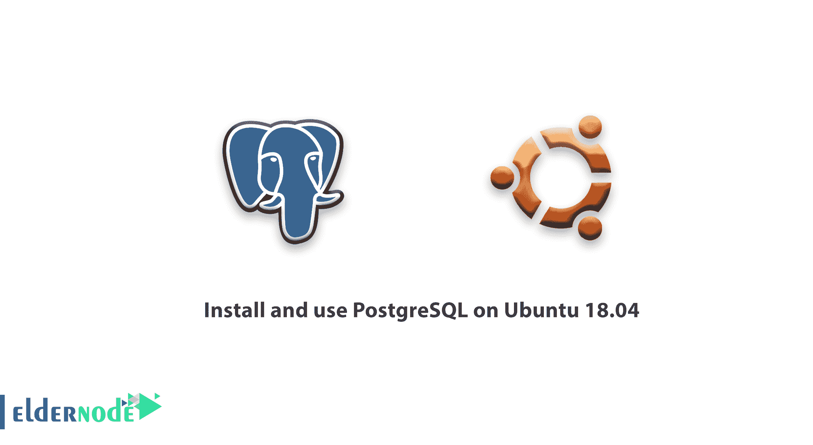

# 教程在 Ubuntu 18.04 上安装和使用 PostgreSQL-elder node

> 原文：<https://blog.eldernode.com/install-postgresq-ubuntu-18-04/>



PostgreSQL(简称 Postgres)是一个开源的、强大的、先进的、高性能的、稳定的关系文档数据库系统。它使用并增强了 SQL 语言以及大量用于安全数据存储和管理的功能。

它高效、可靠、可扩展，可用于处理大量复杂的数据，建立企业级容错环境，同时确保高度的数据完整性。Postgres 也是高度可扩展的，具有 API 附带的索引等特性，因此您可以开发自己的解决方案来解决您的数据存储挑战。

关系数据库管理系统是许多网站和应用程序的关键组件。它们提供了一种结构化的方式来存储、组织和访问信息。PostgreSQL 或 Postgres 是一个关系数据库管理系统，它提供了 SQL 查询语言的实现。对于许多小型和大型项目来说，这是一个受欢迎的选择，它的优点是符合标准，并具有许多高级功能，如可靠的事务和无读锁的并发性。

为了让你的学习更好地进行，选择你自己的 [Ubuntu VPS 服务器](https://eldernode.com/ubuntu-vps/)并立即激活。

为了让本教程更好地发挥作用，请考虑以下**先决条件**:

按照本教程，你将需要一个已经按照我们的[Ubuntu 18.04](https://eldernode.com/initial-setup-ubuntu-18/)初始服务器设置指南配置的 **Ubuntu 18.04** 服务器。

完成这个先决教程后，你的服务器应该有一个非 **root** 用户，拥有 **sudo** 权限和一个基本防火墙。

## 教程在 Ubuntu 18.04 上安装和使用 PostgreSQL

在本文中，您将学习如何在一个 **Ubuntu 18.04** VPS 实例上安装 Postgres，并且还提供了基本的 [数据库管理](https://nl.wikipedia.org/wiki/Database_administrator) 的说明。

### 步骤 1–如何安装 PostgreSQL

Ubuntu 的默认库包含 Postgres 包，所以你可以使用 **apt** 打包系统来安装这些包。

由于这是您第一次在此会话中使用 **apt** ，请刷新您的本地包索引。然后，安装 Postgres 包以及一个 **-contrib** 包，该包添加了一些额外的实用程序和功能:

```
sudo apt update  sudo apt install postgresql postgresql-contrib
```

现在软件已经安装好了，你可以回顾一下它是如何工作的，以及它与你用过的类似的数据库管理系统有什么不同。

### 步骤 2–如何使用 PostgreSQL 角色和数据库

默认情况下，Postgres 使用一个叫做“角色”的概念来处理认证和授权。在某些方面，这些类似于常规的 Unix 风格的帐户，但是 Postgres 不区分用户和组，而是更喜欢更灵活的术语“角色”。

安装时，Postgres 被设置为使用 ident 身份验证，这意味着它将 Postgres 角色与匹配的 Unix/Linux 系统帐户相关联。如果 Postgres 中存在一个角色，则具有相同名称的 Unix/Linux 用户名可以作为该角色登录。

安装过程创建了一个名为 **postgres** 的用户帐户，该帐户与默认 postgres 角色相关联。为了使用 Postgres，您可以登录该帐户。

有几种方法可以利用这个帐户访问 Postgres。

### 如何切换到 postgres 账户

通过键入以下命令切换到服务器上的 **postgres** 帐户:

```
sudo -i -u postgres
```

现在，您可以通过键入以下命令来立即访问 Postgres 提示符:

```
psql
```

这将使您登录到 PostgreSQL 提示符，从这里您可以立即与数据库管理系统进行交互。

通过键入以下命令退出 PostgreSQL 提示符:

```
postgres=# \q
```

这将把你带回 **postgres** Linux 命令提示符。

### 不切换账号如何进入 Postgres 提示

你也可以用 **sudo** 直接用 **postgres** 账号运行你喜欢的命令。

例如，在最后一个例子中，首先切换到 **postgres** 用户，然后运行 **psql** 来打开 Postgres 提示符。您可以通过使用 **sudo** 作为 **postgres** 用户运行单个命令 **psql** 来一步完成，如下所示:

```
sudo -u postgres psql
```

这将使你直接登录 Postgres，中间没有中介 **bash** shell。

同样，您可以通过键入以下命令退出交互式 Postgres 会话:

```
postgres=# \q
```

### 步骤 3–如何创建新角色

目前，您只是在数据库中配置了 **postgres** 角色。您可以从命令行使用 **createrole** 命令创建新角色。**–交互式** 标志将提示您输入新角色的名称，并询问它是否应该具有超级用户权限。

如果您以 **postgres** 帐户登录，您可以通过键入以下命令创建一个新用户:

```
[[email protected]](/cdn-cgi/l/email-protection):~$  createuser --interactive
```

相反，如果您更喜欢使用 **sudo** 来执行每个命令，而不切换您的普通帐户，请键入:

```
sudo -u postgres createuser --interactive
```

该脚本将提示您一些选择，并根据您的回答，执行正确的 Postgres 命令来创建符合您的规范的用户。

输出

```
Enter name of role to add: noodi  Shall the new role be a superuser? (y/n) y
```

您可以通过传递一些额外的标志来获得更多的控制。通过查看 **man** 页面查看选项:

```
man createuser
```

***注*** :我们选择 noodi 作为用户名。**不要忘记在命令行提示中替换你考虑的名字或电子邮件。**

您的 Postgres 安装现在有了一个新用户，但是您还没有添加任何数据库。下一节将描述这个过程。

### 步骤 4–如何创建新数据库

Postgres 身份验证系统默认做出的另一个假设是，对于用于登录的任何角色，该角色都将拥有一个其可以访问的同名数据库。

这意味着，如果您在上一节中创建的用户名为 **noodi** ，该角色将尝试连接到一个默认情况下也称为“noodi”的数据库。你可以用 **createdb** 命令创建合适的数据库。

如果您以 **postgres** 帐户的身份登录，您应该键入如下内容:

```
[[email protected]](/cdn-cgi/l/email-protection):~$ createdb noodi
```

如果您更喜欢使用 **sudo** 来执行每个命令，而不切换您的普通帐户，您可以键入:

```
sudo -u postgres createdb noodi
```

这种灵活性为根据需要创建数据库提供了多种途径。

### ``步骤 5–如何使用新角色打开 Postgres 提示``

``要使用基于 **ident** 的认证登录，您需要一个与您的 Postgres 角色和数据库同名的 Linux 用户。``

``如果没有匹配的 Linux 用户，可以用 **adduser** 命令创建一个。你必须从你的非 **root** 帐户使用 **sudo** 权限(意思是，不是以 **postgres** 用户身份登录)来完成这项工作:``

```
``sudo adduser noodi``
```

``一旦这个新帐户可用，您可以通过键入以下命令切换并连接到数据库:``

```
``sudo -i -u noodi  psql``
```

``或者，您可以内联执行此操作:``

```
``sudo -u noodi psql``
```

``假设所有组件都已正确配置，此命令将自动让您登录。``

``如果希望用户连接到不同的数据库，可以通过如下方式指定数据库:``

```
``psql -d postgres``
```

``登录后，您可以通过键入以下命令来检查您当前的连接信息:``

```
``noodi=# \conninfo``
```

``输出``

```
``You are connected to database "noodi" as user "noodi" via socket in "/var/run/postgresql" at port "5432".``
```

``如果您连接到非默认数据库或非默认用户，这将非常有用。``

### ``步骤 6–如何创建和删除表格``

``现在您已经知道了如何连接到 PostgreSQL 数据库系统，您可以学习一些基本的 Postgres 管理任务。``

``首先，创建一个表来存储一些数据。举个例子，一个描述一些操场设备的表格。``

``该命令的基本语法如下:``

```
``CREATE TABLE table_name (      column_name1 col_type (field_length) column_constraints,      column_name2 col_type (field_length),      column_name3 col_type (field_length)  );``
```

``如您所见，这些命令为表命名，然后定义列、列类型和字段数据的最大长度。您还可以选择为每列添加表约束。``

``出于演示目的，创建一个简单的表，如下所示:``

```
``CREATE TABLE playground (      equip_id serial PRIMARY KEY,      type varchar (50) NOT NULL,      color varchar (25) NOT NULL,      location varchar(25) check (location in ('north', 'south', 'west', 'east', 'northeast', 'southeast', 'southwest', 'northwest')),      install_date date  );``
```

``这些命令将创建一个盘点操场设备的表。这从一个设备 ID 开始，它是 **序列号** 类型的。此数据类型是自动递增的整数。您还为该列赋予了 **主键** 的约束，这意味着值必须是惟一的并且不为空。``

``对于两列(**和 **安装日期** )，命令不指定字段长度。这是因为有些列类型不需要固定长度，因为长度是由类型决定的。**``

``**接下来的两个命令分别为设备 **类型** 和 **颜色** 创建列，每个列都不能为空。之后的命令创建了一个 **位置** 列，并创建了一个要求该值为八个可能值之一的约束。最后一个命令创建一个日期列，记录设备的安装日期。**``

``**您可以通过键入以下命令来查看新表:**``

```
`**`noodi=# \d`**`
```

``**输出**``

```
 `**`List of relations   Schema |          Name           |   Type   | Owner   --------+-------------------------+----------+-------   public | playground              | table    | noodi   public | playground_equip_id_seq | sequence | noodi  (2 rows)`**`
```

``**你的游戏桌在这里，但是还有一个名为 **的游戏桌 _ 装备 _ id _ 序列** 是类型 **序列** 。这是你给你的 **equip_id** 列的 **序列号** 类型的表示。这将跟踪序列中的下一个数字，并为此类型的列自动创建。**``

``**如果您只想查看没有序列的表格，可以键入:**``

``**输出**``

```
`**`noodi=# \d`**`
```

``**第 7 步-表中数据的增加、查询、删除**``

```
 `**`List of relations   Schema |    Name    | Type  | Owner   --------+------------+-------+-------   public | playground | table | noodi  (1 row)`**` 
```

### ``**`现在您有了一个表，您可以向其中插入一些数据。`**``

``**`例如，通过调用要添加的表，命名列，然后为每列提供数据，来添加幻灯片和 swing，如下所示:`**``

``**`输入数据时应该小心，以避免一些常见的问题。首先，不要用引号将列名括起来，但是输入的列值需要引号。`**``

```
`**``noodi=# INSERT INTO playground (type, color, location, install_date) VALUES ('slide', 'blue', 'south', '2017-04-28');``**`
```

```
**``noodi=# INSERT INTO playground (type, color, location, install_date) VALUES ('swing', 'yellow', 'northwest', '2018-08-16');``**
```

```另一件要记住的事情是，不要为 **equip_id** 列输入值。这是因为每当在表中创建新行时都会自动生成。```

```通过键入以下内容检索您添加的信息:```

```输出```

```
````noodi=# SELECT * FROM playground;````
```

**``在这里，您可以看到您的 **equip_id** 已经成功填写，并且您的所有其他数据都已正确组织。``**

```
 ```equip_id | type  | color  | location  | install_date   ----------+-------+--------+-----------+--------------          1 | slide | blue   | south     | 2017-04-28          2 | swing | yellow | northwest | 2018-08-16  (2 rows)```
```

**``如果操场上的滑梯坏了，您必须移除它，您也可以通过键入以下命令从表格中移除该行:``**

**``再次查询该表:``**

```
```noodi=# DELETE FROM playground WHERE type = 'slide';```
```

**``输出``**

```
```noodi=# SELECT * FROM playground;```
```

**``您注意到您的幻灯片不再是表格的一部分。``**

```
 ```equip_id | type  | color  | location  | install_date   ----------+-------+--------+-----------+--------------          2 | swing | yellow | northwest | 2018-08-16  (1 row)```
```

**``步骤 8–如何在表格中添加和删除列``**

### ```创建表后，您可以修改它，以便相对容易地添加或删除列。通过键入以下内容，添加一列以显示每台设备的最后一次维护访问:```

```如果再次查看您的表信息，您将看到新列已被添加(但没有输入任何数据):```

```
````noodi=# ALTER TABLE playground ADD last_maint date;````
```

**``输出``**

```
```noodi=# SELECT * FROM playground;```
```

**``删除列也一样简单。如果您发现您的工作团队使用单独的工具来跟踪维护历史，您可以通过键入以下内容来删除该列:``**

```
 ```equip_id | type  | color  | location  | install_date | last_maint   ----------+-------+--------+-----------+--------------+------------          2 | swing | yellow | northwest | 2018-08-16   |   (1 row)```
```

**``这将删除 **last_maint** 列以及在其中找到的任何值，但保留所有其他数据不变。``**

```
```noodi=# ALTER TABLE playground DROP last_maint;```
```

**``步骤 9–如何更新表格中的数据``**

### **``到目前为止，您已经学习了如何向表中添加记录以及如何删除记录，但是本教程还没有介绍如何修改现有的条目。``**

**``您可以通过查询所需的记录并将该列设置为您希望使用的值来更新现有条目的值。您可以查询“swing”记录(这将匹配表中每个 swing 的*)并将其颜色更改为“红色”。如果您给秋千一个油漆工作，这可能是有用的:*``**

**``您可以通过再次查询数据来验证操作是否成功:``**

```
```noodi=# UPDATE playground SET color = 'red' WHERE type = 'swing';```
```

**``输出``**

```
```noodi=# SELECT * FROM playground;```
```

**``如您所见，您的幻灯片现在显示为红色。``**

```
 ```equip_id | type  | color | location  | install_date   ----------+-------+-------+-----------+--------------          2 | swing | red   | northwest | 2010-08-16  (1 row)```
```

**``结论``**

## **``在本文中，完成本指南的步骤后，您成功地学会了如何在 Ubuntu 18.04 上安装和使用 PostgreSQL。现在你已经在你的 Ubuntu 18.04 服务器上设置了 **PostgreSQL** 。然而，Postgres**还有很多东西要学。如果有兴趣阅读更多相关教程，可以找我们的文章[教程 PostgreSQL 安装 Ubuntu 20.04](https://blog.eldernode.com/tutorial-postgresql-installation-ubuntu-20/) **和** [如何在 Debian 10 中安装 PostgreSQL 数据库](https://blog.eldernode.com/install-postgresql-debian10/)。**``**

**``在本文中，完成本指南的步骤后，您成功地学会了如何在 Ubuntu 18.04 上安装和使用 PostgreSQL。现在你已经在你的 Ubuntu 18.04 服务器上设置了 **PostgreSQL** 。然而，Postgres**还有很多东西要学。如果有兴趣阅读更多相关教程，可以找我们的文章[教程 PostgreSQL 安装 Ubuntu 20.04](https://blog.eldernode.com/tutorial-postgresql-installation-ubuntu-20/) **和** [如何在 Debian 10 中安装 PostgreSQL 数据库](https://blog.eldernode.com/install-postgresql-debian10/)。**``**