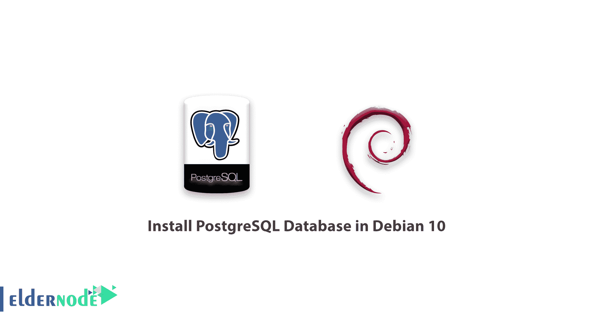

# 如何在 Debian 上安装 Debian 10 - postgre 中的 PostgreSQL 数据库

> 原文：<https://blog.eldernode.com/install-postgresql-debian10/>



为了教授更多关于 PostgreSQL 的知识，在这篇文章中，你将学习如何在 Debian 10 中安装 PostgreSQL 数据库。PostgreSQL 是最先进的开源通用和对象关系数据库系统，具有可在所有主流操作系统上运行的成熟架构。

此外，它是一个高性能、稳定、可伸缩和可扩展的数据库系统，提供惊人的数据完整性并支持强大的附加组件。

最重要的特性之一是 **PostgreSQL** 允许你定义自己的数据类型，添加自定义函数，甚至从不同的[编程语言](https://en.wikipedia.org/wiki/Programming_language#:~:text=A%20programming%20language%20is%20a,consist%20of%20instructions%20for%20computers.)如 C/C++、Java 等编写代码，而无需重新编译你的数据库。

#### 要求:

[Debian 10 的初始设置](https://eldernode.com/initial-setup-with-debian-10/)

## 如何在 Debian 10 中安装 PostgreSQL 数据库

遵循这个指南来学习如何在 **Debian 10** 中安装、保护和配置 **PostgreSQL** 数据库服务器。

了解 PostgreSQL 正在被知名的科技公司使用，如苹果、富士通、红帽、思科、瞻博网络等，这是很有用的。

[购买 Linux 虚拟私有服务器](https://eldernode.com/linux-vps/)

### 在 Debian 10 上安装 PostgreSQL 服务器

首先，通过键入以下命令安装 **PostgreSQL** 数据库服务器:

```
apt install postgresql-11 postgresql-client-11 
```

**点** :在 **Debian** 上，和其他任何守护进程一样， **Postgres** 数据库在软件包安装完成后立即初始化。

您可以使用检查 PostgreSQL 服务器连接状态的 **pg_isready** 实用程序来检查 **Postgres** 数据库是否真正初始化。

```
pg_isready
```

同样，在 **systemd** 下， **Postgres** 服务也会自动启动，并在系统引导时启动。为了确保服务正常运行，运行下面的命令。

```
systemctl status postgresql 
```

使用以下有用的命令来管理 systemd 下的 Postgres 服务。

```
systemctl start postgresql  systemctl restart postgresql  systemctl stop postgresql  systemctl reload postgresql 		this reloads the service configuration
```

不要错过相关文章。

**[Windows Server 上的 PostgreSQL 安装教程 2016](https://eldernode.com/postgresql-installation-tutorial/)**

### 保护和配置 PostgreSQL 数据库

Postgres 使用角色的概念来管理数据库访问权限，默认情况下，数据库角色在概念上与操作系统用户完全分离。

更详细地说，用户是可以是用户或组的角色，并且是具有登录权限的角色。

您需要保护 Postgres 系统用户帐户，因为它没有使用密码进行保护。为此，您可以使用 **passwd 实用程序**创建一个密码。

```
passwd postgres 
```

此外，默认情况下， **Postgres** 角色是不安全的。您还需要用密码来保护它。现在切换到如图所示的 **postgres** 系统用户账户和 **postgres** 角色。

**注意**:记得设置强和[安全密码](https://eldernode.com/how-to-create-strong-password/)和。

```
su - postgres  sql -c "ALTER USER postgres WITH PASSWORD 'securepass_here';"
```

现在，您可以退出 **postgres** 帐户，继续阅读指南。

### 配置客户端认证

在这一步中，您将查看主 **Postgres** 配置文件，该文件位于**/etc/PostgreSQL/11/main/PostgreSQL . conf .**除了这个文件， **Postgres** 使用另外两个手动编辑的配置文件，它们控制客户端认证。

要控制客户端验证，请使用**/etc/PostgreSQL/11/main/pg _ HBA . conf**配置文件。

Postgres 提供了许多不同的客户端认证方法，包括基于密码的认证。客户端连接基于客户端主机地址、数据库和用户进行身份验证

如果您想使用**基于密码的认证**，请尝试以下方法之一。

**md5** 或**密码**，除了密码通过连接传输的方式不同，操作类似，分别是 **MD5 哈希**和明文。

只有在连接受到 SSL 加密保护的情况下，才能安全地使用密码方法，但是使用 **md5 密码认证**可以避免黑客嗅探密码，并避免在服务器上以纯文本形式存储密码。

因此，要为客户端身份验证配置 **md5 密码身份验证**，请使用下面的命令。

```
vim /etc/postgresql/11/main/pg_hba.conf 
```

然后，要将身份验证方法更改为 **、md5** ，请查找以下代码行。

```
local   all             all                                     md5 
```

接下来，保存文件中的更改并退出。然后通过重新启动 **Postgres** 服务来应用最近的更改，如下所示。

```
systemctl restart postgresql 
```

### 在 PostgreSQL 中创建新的数据库和数据库角色/用户

最后，您将看到如何创建新的数据库用户和数据库角色来管理它。

现在，切换到 **postgres** 帐户，打开 Postgres shell，如下所示。

```
su - postgres  psql
```

然后，要创建一个名为**“test _ db”**的数据库，运行下面的 SQL 命令。

```
postgres=# CREATE DATABASE test_db; 
```

接下来，为了管理新数据库，创建一个数据库用户(具有登录权限的角色)

```
postgres=#CREATE USER test_user PASSWORD ‘[[email protected]](/cdn-cgi/l/email-protection)_here’;     #assumes login function by default 
```

运行以下命令，以用户 **test_user** 的身份连接到 **test_db** ，

```
psql -d  test_db  -U test_user 
```

**好样的** ！通过完成本教程，我们已经展示了如何在 **Debian 10 中安装、保护和配置 **PostgreSQL** 数据库服务器。**

亲爱的用户，我们希望本教程能对你有所帮助，如有任何问题或想查看我们的用户关于本文的对话，请访问 [提问页面](https://eldernode.com/ask) 。也是为了提高自己的见识，准备了这么多有用的教程给 [Eldernode 培训](https://eldernode.com/blog/) 。