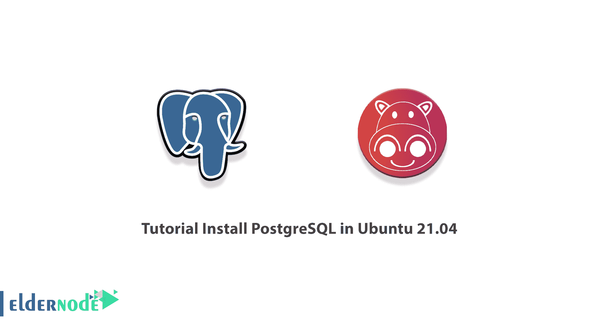

# 教程在 Ubuntu 21.04 中安装 PostgreSQL-elder node 博客

> 原文：<https://blog.eldernode.com/install-postgresql-in-ubuntu/>



PostgreSQL 只是一个数据库管理系统或 DBMS，针对不同类型的操作系统进行了优化。PostgreSQL 可以在各种型号的操作系统上安装和维护，如 Windows、Linux 和 macOS。在本文中，我们将一步一步教你关于**教程在 Ubuntu 21.04 中安装 PostgreSQL**。如果你想购买一台 [Ubuntu VPS](https://eldernode.com/ubuntu-vps/) 服务器，你可以访问 [Eldernode](https://eldernode.com/) 中提供的软件包。

## **如何在 Ubuntu 21.04 中安装 PostgreSQL**

PostgreSQL 是最先进的通用数据库管理系统之一，应该补充的是，它的代码是开源的。在下一节中，我们将有 PostgreSQL 的定义。然后我们会一步步教你如何在 Ubuntu 21.04 上安装 PostgreSQL，Ubuntu 21.04 是最新发布的 [Ubuntu](https://blog.eldernode.com/tag/ubuntu/) 。然后，我们将教您如何配置 PostgreSQL，最后，解释如何访问它。请继续关注本文的其余部分。

### **什么是 PostgreSQL？**

PostgreSQL 数据库是世界上最强大的开源数据库之一，强调灵活性和符合标准。

PostgreSQL 由 PostgreSQL 全球开发团队开发，该团队包括大量志愿者。应该注意，PostgreSQL 数据库是一个对象关系数据库管理系统，它针对不同类型的操作系统进行了优化。它还可以在各种型号的操作系统上安装和维护，如 Windows、 [Linux](https://blog.eldernode.com/tag/linux/) 和 macOS。

要在 Ubuntu 21.04 上安装 PostgreSQL，可以使用以下步骤。

## **在 Ubuntu 中安装 PostgreSQL 21.04 | 20.04**

在这一节，我们想教你如何在 Ubuntu 21.04 中安装 PostgreSQL。为此，只需按顺序运行以下命令。首先，您需要使用以下命令导入 PostgreSQL 的签名密钥:

```
wget -q https://www.postgresql.org/media/keys/ACCC4CF8.asc -O- | sudo apt-key add -
```

然后在下一步中，您必须使用以下命令将 PostgreSQL 存储库信息添加到 **Postgresql.list** 文件中:

```
echo "deb [arch=amd64] http://apt.postgresql.org/pub/repos/apt/ focal-pgdg main" | sudo tee /etc/apt/sources.list.d/postgresql.list
```

此时，您可以运行下面的命令来更新存储库列表:

```
sudo apt update
```

您现在可以通过运行以下命令轻松地**安装 PostgreSQL** :

```
sudo apt install -y postgresql-12
```

请注意，默认情况下，PostgreSQL 服务会在安装后自动启动。因此，您可以通过运行以下命令来检查 PostgreSQL 服务的**状态:**

```
sudo systemctl status postgresql
```

*注意:* 在上面的命令中，要用 start、stop、restart 分别替换 status 来启动、停止、重启 PostgreSQL 服务。

### **Ubuntu 21.04**如何配置 PostgreSQL

在本节中，我们将教您如何配置 PostgreSQL。请注意，PostgreSQL 服务器默认监听本地主机(127.0.0.1)。因此，您需要不时地配置 PostgreSQL 来监听所有适配器或系统的 IP 地址，以允许托管在外部机器上的应用程序连接到数据库。

使用所需的编辑器打开配置文件:

```
sudo nano /etc/postgresql/12/main/postgresql.conf
```

下一步，你需要将 listen_addresses 设置为 ***** 或者 **< IPAddress >** 。

```
listen_addresses = '*'
```

完成更改后，现在应该使用以下命令重新启动 PostgreSQL:

```
sudo systemctl restart postgresql
```

最后，您可以使用以下命令来验证 PostgreSQL 是否正在监听**端口 5432** :

```
sudo netstat -antup | grep 5432
```

### **如何在 Ubuntu 21.04 上访问 PostgreSQL**

根据前面几节中的说明成功安装和配置 PostgreSQL 后，我们现在想教您如何访问它。您必须首先以 **Postgres 用户**的身份登录来管理数据库:

```
sudo su -l postgres
```

然后，您可以很容易地使用以下命令进入交互式 shell 来使用 PostgreSQL 数据库:

```
psql
```

您可以使用以下命令来编写数据库:

```
postgres=# CREATE DATABASE test;
```

您还可以使用以下命令创建一个用户:

```
postgres=# CREATE USER Michael WITH SUPERUSER LOGIN PASSWORD 'password';
```

完成前面的步骤后，现在可以使用以下命令来检查用户是否已创建:

```
postgres=# \du
```

您还可以使用以下命令列出数据库:

```
postgres=# \l
```

您可以使用以下命令登录到数据库:

```
psql -h localhost -d test -U Michael
```

## 结论

除了数据库，还有维护数据库的服务。这些服务称为数据库管理系统或 DBMS。其中一个数据库管理系统叫做 PostgreSQL。在本文中，我们试图在介绍 PostgreSQL 之后，教大家如何在 Ubuntu 21.04 中安装 PostgreSQL。然后，我们教您如何配置和访问 PostgreSQL。