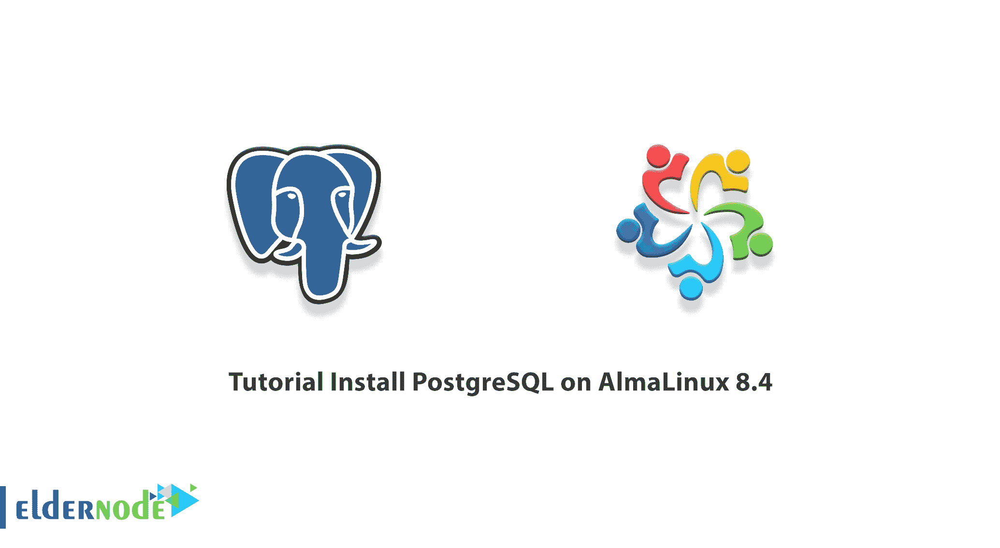

# 教程在 AlmaLinux 8.4 上安装 PostgreSQL-elder node 博客

> 原文：<https://blog.eldernode.com/install-postgresql-on-almalinux-8-4/>



PostgreSQL 在某些资料中被称为 Postgres，是世界上最强大的开源数据库之一。该数据库强调灵活性和符合标准。PostgreSQL 由 PostgreSQL 全球开发团队开发，该团队包括大量志愿者。Postgres 数据库是一个对象关系数据库管理系统，针对不同类型的操作系统进行了优化。它还可以在各种型号的操作系统上安装和维护，如 Windows、 [Linux](https://blog.eldernode.com/tag/linux/) 和 macOS。在这篇文章中，我们将教你**如何在 AlmaLinux 8.4** 上安装 PostgreSQL。你可以访问 [Eldernode](https://eldernode.com/) 中可用的包来购买一台 [**Linux VPS**](https://eldernode.com/linux-vps/) 服务器。

## **如何在 AlmaLinux 8.4 上安装 PostgreSQL**

### **什么是 PostgreSQL 及其特性？**

PostgreSQL 是一个数据库管理系统，很容易与 MySQL 数据库共享其受欢迎程度。这个 DBMS 被认为是一个对象关系数据库管理系统，其中用户定义的对象和表方法相结合，以建立更复杂的数据结构。其目标之一是加强合规性和开发标准。该 DBMS 由 PostgreSQL 全球开发组开发，是该组中唯一一个具有开源功能的 DBMS。该数据库管理系统主要应用于微软、iOS、Android 等平台系统。

PostgreSQL 具有以下特性:

**1。设计:** PostgreSQL 设计是集成的，但是 Mysql 设计是两层的(第一层是 SQL 层，第二层是存储引擎)。

**2。速度:**PostgreSQL 和 Mysql 的共同点之一就是速度。如何提高两者的速度因算法不同而不同。

**3。易用性:**专业用户易用的 PostgreSQL，普通用户易用的 Mysql。

**4。可靠性:** PostgreSQL 使用 ACID 结构比 Mysql 更安全。

### **在 AlmaLinux 8.4 上安装 PostgreSQL 的先决条件**

安装 PostgreSQL 的第一步是使用以下命令添加 PostgreSQL 存储库。请注意，PostgreSQL 的默认版本位于应用流 PostgreSQL 10 存储库中:

```
sudo dnf module list postgresql
```

在安装 PostgreSQL 最新版本的下一步中，您需要使用以下命令**安装 PostgreSQL YUM 存储库**:

```
sudo dnf install https://download.postgresql.org/pub/repos/yum/reporpms/EL-8-x86_64/pgdg-redhat-repo-latest.noarch.rpm
```

## **在 AlmaLinux 8.4 上安装 PostgreSQL**

在您安装了上一节中必需的先决条件之后，我们现在希望在 AlmaLinux 8.4 上安装 PostgreSQL。为此，只需遵循以下步骤。首先，**使用以下命令更新 Rocky Linux 存储库**:

```
sudo dnf update
```

您现在应该使用以下命令**禁用默认模块**:

```
sudo dnf -qy module disable postgresql
```

接下来，您需要通过运行以下命令来**安装 PostgreSQL 13** 客户端和服务器:

```
sudo dnf install postgresql13 postgresql13-server
```

***注意:*** 每次被要求输入 GPG 键时，你都需要键入“ **y** ”并按 **ENTER** 。

最后，您可以通过运行以下命令来验证 PostgreSQL 的状态:

```
psql -V
```

### **如何在 AlmaLinux 8.4 上启动 PostgreSQL**

在上一节中，我们向您展示了如何安装 PostgreSQL。现在我们想教你如何设置和启动 PostgreSQL。第一步是使用以下命令**启用 PostgreSQL** :

```
sudo systemctl enable postgresql-13
```

在下一步中，您可以使用以下命令**启动 PostgreSQL** :

```
sudo systemctl start postgresql-13
```

现在，您可以使用以下命令验证 PostgreSQL 是否正在运行:

```
sudo systemctl status postgresql-13
```

您可以使用下面的命令**初始化数据库**:

```
sudo /usr/pgsql-*/bin/postgresql-*-setup initdb
```

注意，在下一步中，您需要为 Postgres 用户创建一个密码。因此，您可以通过切换到 Postgres 用户来进入 PostgreSQL shell:

```
sudo su - postgres
```

现在，您可以使用以下命令访问数据库提示符:

```
psql
```

要使用密码保护 Postgres 用户，您需要以 sudo 用户的身份运行以下命令:

```
sudo passwd postgres
```

您现在可以输入并确认新密码。在下一步中，您必须使用以下命令以 Postgres 用户的身份再次登录:

```
su - postgres
```

最后，运行以下命令并输入您想要的密码，而不是“ **your-password** ”:

```
psql -c "ALTER USER postgres WITH PASSWORD 'your-password';"
```

从现在开始，如果你想登录，你必须验证:

```
su - postgres
```

## 结论

由于 PostgreSQL 数据库是开源的，它添加了许多函数、数据类型和操作符，这使得使用这个数据库非常简单。在本文中，我们试图教你如何在 AlmaLinux 8.4 上安装 PostgreSQL。