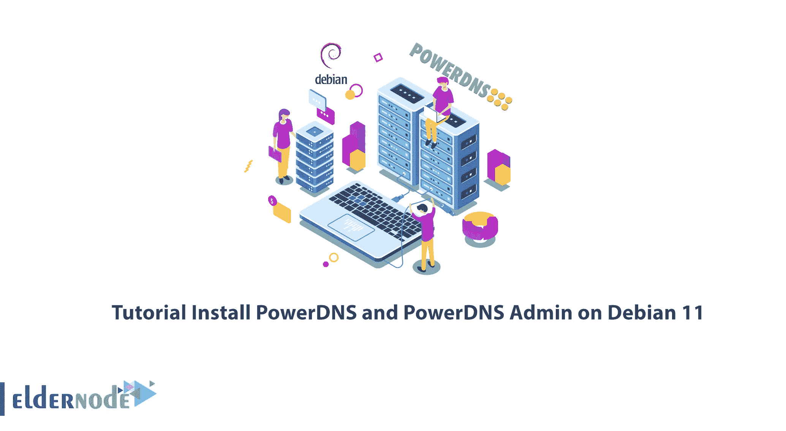
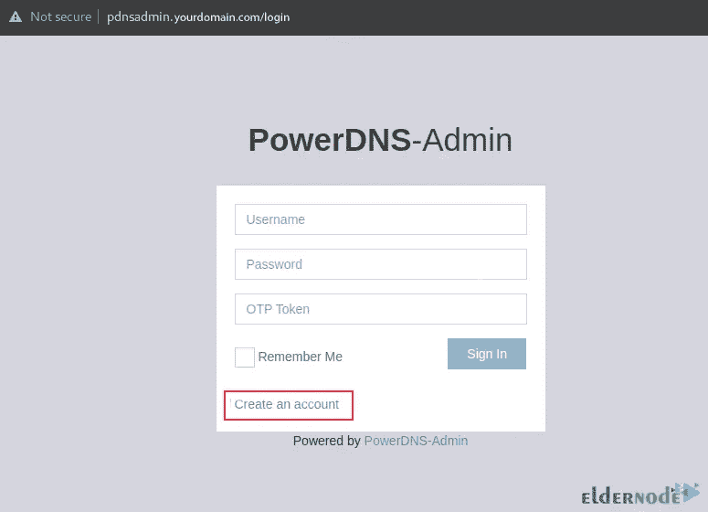
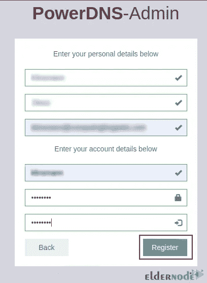
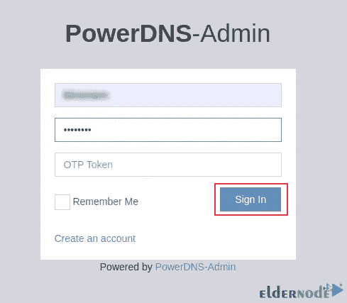
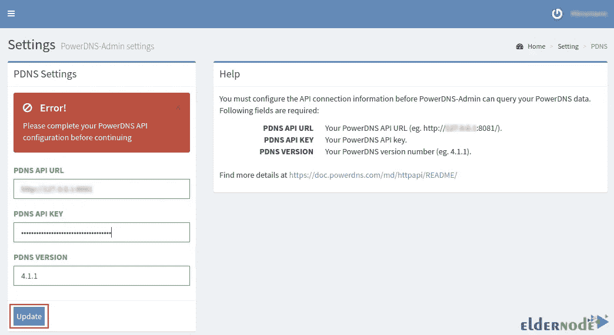
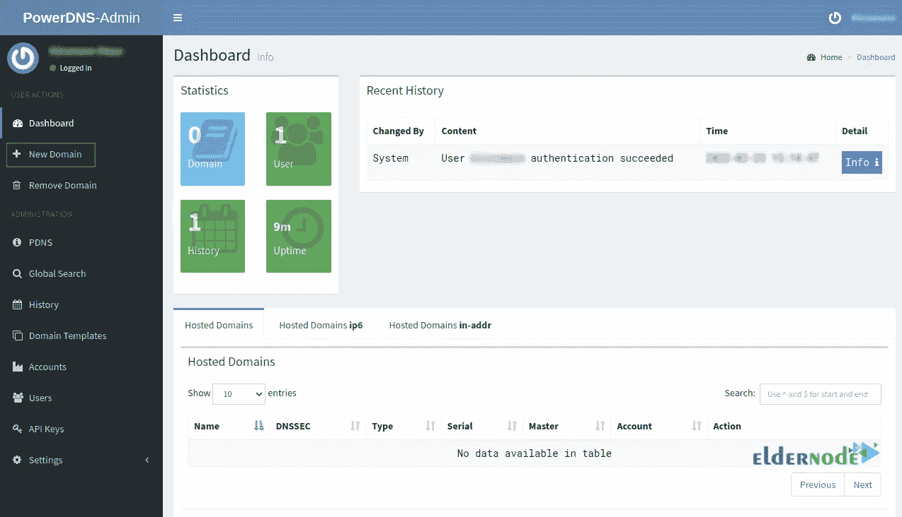
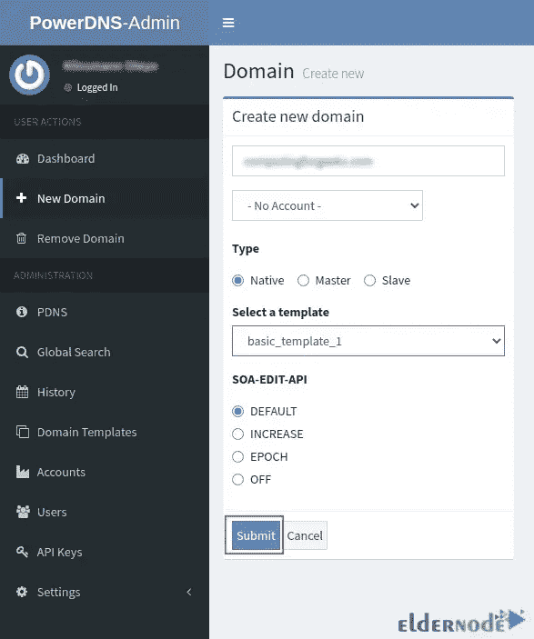
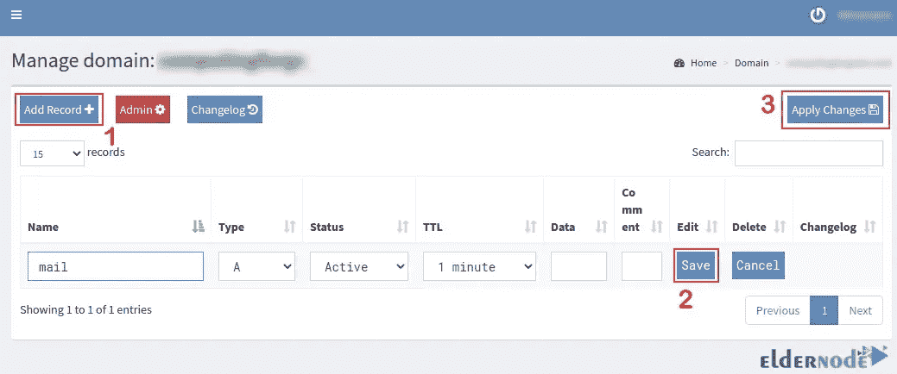

# 教程在 Debian 11 上安装 PowerDNS 和 PowerDNS Admin

> 原文：<https://blog.eldernode.com/install-powerdns-and-powerdns-admin-on-debian-11/>



Linux web 服务器最重要的服务之一是 DNS 服务，它能够使用服务器上的 Internet 域。如你所知，计算机通过 IP 地址相互通信。但是，如果我们想使用清晰的字母和数字(域名)而不是 IP，DNS 调解。PowerDNS 是 DNS 服务之一。在本文中，我们将向您介绍并教您**如何在 Debian 11** 上安装 PowerDNS 和 PowerDNS Admin。你可以在 [Eldernode](https://eldernode.com/) 网站上查看 **[Linux VPS](https://eldernode.com/linux-vps/)** 服务，如果你想购买的话。

## **如何在 Debian 11 上安装 PowerDNS 和 PowerDNS Admin**

### **PowerDNS 及 PowerDNS Admin 简介**

PowerDNS 是在 Linux 平台上设计和实现的开源 DNS 服务器。这个 DNS 服务器是使用 C++编程语言编写的，并在 GPL 下获得许可。它可以在几乎所有的 Unix、Linux 甚至 Windows 系列上安装和使用，也可以与各种 SQL 平台支持的许多后端一起工作。该服务器成立于 1999 年，2002 年成为开源产品。

PowerDNS 同时提供权威服务器和递归 DNS 产品，它们是单独提供的。权威服务器回答关于它有信息的域的问题，并解决关于它没有信息的域的问题。DNS 递归器咨询其他著名的服务器来回答相关的问题。

PowerDNS Admin 是一个基于 web 的工具，用于管理 PowerDNS。您可以使用 web 浏览器来创建和管理 DNS 域。

**PowerDNS 特性**

–提供高域分辨率性能

–提供大量统计数据，帮助确定可扩展性和发现问题

–改进的安全功能

–支持无数后端和负载平衡/故障转移算法

**PowerDNS 管理功能**

1-支持域模板

2-支持批量域创建

3-支持本地数据库、SAML、LDAP、活动目录用户验证

4-支持动态域名系统 2 协议和 TOTP 协议

5-支持谷歌，Github，Azure，OpenID OAuth

6-支持 IPv4 和 IPv6

7-支持 DNSSec

8-提供一个域模板

9-为操作区域和记录提供有限的 API

10-创建和更新反向 PTR 记录

### **如何安装 PowerDNS 关系数据库**

在执行任何操作之前，**使用以下命令更新您的系统**并安装所需的工具:

```
sudo apt update
```

```
sudo apt upgrade 
```

```
sudo apt install curl vim git -y
```

正如我之前提到的，PowerDNS 支持无数的数据库后端，如 MySQL、PostgreSQL、Oracle 等。您可以将它们中的任何一个用于后端存储 PowerDNS 区域文件。我更喜欢用 [MariaDB](https://blog.eldernode.com/whats-mariadb-how-it-works/) 。您应该首先安装所需的工具，通过输入以下命令来**安装 MariaDB** :

```
sudo apt install software-properties-common gnupg2 -y
```

现在**借助以下命令下载 MariaDB 存储库**:

```
curl -LsS -O https://downloads.mariadb.com/MariaDB/mariadb_repo_setup 
```

```
sudo bash mariadb_repo_setup
```

**更新软件包后安装 MariaDB** :

```
sudo apt update 
```

```
sudo apt install mariadb-server mariadb-client
```

您可以使用以下命令**启动 MariaDB** :

```
sudo systemctl start mariadb
```

为了**启用 MariaDB** :

```
sudo systemctl enable mariadb
```

现在，您需要使用 root 用户**登录到 shell** :

```
sudo mysql -u root
```

您可以通过运行以下命令**创建一个 PowerDNS 数据库**:

```
CREATE DATABASE powerdns; 
```

```
GRANT ALL ON powerdns.* TO 'powerdns_user'@'%' IDENTIFIED BY 'Strongpassword'; 
```

```
FLUSH PRIVILEGES; 
```

```
EXIT
```

请注意，您设置的密码不包含特殊字符，因为这将导致“拒绝用户' powerdns_user'@'localhost '(使用密码:是)的访问”错误。

## **如何在 Debian 11 上安装 PowerDNS**

首先，您应该**停止并禁用 systemd 解析的**服务:

```
sudo systemctl stop systemd-resolved 
```

```
sudo systemctl disable systemd-resolved
```

现在**删除文件的符号链接**:

```
ls -lh /etc/resolv.conf 
```

```
sudo unlink /etc/resolv.conf
```

然后**使用以下命令更新 resolv.conf** 文件:

```
echo "nameserver 8.8.8.8" | sudo tee /etc/resolv.conf
```

在此步骤中，**通过输入以下命令将存储库**添加到系统中:

```
sudo vim /etc/apt/sources.list.d/pdns.list 
```

```
deb [arch=amd64] http://repo.powerdns.com/debian bullseye-auth-46 main
```

现在，您应该为存储库导入 GPG 密钥签名:

```
curl -fsSL https://repo.powerdns.com/FD380FBB-pub.asc | sudo gpg --dearmor -o /etc/apt/trusted.gpg.d/pdns.gpg
```

然后输入以下命令来设置 APT 首选项:

```
sudo vim /etc/apt/preferences.d/pdns 
```

```
Package: pdns-* 
```

```
Pin: origin repo.powerdns.com 
```

```
Pin-Priority: 600
```

**再次更新**您的 APT 包:

```
sudo apt update
```

要从默认 APT 存储库中安装 PowerDNS 和 MySQL 后端，请运行以下命令:

```
sudo apt install pdns-server pdns-backend-mysql
```

### **如何在 Debian 11 上配置 PowerDNS 数据库**

首先，您应该将数据库模式输入到在 MariaDB 上创建的 PowerDNS 数据库，这些模式通常作为一个 **schema.mysql.sql** 文件存储在**/usr/share/pdns-back end-MySQL/schema/**中。

将上述模式导入到在上述步骤中创建的数据库中:

```
mysql -u powerdns_user -p powerdns < /usr/share/pdns-backend-mysql/schema/schema.mysql.sql
```

然后使用以下命令验证模式导入:

```
sudo mysql -u root 
```

```
use powerdns; 
```

```
show tables;
```

在此步骤中，创建文件以配置数据库的 PowerDNS 连接详细信息:

```
sudo vim /etc/powerdns/pdns.d/pdns.local.gmysql.conf
```

在打开的文件中编辑以下行:

```
# MySQL Configuration 
```

```
# Launch gmysql backend 
```

```
launch+=gmysql 
```

```
# gmysql parameters 
```

```
gmysql-host=127.0.0.1 
```

```
gmysql-port=3306 
```

```
gmysql-dbname=powerdns 
```

```
gmysql-user=powerdns_user 
```

```
gmysql-password=Strongpassword 
```

```
gmysql-dnssec=yes 
```

```
# gmysql-socket=
```

然后你需要**设置文件的权限**:

```
sudo chown pdns: /etc/powerdns/pdns.d/pdns.local.gmysql.conf 
```

```
sudo chmod 640 /etc/powerdns/pdns.d/pdns.local.gmysql.conf
```

接下来，运行下面的命令来验证数据库连接:

```
sudo systemctl stop pdns.service 
```

```
sudo pdns_server --daemon=no --guardian=no --loglevel=9
```

在最后一步中，**通过运行以下命令重新启动并启用 PowerDNS** 服务:

```
sudo systemctl restart pdns 
```

```
sudo systemctl enable pdns
```

您可以使用以下命令**验证端口 53** 是否为 DNS 打开:

```
sudo ss -alnp4 | grep pdns
```

您可以使用以下命令检查 PowerDNS 是否响应请求:

```
dig @127.0.0.1
```

## **如何在 Debian 11 上安装 PowerDNS Admin**

第一步，您需要通过输入以下命令来安装 Python 开发包:

```
sudo apt install python3-dev
```

现在运行下面的命令来**安装所需的构建工具**:

```
sudo apt install libsasl2-dev libldap2-dev libssl-dev libxml2-dev libxslt1-dev libxmlsec1-dev libffi-dev pkg-config apt-transport-https virtualenv python3-venv build-essential libmariadb-dev git python3-flask -y
```

然后，您应该安装 Node.js。为此，**添加存储库**:

```
curl -sL https://deb.nodesource.com/setup_16.x | sudo -E bash -
```

现在是时候**安装 Nodejs** 了:

```
sudo apt install -y nodejs
```

然后你应该安装 yarn 包，但是首先**添加它的库和 GPG 键**:

```
curl -sL https://dl.yarnpkg.com/debian/pubkey.gpg | gpg --dearmor | sudo tee /usr/share/keyrings/yarnkey.gpg >/dev/null 
```

```
echo "deb [signed-by=/usr/share/keyrings/yarnkey.gpg] https://dl.yarnpkg.com/debian stable main" | sudo tee /etc/apt/sources.list.d/yarn.list
```

运行以下命令进行安装:

```
sudo apt update 
```

```
sudo apt install yarn -y
```

接下来，您应该使用以下命令**克隆 PowerDNS 管理源代码**:

```
sudo su - 
```

```
git clone https://github.com/ngoduykhanh/PowerDNS-Admin.git /var/www/html/pdns
```

在这一步，**创建一个虚拟环境**如下:

```
cd /var/www/html/pdns/ 
```

```
virtualenv -p python3 flask
```

然后执行以下命令**激活环境并安装 requirements.txt 中指定的库**:

```
source ./flask/bin/activate 
```

```
pip install --upgrade pip 
```

```
pip install -r requirements.txt
```

要配置到数据库的 PowerDNS 管理连接，您应该停用虚拟环境:

```
deactivate
```

现在编辑以下文件:

```
vim /var/www/html/pdns/powerdnsadmin/default_config.py
```

然后在里面编辑下面一行:

```
### DATABASE CONFIG 
```

```
SQLA_DB_USER = 'powerdns_user' 
```

```
SQLA_DB_PASSWORD = 'Strongpassword' 
```

```
SQLA_DB_HOST = '127.0.0.1' 
```

```
SQLA_DB_NAME = 'powerdns' 
```

```
SQLALCHEMY_TRACK_MODIFICATIONS = True 
```

….

**通过运行以下命令创建一个数据库模式**:

```
cd /var/www/html/pdns/ 
```

```
source ./flask/bin/activate 
```

```
export FLASK_APP=powerdnsadmin/__init__.py 
```

```
flask db upgrade
```

如果您收到一个**“import error:cannot import name ' JSON ' from ' its dangerous "**错误，请输入以下命令:

```
pip uninstall itsdangerous 
```

```
pip install itsdangerous==2.0.1 
```

```
flask db upgrade
```

上述问题解决后，**通过运行以下命令创建资产文件**:

```
yarn install --pure-lockfile 
```

```
flask assets build
```

最后，**通过输入以下命令停用虚拟环境**:

```
deactivate
```

### **如何启用 PowerDNS API 访问**

在此步骤中，您应该启用 PowerDNS API 访问。

使用以下命令，您可以打开文件并启用参数，如控制多个活动、读取统计数据、更改区域内容等。

```
sudo vim /etc/powerdns/pdns.conf
```

编辑文件，如下所示:

```
# api Enable/disable the REST API (including HTTP listener) 
```

```
# api=no  api=yes 
```

```
########################### 
```

```
# api-key Static pre-shared authentication key for access to the REST API 
```

```
# api-key= 
```

```
api-key=3ce1af6c-981d-4190-a559-1e691d89b90e
```

```
#You can generate one from https://codepen.io/corenominal/pen/rxOmMJ
```

最后，**保存**文件，**使用以下命令重启 PowerDNS** :

```
sudo systemctl restart pdns
```

现在是时候**创建一个 PowerDNS 虚拟主机文件**了。首先，安装 Nginx web 服务器:

```
sudo apt install nginx
```

然后**创建一个虚拟主机文件**如下:

```
vim /etc/nginx/conf.d/powerdns-admin.conf
```

并增加以下内容:

```
server {    listen         *:80;    server_name               pdnsadmin.yourdomain.com;      index                     index.html index.htm index.php;    root                      /var/www/html/pdns;    access_log                /var/log/nginx/pdnsadmin_access.log combined;    error_log                 /var/log/nginx/pdnsadmin_error.log;      client_max_body_size              10m;    client_body_buffer_size           128k;    proxy_redirect                    off;    proxy_connect_timeout             90;    proxy_send_timeout                90;    proxy_read_timeout                90;    proxy_buffers 32                  4k;    proxy_buffer_size                 8k;    proxy_set_header                  Host $host;    proxy_set_header                  X-Real-IP $remote_addr;    proxy_set_header                  X-Forwarded-For $proxy_add_x_forwarded_for;    proxy_headers_hash_bucket_size    64;      location ~ ^/static/ {     include   /etc/nginx/mime.types;     root  /var/www/html/pdns/powerdnsadmin;       location ~* \.(jpg|jpeg|png|gif)$ {       expires 365d;     }        location ~* ^.+.(css|js)$ {        expires 7d;      }    }      location / {      proxy_pass http://unix:/run/pdnsadmin/socket;      proxy_read_timeout 120;      proxy_connect_timeout 120;      proxy_redirect off;       }    }
```

接下来，**重命名 Nginx 文件**:

```
mv /etc/nginx/sites-enabled/default{,.old}
```

您可以使用以下命令检查上述文件语法:

```
nginx -t
```

现在运行以下命令来设置文件的正确所有权:

```
chown -R www-data: /var/www/html/pdns
```

然后记得**重启 Nginx** 以应用更改:

```
systemctl restart nginx
```

下一步，您需要**为 PowerDNS Admin 创建一个系统服务文件**。为此，首先创建如下文件:

```
vim /etc/systemd/system/pdnsadmin.service
```

并将以下内容添加到创建的文件中:

```
[Unit]  Description=PowerDNS-Admin  Requires=pdnsadmin.socket  After=network.target    [Service]  PIDFile=/run/pdnsadmin/pid  User=pdns  Group=pdns  WorkingDirectory=/var/www/html/pdns  ExecStart=/var/www/html/pdns/flask/bin/gunicorn --pid /run/pdnsadmin/pid --bind unix:/run/pdnsadmin/socket 'powerdnsadmin:create_app()'  ExecReload=/bin/kill -s HUP $MAINPID  ExecStop=/bin/kill -s TERM $MAINPID  PrivateTmp=true    [Install]  WantedBy=multi-user.target
```

现在，使用以下命令创建一个套接字文件:

```
sudo vim /etc/systemd/system/pdnsadmin.socket
```

并在其中添加以下内容:

```
[Unit]  Description=PowerDNS-Admin socket 
```

```
[Socket]  ListenStream=/run/pdnsadmin/socket 
```

```
[Install]  WantedBy=sockets.target
```

接下来，您应该**创建一个环境文件**,如下所示:

```
mkdir /run/pdnsadmin/ 
```

```
echo "d /run/pdnsadmin 0755 pdns pdns -" >> /etc/tmpfiles.d/pdnsadmin.conf
```

接下来，设置所需的权限，如下所示:

```
chown -R pdns: /run/pdnsadmin/ 
```

```
chown -R pdns: /var/www/html/pdns/powerdnsadmin/
```

记住使用以下命令**重新加载系统守护进程**:

```
systemctl reload-daemon
```

要**启动并启用 PowerDNS 管理服务**，请输入以下命令:

```
systemctl enable --now pdnsadmin.service pdnsadmin.socket
```

您可以通过运行以下命令**检查服务状态**:

```
systemctl status pdnsadmin.service pdnsadmin.socket
```

### **如何访问 PowerDNS 管理 Web UI**

首先，借助 **http://domain_name** 或 **http://IP_address** 网址导航至 PowerDNS web UI，点击**创建账户**:



填写信息并点击**注册**以创建用户管理员:



在**创建帐户**后，使用它登录到 PowerDNS 管理界面:



现在，您应该提供 API 密钥 URL**http://your-IP address:8081**和在 PowerDNS 配置文件中定义的 API 密钥来管理 PowerDNS 服务器。如果点击**更新**，错误将会消失:



**PowerDNS 管理仪表板**应该如下所示。点击 **+新域**创建一个新域:



现在您应该输入**域名**并从模板列表中选择要使用的模板并提交。然后，您的域将添加如下:



点击域添加记录。然后点击**添加记录+** ，输入记录名称。按**保存**和**应用更改**:



就是这样！

结论

## PowerDNS 是一个 DNS 服务器，您可以使用 PowerDNS Admin web UI 进行许多配置，例如删除域、编辑域模板等。在本文中，我们教你在 Debian 11 上安装 PowerDNS 和 PowerDNS Admin。我希望这篇教程对你有用。如有疑问，可在评论中联系我们。

PowerDNS is a DNS server and you can make many configurations using the PowerDNS Admin web UI such as removing domains, editing the domain templates and etc. In this article, we taught you to Install PowerDNS and PowerDNS Admin on Debian 11\. I hope this tutorial was useful for you. If you have any questions, you can contact us in the Comments.