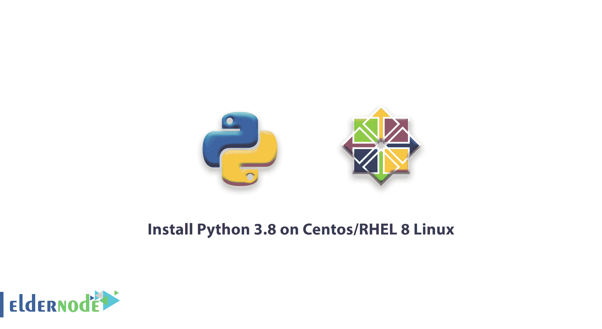

# 教程在 Centos/RHEL 8 Linux - Eldernode 上安装 Python 3.8

> 原文：<https://blog.eldernode.com/install-python-3-8-on-centos/>



在本[教程](https://eldernode.com/category/tutorial/)中，我们将一步步介绍如何在 Centos / RHEL 8 Linux 上安装 Python 3.8。

## 教程如何在 Centos/RHEL 8 Linux 上配置和安装 Python 3.8

使用以下命令安装所需的 [Python](https://www.python.org/) 开发库。

```
sudo dnf install gcc openssl-devel bzip2-devel libffi-devel 
```

### 步骤 1)更新[百分位](https://eldernode.com/centos-vps/)

在执行任何操作之前，您需要更新 Centos，请使用以下命令:

```
yum -y update 
```

### 步骤 2)下载 Python 3.8

您可以使用以下命令从 Python 的官方网站下载 Python。

```
cd /opt  wget https://www.python.org/ftp/python/3.8.3/Python-3.8.3.tgz 
```

注意:如果没有启用 wget，可以使用以下命令安装它:

```
yum -y install wget 
```

然后，使用下面的命令，您必须提取下载的归档文件:

```
tar xzf Python-3.8.3.tgz 
```

### 步骤 3)在 Centos 上安装 Python

解压缩后，转到 Python-3.8.3 文件夹，然后根据您的服务器或系统环境配置源文件。

```
cd Python-3.8.3  sudo ./configure --enable-optimizations  sudo make altinstall 
```

### 步骤 4)在 Centos 8 上测试 Python

完成安装步骤后，我们使用以下命令测试已安装的 Python 版本:

```
python3.8 -V 
```

输出应该如下所示:

```
Python 3.8.3
```

恭喜您，您已经能够在 Centos 上成功安装和配置 Python。

**亦作，见**

[如何在 Ubuntu 20.04 上安装 Django](https://eldernode.com/install-django-on-ubuntu-20/)

[教程在 Windows 上安装 PIP](https://eldernode.com/install-pip-on-windows/)