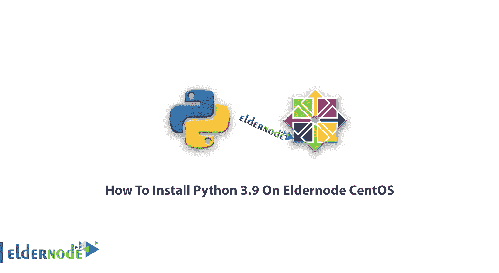

# 如何在 CentOS 8 和 Centos 7 - Eldernode 上安装 Python 3.9

> 原文：<https://blog.eldernode.com/install-python-3-9-on-centos/>



教程如何**在 CentOS 8 & Centos 7** 上安装 Python 3.9。Python 编程语言是一种面向对象的编程语言，在 web 软件设计、执行复杂的计算和操作、快速原型制作等情况下有许多应用，并且被 web 世界中大多数访问量最大的大型站点所使用。 [Python](https://www.python.org/) 的优势之一是它可以用于大多数网页设计和其他相关任务，并且不会对用户施加任何特殊的限制。这个解释是对 Python 语言的介绍，因此我们可以在本文的剩余部分教您如何在 CentOS 上安装 Python 3.9。请和我们在一起。如果您需要购买 [CentOS VPS](https://eldernode.com/centos-vps/) 服务器，您还可以在 [Eldernode](https://eldernode.com/) 中看到可用的软件包。

## 如何在 CentOS 8 上安装 Python 3.9

首先，使用以下命令安装所需的 Python 开发库。然后按照本教程剩余部分中的步骤 1 至 4 进行操作:

```
sudo dnf install gcc openssl-devel bzip2-devel libffi-devel 
```

### 第一步:如何更新 CentOS

在执行任何操作之前，您需要更新 Centos，请使用以下命令:

```
yum update 
```

### 第二步:如何下载 Python 3.9

您可以使用以下命令从 Python 的官方网站下载 Python。

```
cd /opt  wget https://www.python.org/ftp/python/3.9.0/Python-3.9.0tgz 
```

*注意*:如果 **wget** 没有启用，可以用以下命令安装:

```
yum install wget -y 
```

然后，使用下面的命令，您必须提取下载的归档文件:

```
tar xzf Python-3.9.0tgz
```

### 第三步:如何在 CentOS 上安装 Python

解压缩后，转到 Python-3.9.0 文件夹，然后根据您的服务器或系统环境配置源文件。

```
cd Python-3.9.0  sudo ./configure --enable-optimizations  sudo make altinstall 
```

### 第四步:如何在 CentOS 8 上测试 Python

完成安装步骤后，我们使用以下命令测试已安装的 Python 版本:

```
python3.9.0 -V 
```

输出应该如下所示:

```
Python 3.9.0
```

## 如何在 CentOS 7 上安装 Python 3.9

还是那句话，用 7 版 [CentOS](https://blog.eldernode.com/tag/centos/) ？在上面安装 Python 3.9 几乎可以做任何你想做的事情，写小脚本，构建游戏，开发网站，创建机器学习算法，分析数据等等。或者，如果你习惯使用 ouTube、DropBox、Reddit、Quora、Instagram、Pinterest，安装 Python 是个好主意，因为它们都是用 Python 开发的。

***注** :* 由于 CentOS base repository 不提供 Python 3 包，因此在 CentOS 7.7 之前的版本中，需要通过设置第三方库(如 IUS 库)来安装 Python 3。但是现在，从 CentOS 7.7 开始，Python 3 可以在基础包存储库中获得！让我们来看一下安装的这一部分的步骤。

### 步骤 1:如何更新 CentOS 环境

首先，您需要确保您正在使用我们的软件包中尽可能最新的环境。为此，请运行以下命令:

```
[[[email protected]](/cdn-cgi/l/email-protection) ~]# yum update -y
```

### 第二步:如何安装 Python 3

更新环境后，您就可以通过键入以下命令来安装 Python 3 了:

```
[[[email protected]](/cdn-cgi/l/email-protection) ~]# yum install -y python3
```

### 步骤 3:如何验证安装

您可以确保 Python 3 实际上已经安装并且可以使用。使用以下命令来完成此操作:

```
[[[email protected]](/cdn-cgi/l/email-protection) ~]# python3  Python 3.9.0 (default, Nov 02 2020, 16:23:09)   [GCC 4.8.5 20150623 (Red Hat 4.8.5-39)] on linux  Type "help", "copyright", "credits" or "license" for more information.  >>>
```

您应该会看到系统上安装的 Python 3 版本以及命令提示符字符的变化。

### 如何在 Python 3.9 中安装源码

安装 Python 3 最简单的方法是使用 Yum 包管理器，但是如果您想要获得最新版本的 Python，您应该通过三个必需的步骤来安装源代码:

#### 步骤 1:如何从源代码设置 Python 3.9 环境

如果需要从源代码安装 Python 3，则需要检查要安装的必备包:

```
[[[email protected]](/cdn-cgi/l/email-protection) ~]# yum install gcc openssl-devel bzip2-devel libffi-devel -y
```

#### 第二步:如何下载 Python 3.9

然后，通过运行以下命令获取您需要的 python 版本，这有助于您下载 Python 的最新稳定版本:

```
[[[email protected]](/cdn-cgi/l/email-protection) ~]# curl -O https://www.python.org/ftp/python/3.9.0/Python-3.9.0.tgz
```

接下来，提取文件:

```
[[[email protected]](/cdn-cgi/l/email-protection) ~]# tar -xzf Python-3.9.0.tgz 
```

第三步:如何安装 Python 3.9

#### 提取之后，您可以通过运行以下命令切换到结果目录:

然后，通过键入以下命令准备从源代码编译 Python:

要完成安装而不替换系统上的默认系统 Python，请使用命令 belwo:

```
[[[email protected]](/cdn-cgi/l/email-protection) Python-3.9.0]# ./configure --enable-optimizations
```

过一会儿，从源代码编译代码就完成了。要测试新的 Python 3 版本，请运行以下命令:

```
[[[email protected]](/cdn-cgi/l/email-protection) Python-3.9.0]# make altinstall
```

就像之前通过 Yum 安装 Python 3 时一样，您会进入一个 Python shell，输出您当前使用的版本:

```
[[[email protected]](/cdn-cgi/l/email-protection) Python-3.9.0]# python3.8
```

**结论**

```
Python 3.9.0 (default, Nov 02 2020, 16:23:09)  [GCC 4.8.5 20150623 (Red Hat 4.8.5-39)] on linux  Type "help", "copyright", "credits" or "license" for more information.  >>> 
```

Python 是世界上最流行的编程语言之一。对于初学者和有经验的开发人员来说，Python 是一个受欢迎的选择，学习起来简单容易。与其他 Linux 发行版不同，Python 在默认情况下不会安装在 CentOS 8 上。这就是为什么我们决定在本教程中教你如何在 CentOS 7 和 CentOS 8 上安装 Python 3.9。

Python is one of the most popular programming languages in the world. Python is a popular choice for beginners and experienced developers with simple and easy learning. Unlike other Linux distributions, Python does not install on CentOS 8 by default. That’s why we decided to teach you how to install Python 3.9 on CentOS 7 and CentOS 8 in this tutorial.