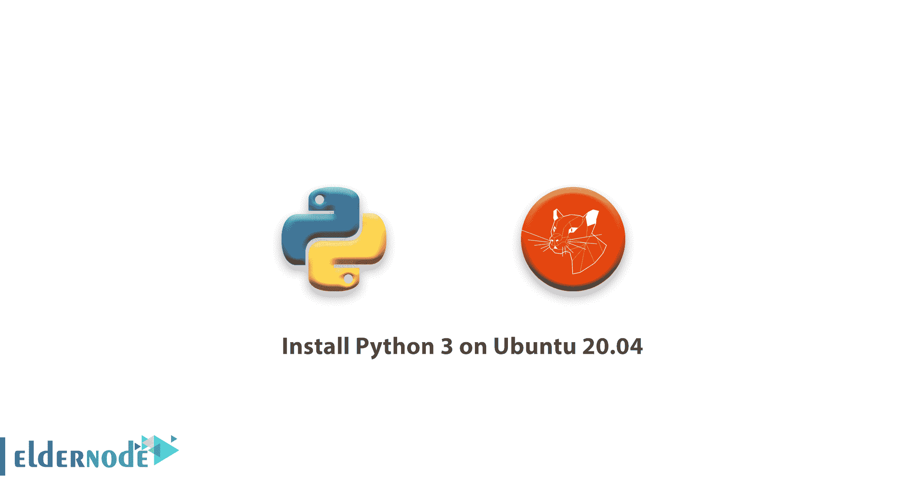

# 如何在 Ubuntu 20.04 上安装 Python 3——在 Ubuntu 20 上安装 Python

> 原文：<https://blog.eldernode.com/install-python-3-ubuntu-20/>



在接下来的 [Python 3](https://eldernode.com/install-python-3-8-on-centos/) 教程中，在这篇文章中，我们将向你**学习如何在 Ubuntu 20.04 上安装 Python 3。**众所周知，Python 编程语言对于初学者和有经验的开发人员来说都是越来越受欢迎的选择。提到它的其他特性，我们可以说它灵活多变，在脚本、自动化、数据分析、机器学习和后端开发方面都有优势。

### 如何在 Ubuntu 20.04 上安装 Python 3

通过阅读本教程，你将会用 Python 3 编程环境来设置你的 Ubuntu 20.04 服务器。我们将向您展示在服务器上编程有许多优点，并支持跨开发项目的协作，本教程的一般原则将适用于任何发布的 [Debian Linux](https://www.debian.org/) 。

#### 先决条件

如果您知道以下内容，本教程可能会更有用:

**同样，请阅读:**

[Python 3.6 安装教程 Debian 9](https://eldernode.com/python-3-6-installation-tutorial-in-debian-9/)

1-设置 Python 3

### 你只需要确保我们的版本是最新的，比如 Ubuntu 20.04。Debian Linux 的其他版本预装了 Python 3。

使用 apt 命令更新和升级系统，以便与 Ubuntu 的**A**advanced**P**packaging**T**tool 一起工作:

接下来， -y 标志将确认您同意安装所有项目，但是根据您的 Linux 版本，您可能需要在系统更新和升级时确认额外的提示。该过程完成后，您可以通过键入以下内容来检查系统中安装的 Python 3 的版本:

```
sudo apt update  sudo apt -y upgrade
```

您将在终端窗口中收到输出，让您知道版本号。虽然这个数字可能有所不同。

```
python3 -V
```

输出

此外，您可以安装 **pip，**来管理 Python 的软件包，这是一个工具，它将安装和管理我们可能要在开发项目中使用的编程包。

```
Python 3.8.2
```

您可以使用以下命令安装 Python 包:

```
sudo apt install -y python3-pip 
```

然后，您可以使用 **package_name** 来引用任何 Python 包或库，例如用于 web 开发的 Django 或用于科学计算的 NumPy。如果你想安装 NumPy，你可以使用命令 **pip3 install numpy** 来完成。

```
pip3 install package_name 
```

但是，还需要安装一些软件包和开发工具，以确保我们的编程环境有一个健壮的设置:

```
sudo apt install -y build-essential libssl-dev libffi-dev python3-dev
```

[电子管 VPS 比特币](https://eldernode.com/bitcoin-vps/)

2-建立虚拟环境

### 在这一步中，我们想说明虚拟环境使您能够在服务器上为 Python 项目提供一个独立的空间，确保您的每个项目都有自己的一组依赖项，不会中断任何其他项目。

设置编程环境可以更好地控制 Python 项目以及如何处理不同版本的包，这在使用第三方包时尤其重要。

因此，您可以设置任意多的 Python 编程环境。每个环境基本上都是服务器上的一个目录或文件夹，其中有一些脚本使其充当一个环境。

虽然有几种方法可以在 Python 中实现编程环境，但我们将在这里使用 **venv** 模块，它是标准 Python 3 库的一部分。

要安装 venv:

之后，您就可以创建环境了。让我们选择我们想要将 Python 编程环境放在哪个目录中，或者用 **mkdir** 创建一个新目录，如下所示:

```
sudo apt install -y python3-venv
```

After that, you are ready to create environments. Let’s either choose which directory we would like to put our Python programming environments in, or create a new directory with **mkdir**, as in:

```
mkdir environments  cd environments 
```

##### 你正在学习如何在 Ubuntu 20.04 上安装 Python 3

当您在您希望环境存在的目录中时，您可以创建一个环境。

因为， **pyvenv** 建立了一个新的目录，其中包含一些项目，您可以使用以下命令查看它:

```
python3 -m venv my_env
```

输出

```
ls my_env
```

您需要激活它才能使用此环境。通过键入下面的命令就可以实现。

```
bin include lib lib64 pyvenv.cfg share
```

现在，您的命令提示符将会以您的环境名作为前缀。这里叫做 my_env 。我们的前缀可能会有所不同，这取决于您运行的 Debian Linux 版本。括号中的环境名称应该是您在这行上看到的第一个内容:

```
source my_env/bin/activate
```

当你看到这个前缀时，这意味着环境 my_env 当前是活动的，并且创建程序，它们将只使用这个特定环境的设置和包。

```
(my_env)  [[email protected]](/cdn-cgi/l/email-protection):~/ environments
```

**重要** :在虚拟环境中，你可以使用命令 **python** 代替**python 3**；如果你愿意，可以使用 **pip** 代替 **pip3** 。如果您在环境之外的机器上使用 Python 3，您将需要专门使用 **python3** 和 **pip3** 命令。

3-制作《你好，世界》节目

### 这将让您测试您的环境。并且为我们提供了一个机会，如果您还不熟悉 Python 的话。

为此，打开命令行文本编辑器(如 nano)并创建一个新文件:

文本文件在终端窗口中打开后，输入您的程序:

```
(my_env)  [[email protected]](/cdn-cgi/l/email-protection):~/ environments nano hello.py 
```

然后，通过按下 CTRL 和 X 键退出 nano。当被询问时，按下 y 保存文件。

现在，当您退出 nano 并返回到您的 shell 时，运行以下命令。

您刚刚创建的 **hello.py** 程序应该会使您的终端产生以下输出:

```
(my_env)  [[email protected]](/cdn-cgi/l/email-protection):~/ environments python hello.py
```

输出

您必须键入命令 **停用** ，您将返回到您的原始目录以离开该环境。

```
Hello, World!
```

**好样的** ！至此，您已经在 Ubuntu Linux 服务器上建立了 Python 3 编程环境。所以你现在可以开始一个编码项目了！

亲爱的用户，我们希望你会喜欢如何在 Ubuntu 20.04 上安装 Python 3 的教程，你可以在评论区提出关于这次培训的问题，或者解决 [Eldernode](https://eldernode.com/) 培训领域的其他问题，请参考[提问页面](https://eldernode.com/ask)部分并在其中提出你的问题。

**不要错过一些相关文章:**

[教程在 Centos/RHEL 8 Linux 上安装 Python 3.8](https://eldernode.com/install-python-3-8-on-centos/)

[教程在 Windows 上安装 PIP](https://eldernode.com/install-pip-on-windows/)

**和**

[教程在 Windows 上安装 Python](https://eldernode.com/install-python-on-windows/)

[Tutorial Install Python on Windows](https://eldernode.com/install-python-on-windows/)