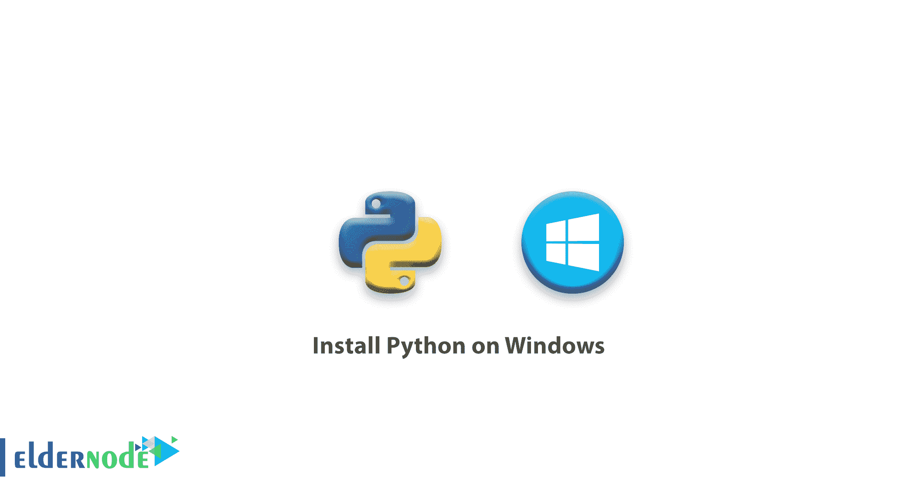
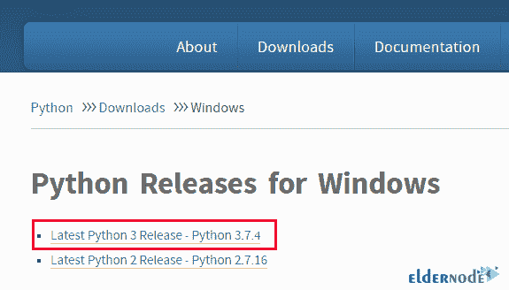
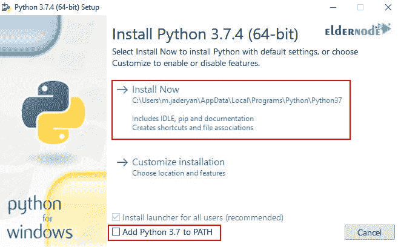
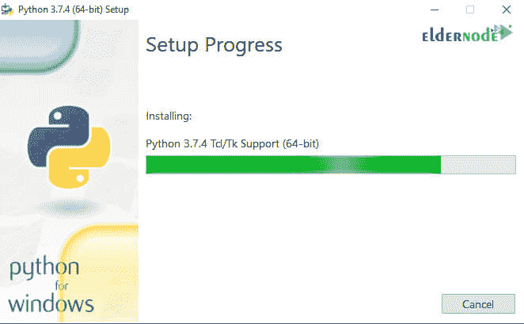
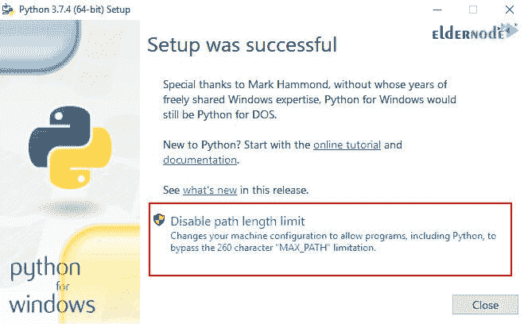

# 教程在 Windows 上安装 Python-elder node

> 原文：<https://blog.eldernode.com/install-python-on-windows/>



教程在 Windows 上安装 Python。Python 是一种高级编程语言，在程序员中非常流行。由于这种编程语言的奇妙设计，它具有非常高的可读性。这种编程语言既简单又非常全面，在这种语言的帮助下可以做成千上万的事情。通过一次搜索，您可以访问和执行网站上数百个 Python 就绪的项目。但是在你这样做之前，你需要安装 Python。

在 [Windows 服务器](https://eldernode.com/windows-vps/)上安装 Python 是一件简单的事情，从 Python 下载安装程序并在您的服务器上运行它。

## 如何在 Windows 上安装 Python

**1。** 通过 [远程桌面](https://eldernode.com/buy-rdp/) 登录您的服务器。

**2。** 从 [Python](https://www.python.org/downloads/windows/) 下载并执行最新的 Python 安装包。



**3。** 选择推荐的安装选项，获得最简单的安装体验。

**4。T3 在显示的第一个屏幕上，启用将 Python 3.7 添加到路径选项，然后点击立即安装。**



*



**5。** 最后点击关闭将完成 Python 在 Windows 中的安装过程。



**6。** 如果您只在 Windows 上安装了 Python 版本 3，请打开命令提示符并键入以下命令以确保 Python 安装正确:

```
 python -V 
```

**输出**:

```
 Python 3.7.4 
```

如果没有安装 PIP，或者想了解更多关于安装 PIP 的信息，请参阅我们的文章[教程在 Windows 上安装 PIP](https://eldernode.com/install-pip-on-windows/)。

**尊敬的用户**，我们希望您能喜欢这个[教程](https://eldernode.com/category/tutorial/)，您可以在评论区提出关于本次培训的问题，或者解决[老年人节点培训](https://eldernode.com/blog/)领域的其他问题，请参考[提问页面](https://eldernode.com/ask)部分，并尽快提出您的问题。腾出时间给其他用户和专家来回答你的问题。

好运。

**亦作，见**

[如何在 Ubuntu 18.04 上安装 Django](https://eldernode.com/install-django-ubuntu-18/)

[教程在 Centos/RHEL 8 Linux 上安装 Python 3.8](https://eldernode.com/install-python-3-8-on-centos/)

[Tutorial Install Python 3.8 on Centos/RHEL 8 Linux](https://eldernode.com/install-python-3-8-on-centos/)