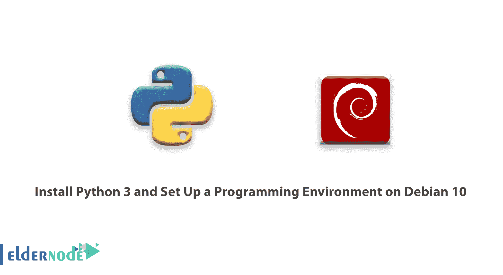

# 安装 Python 3 并在 Debian 10 - Eldernode 上设置一个编程环境

> 原文：<https://blog.eldernode.com/install-python-programming-debian-10/>



Python 是一种真正通用的、灵活的、受数据科学欢迎的编程语言。如果您的目标是从您的数据中获得洞察力并获得竞争优势，这个工具是合适的。它的第一次出版是在 1991 年，灵感来自英国喜剧团体“巨蟒剧团”的名字。您将学习如何存储和操作数据，如果您是初学者，继续学习本教程是个好主意。在这之前，先看看 Linux VPS 的计划，然后抓住你自己的。

## 

为了让本教程更好地发挥作用，请考虑以下**先决条件**:

拥有 sudo 权限的非 root 用户。
按照我们的[Debian 10](https://eldernode.com/initial-setup-with-debian-10/)的初始设置进行设置

## 安装 Python 3，在 Debian 10 上设置编程环境

让我们按照本教程的步骤，用 Python 3 编程环境来设置您的 Debian 10 服务器。在服务器上编程有很多优点，并且支持跨开发项目的协作。

### 步骤 1:设置 Python 3

虽然 [Debian Linux](https://www.debian.org/) 预装了 Python 3 和 **Python** 2，但你可以确保你的版本是最新的。请参见以下命令，更新和升级系统以使用高级打包工具:

```
sudo apt update  sudo apt -y upgrade
```

为了确认您同意安装所有项目，您将使用 **-y** 标志。

一旦该过程完成，您可以通过键入以下命令来检查系统中安装的 **Python 3** 的版本:

```
python3 -V
```

您将在终端窗口中收到输出，让您知道版本号。虽然这个数字可能会有所不同，但输出将与此类似:

输出

```
Python 3.7.3 
```

为了管理 **Python** 的软件包，让我们安装 **pip** ，这是一个工具，它将安装和管理我们可能要在开发项目中使用的编程包。

```
sudo apt install -y python3-pip
```

可以通过键入以下命令来安装 Python 包:

```
pip3 install package_name
```

在这里， **package_name** 可以指任何 Python 包或者库，比如 web 开发的 Django 或者科学计算的 NumPy。所以如果你想安装 NumPy，你可以用命令 pip3 install numpy 来完成。

还需要安装一些软件包和开发工具，以确保您对我们的编程环境有一个健壮的设置:

```
sudo apt install build-essential libssl-dev libffi-dev python3-dev
```

一旦设置好 Python，并且安装了 pip 和其他工具，您就可以为我们的开发项目设置一个虚拟环境。

### 第二步:建立虚拟环境

虚拟环境使您能够在服务器上为 Python 项目提供一个隔离的空间，确保您的每个项目都有自己的依赖项集，不会中断任何其他项目。

设置编程环境可以让您更好地控制 Python 项目以及如何处理不同版本的包。这在使用第三方包时尤其重要。

您可以设置任意多的 Python 编程环境。每个环境基本上都是服务器上的一个目录或文件夹，其中有一些脚本使其充当一个环境。

虽然有几种方法可以在 Python 中实现编程环境，但是您将在这里使用 **venv** 模块，它是标准 Python 3 库的一部分。让我们通过键入以下命令来安装 venv:

```
sudo apt install -y python3-venv
```

安装完成后，您就可以创建环境了。让我们选择您希望将我们的 Python 编程环境放在哪个目录中，或者使用 mkdir 创建一个新目录，如下所示:

```
mkdir environments  cd environments
```

一旦你进入了你想要的环境所在的目录。您可以通过运行以下命令来创建环境:

```
python3.7 -m venv my_env
```

实际上， pyvenv 建立了一个新的目录，其中包含一些您可以使用 ls 命令查看的项目:

```
ls my_env
```

输出

```
bin include lib lib64 pyvenv.cfg share 
```

这些文件共同确保您的项目与您本地机器的大环境隔离开来。以便系统文件和项目文件不会混淆。这是版本控制的良好实践。并确保您的每个项目都可以访问它所需要的特定包。

Python Wheels 是 Python 的一种内置包格式，可以通过减少需要编译的次数来加快你的软件生产，它将位于 Ubuntu 18.04 **共享** 目录中。

要使用这个环境，您需要激活它。这可以通过键入以下命令调用**激活**脚本来实现:

您的命令提示符现在将以您的环境名称作为前缀，在本例中，它被称为 my_env。根据您运行的 Debian Linux 版本，您的前缀可能会有所不同。但是括号中的环境名称应该是您在这行上看到的第一个内容:

```
source my_env/bin/activate
```

这个前缀让我们知道环境 **my_env** 当前是活动的，这意味着当您在这里创建程序时，它们将只使用这个特定环境的设置和包。

```
(my_env) [[email protected]](/cdn-cgi/l/email-protection):~/environments$
```

**注意:**在虚拟环境中，你可以使用命令 python 来代替 python3 ，以及 pip 来代替 pip3 。如果您在环境之外的机器上使用 Python 3，您将需要专门使用 python3 和 pip3 命令。 

完成这些步骤后，您的虚拟环境就可以使用了。

完成这些步骤后，您的虚拟环境就可以使用了。

## 第三步:创建一个“你好，世界”程序

### 现在我们已经设置好了虚拟环境，让我们创建一个传统的“Hello，World！”程序。这将让您测试您的环境。如果您还不熟悉 Python，那么它为您提供了一个熟悉 Python 的机会。

为此，您打开一个命令行文本编辑器(如 nano)并创建一个新文件:

一旦文本文件在终端窗口中打开，您将输入我们的程序:

```
(my_env) [[email protected]](/cdn-cgi/l/email-protection):~/environments$ nano hello.py
```

通过键入 CTRL 和 X 键退出 nano，当提示保存文件时按yT7。

一旦您退出 nano 并返回到您的 shell，让我们运行程序:

您刚刚创建的 hello.py 程序应该会使您的终端产生以下输出:

```
python hello.py
```

输出

要离开这个环境，只需输入命令 deactivate 就可以返回到原来的目录。

```
Hello, World! 
```

结论

## 在本文中，您在 Debian 10 Linux 服务器上设置了一个 Python 3 编程环境。从现在开始，你可以开始编码项目！如果你需要在另一个操作系统上学习这个主题，请阅读我们的文章教程在 Centos/RHEL 8 Linux 上安装[Python 3.8](https://blog.eldernode.com/install-python-3-8-on-centos/)**和** [如何在 Ubuntu 20.04 上安装 Python 3](https://blog.eldernode.com/install-python-3-ubuntu-20/)。**但是**如果你使用的是 windows，[这个指南](https://blog.eldernode.com/install-python-on-windows/)可能会比较合适。

在本文中，您在 Debian 10 Linux 服务器上设置了一个 Python 3 编程环境。从现在开始，你可以开始编码项目！如果你需要在另一个操作系统上学习这个主题，请阅读我们的文章教程在 Centos/RHEL 8 Linux 上安装[Python 3.8](https://blog.eldernode.com/install-python-3-8-on-centos/)**和** [如何在 Ubuntu 20.04 上安装 Python 3](https://blog.eldernode.com/install-python-3-ubuntu-20/)。**但是**如果你使用的是 windows，[这个指南](https://blog.eldernode.com/install-python-on-windows/)可能会比较合适。