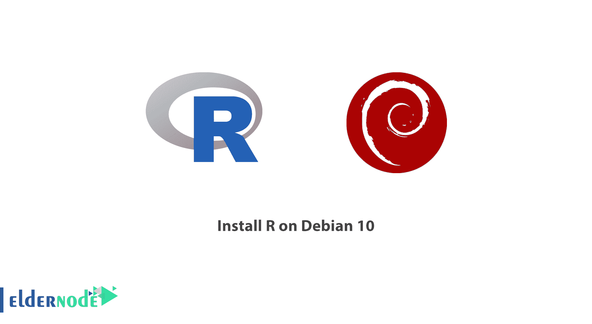

# 教程在 Debian 10 上安装 R-Debian 教程- Eldernode 博客

> 原文：<https://blog.eldernode.com/install-r-debian-10/>



**R** 是一种开源编程语言。它也用于统计计算和图形表示。有了一个免费的环境，用户安装这个工具，一些统计软件，执行数据分析，和可视化。在这篇文章中，你将学习**教程在 Debian 10** 上安装 R。继续本指南，为您的特定学习领域生成包。首先，你首先需要有自己的 [Linux VPS](https://eldernode.com/linux-vps/) 。根据您的需求在 [Eldernode](https://eldernode.com/) 中找到合适的包装，并触摸其中的差异。

为了让本教程更好地发挥作用，请考虑下面的 **先决条件** :

一个至少 1 GB 的内存

拥有 sudo 权限的非 root 用户或以 root 用户身份登录

要进行设置，请按照 Debian 10 的[初始设置进行。](https://eldernode.com/initial-setup-with-debian-10/)

## **在 Debian 10 上安装 R**

此外， **R** 由 **R** 统计计算基金会支持，主要由统计学家和数据挖掘者用于开发统计软件和执行数据分析。和我们一起向你展示如何在 Debian 10 上安装 **R** 并添加软件包。

### **如何在 Debian 10 上安装 R 依赖**

你不会发现最新的稳定版本总是可用的。因为 R 是一个快消项目。要解决这个问题，您可以添加由 CRAN 维护的外部存储库。你将通过为 Debian 10 云映像安装一些依赖项来处理它。此外，您应该安装 dirmngr ，以便能够添加外部存储库并执行管理和下载证书的网络操作。

```
sudo apt install dirmngr --install-recommends
```

你可以使用*add-apt-repository*命令来添加一个 PPA 引用。但是任何时候你找不到这个命令，通过安装 *软件-属性-通用* 将这个工具添加到你的系统中

```
sudo apt install software-properties-common
```

之后，你可以确定你是否有安全协议的 HTTPS 支持。为此，请安装以下工具。

```
sudo apt install apt-transport-https
```

### **学习在 Debian 10 上安装 R**

你可以从 **CRAN** 库安装，以接收最新版本的 R

运行以下命令添加相关的 GPG 键。

```
sudo apt-key adv --keyserver keys.gnupg.net --recv-key 'E19F5F87128899B192B1A2C2AD5F960A256A04AF'
```

输出

```
Executing: /tmp/apt-key-gpghome.y6W4E0Gtfp/gpg.1.sh --keyserver keys.gnupg.net --recv-key E19F5F87128899B192B1A2C2AD5F960A256A04AF  gpg: key AD5F960A256A04AF: 4 signatures not checked due to missing keys  gpg: key AD5F960A256A04AF: public key "Johannes Ranke (Wissenschaftlicher Berater) <[[email protected]](/cdn-cgi/l/email-protection)>" imported  gpg: Total number processed: 1  gpg:               imported: 1
```

获得可信密钥后，添加存储库。

```
sudo add-apt-repository 'deb http://cloud.r-project.org/bin/linux/debian buster-cran35/'
```

接下来，您将需要在此之后运行一个更新,以便包含来自新存储库的包清单。

```
sudo apt update
```

当运行完成并返回到提示符后，使用下面的命令开始安装 R。

```
sudo apt install r-base
```

当提示确认安装时，按 *y* 继续。

**请注意**:如您所见，您正在为系统上的每个用户安装一个示例包。所以您应该以 root 用户身份启动 R，这样所有用户都可以自动使用这些库。虽然您可以通过运行没有 sudo: 的 R 命令为您的用户建立一个个人库

```
sudo -i R
```

输出

```
R version 3.5.2 (2018-12-20) -- "Eggshell Igloo"  Copyright (C) 2018 The R Foundation for Statistical Computing  Platform: x86_64-pc-linux-gnu (64-bit)    R is free software and comes with ABSOLUTELY NO WARRANTY.  You are welcome to redistribute it under certain conditions.  Type 'license()' or 'licence()' for distribution details.      Natural language support but running in an English locale    R is a collaborative project with many contributors.  Type 'contributors()' for more information and  'citation()' on how to cite R or R packages in publications.    Type 'demo()' for some demos, 'help()' for on-line help, or  'help.start()' for an HTML browser interface to help.  Type 'q()' to quit R.    >
```

### **如何在 Debian 10 上从 CRAN 安装 R 包**

在这一步中，您会看到大量可用的附加软件包是 R 特权之一。要输出包括散点图、线图、密度图、acf 和条形图的 ASCII 图形，请安装 txtplot 库。

```
install.packages('txtplot')
```

输出

```
...  Installing package into ‘/usr/local/lib/R/site-library’  (as ‘lib’ is unspecified)  . . .
```

**点**:通过接收上面的输出，可以看到软件包将被安装在哪里。这个站点范围路径是可用的，因为您以 root 用户身份运行 R。这是使所有用户都可以使用该包的正确位置。

安装完成后加载 *txtplot* 。

```
library('txtplot')
```

如果看不到任何错误消息，您可以确保库已成功加载。看看下面的例子，验证一个基本的绘图功能与轴标签。

```
txtplot(cars[,1], cars[,2], xlab = 'speed', ylab = 'distance')
```

输出

```
 +----+-----------+------------+-----------+-----------+--+    120 +                                                   *    +        |                                                        |  d 100 +                                                   *    +  i     |                                    *                *  |  s  80 +                          *         *                   +  t     |                                       * *    *    *    |  a  60 +                          *  *      *    *      *       +  n     |                        *         * *  * *              |  c  40 +                *       * *    *  *    * *              +  e     |         *      *  * *  * *  *                          |     20 +           *    *  * *       *                          +        |  *      *    *                                         |      0 +----+-----------+------------+-----------+-----------+--+             5          10           15          20          25                                     speed
```

**点**:由 R 公司的数据集包提供的示例数据，包含基于 20 世纪 20 年代数据的汽车速度和需要停车的距离:

此外，请注意，您可以使用 install 从 CRAN 安装任何预编译的包。包()。

也可以输入 *q()* 退出 R 或者按 n 保存工作区图像。

## **结论**

在本文中，您了解了如何在 Debian 10 上安装 R。如果你已经成功地通过了本指南的步骤，R 现在已经安装在你的 Debian 系统上了。如果你有兴趣了解这个主题的更多信息，请阅读相关文章[如何在 Ubuntu 20.04 上安装 R](https://blog.eldernode.com/install-r-on-ubuntu-20/)。