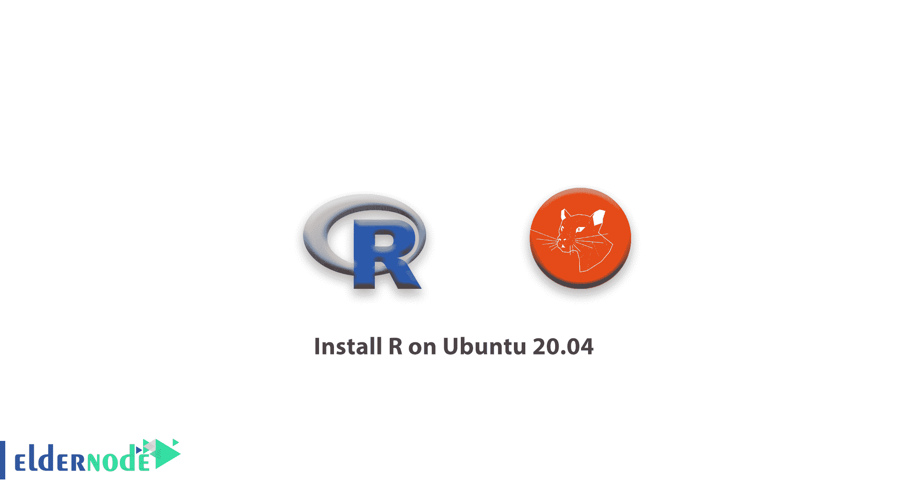

# 如何在 Ubuntu 20.04 - Eldernode 上安装 R

> 原文：<https://blog.eldernode.com/install-r-on-ubuntu-20/>



要说最流行和可扩展的语言之一，在这篇文章中我们将学习如何在 Ubuntu 20.04 上安装 R。它是一种开源编程语言，广泛用于执行数据分析和统计计算。R 拥有一个活跃的社区，并得到 R 统计计算基金会的支持，R 为特定的研究领域提供了许多用户生成的包，这使它适用于许多领域。下面，你可以从官方的[综合 R 档案网(CRAN)](https://cloud.r-project.org/) 学习如何安装 R 以及如何添加包。

**先决条件**

如果您知道以下内容，本教程可能会更有用:

## 如何在 Ubuntu 20.04 上安装 R

### 1- 安装 R

首先，添加 GPG 键。

```
sudo apt-key adv --keyserver keyserver.ubuntu.com --recv-keys E298A3A825C0D65DFD57CBB651716619E084DAB9 
```

运行后，您应该看到下面的输出。

输出

```
Executing: /tmp/apt-key-gpghome.cul0ddtmN1/gpg.1.sh --keyserver keyserver.ubuntu.com --recv-keys E298A3A825C0D65DFD57CBB651716619E084DAB9  gpg: key 51716619E084DAB9: public key "Michael Rutter <[[email protected]](/cdn-cgi/l/email-protection)>" imported  gpg: Total number processed: 1  gpg:               imported: 1
```

收到可信密钥后，您可以添加存储库。如果您没有使用 20.04，请从 R Project [Ubuntu](https://eldernode.com/tag/ubuntu/) 列表中找到相关的存储库。

```
sudo add-apt-repository 'deb https://cloud.r-project.org/bin/linux/ubuntu focal-cran40/' 
```

显示输出时，按如下方式识别行。

输出

```
...  Get:7 https://cloud.r-project.org/bin/linux/ubuntu focal-cran40/ InRelease [3622 B]                    Get:8 https://cloud.r-project.org/bin/linux/ubuntu focal-cran40/ Packages [15.6 kB]  ...
```

要包含来自新存储库的包清单，在此之后运行 update 。

```
sudo apt update
```

其中一个输出行应该如下所示。

`输出`

```
`...  Hit:5 https://cloud.r-project.org/bin/linux/ubuntu focal-cran40/ InRelease  ...`
```

`为了在输出中看到 update 命令，存储库添加是成功的。`

`现在用下面的命令安装 R。`

```
`sudo apt install r-base` 
```

`要确认安装，按下 y 继续。`

`最好为系统上的每个用户安装一个示例包。所以以 root 用户身份启动 R，这样所有用户都可以自动使用这些库。如果你需要为你的用户设置一个个人库，运行不带 sudo 的 R 命令`

```
`sudo -i R`
```

`输出`

```
`R version 4.0.0 (2020-04-24) -- "Arbor Day"  Copyright (C) 2020 The R Foundation for Statistical Computing  Platform: x86_64-pc-linux-gnu (64-bit)  ...  Type 'demo()' for some demos, 'help()' for on-line help, or  'help.start()' for an HTML browser interface to help.  Type 'q()' to quit R.    >`
```

`[购买 Linux 虚拟私有服务器](https://eldernode.com/linux-vps/)`

`2- 从起重机安装 R 包`

### `由于 R 的特性之一是丰富的附加包，您可以安装 txtplot ，这是一个输出 ASCII 图形的库，包括散点图、线图、密度图、act 和条形图，以达到演示目的。`

`输出`

```
`install.packages('txtplot')`
```

`安装后，加载 txtplot 。`

```
`...  Installing package into ‘/usr/local/lib/R/site-library’  (as ‘lib’ is unspecified)  ...`
```

`如果没有错误消息，则安装成功。`

```
`library('txtplot')`
```

`亲爱的用户，我们希望这篇教程能对你有所帮助，如果你有任何问题或想查看我们的用户关于这篇文章的对话，请访问[提问页面](https://eldernode.com/ask)。也为了提高你的知识，有这么多有用的教程为[老年节点培训](https://eldernode.com/blog/)准备。`

`**亦作，见**`

`[如何在 Ubuntu 20.04 上安装 Django](https://eldernode.com/install-django-on-ubuntu-20/)`

`[教程在 Debian 10 上安装 R](https://eldernode.com/install-r-debian-10/)`

`[Tutorial Install R on Debian 10](https://eldernode.com/install-r-debian-10/)`