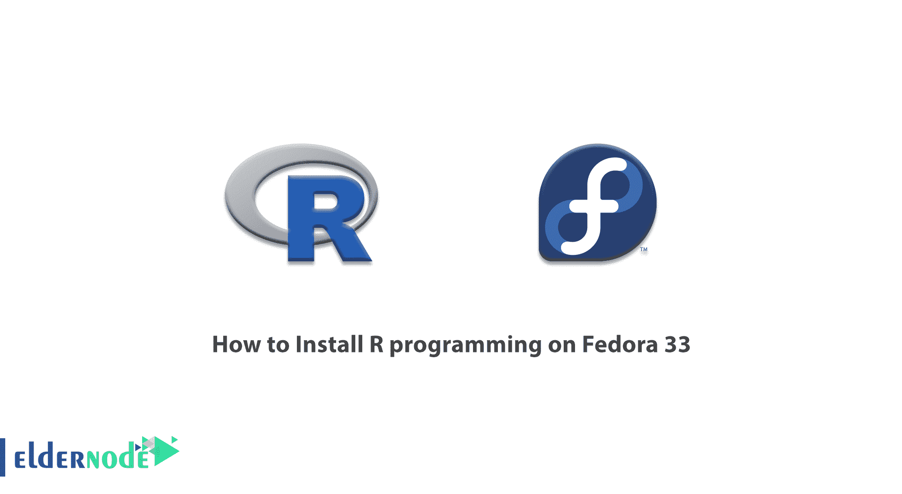

# 如何在 Fedora 33 - Eldernode 博客上安装 R 编程

> 原文：<https://blog.eldernode.com/install-r-programming-on-fedora/>



r 是 Ross Ihaka 和 Robert Gentleman 在 1993 年开发的免费编程语言和软件。r 有大量的各种统计方法和图形方法的库。在这种编程语言中，可以使用机器学习算法、线性回归、时间序列和统计 Inference‌。R 中可用的大多数库或包都是用 R 编程语言本身编写的。但对于繁重的计算，代码也可以用 C ++、C 和 Fortran 编写，库也是用这些语言编写的。R 编程语言不仅在学术界和研究人员中很流行，而且许多大公司也使用 R 编程语言。这些公司包括优步、谷歌、Airbnb 和脸书。在这篇文章中，我们将教你如何在 Fedora 33 上安装 R 编程。你可以访问 [Eldernode](https://eldernode.com/) 提供的包来购买 [Linux VPS](https://eldernode.com/linux-vps/) 服务器。

## **教程在 Fedora 33 上安装 R 编程循序渐进**

**数据分析**用 R 分 5 步做。“编程”、“转换”、“发现”、“建模”和“报告结果”。这些步骤中的每一个都是按以下顺序介绍的。

**1。编程:** R 是一个清晰易用的编程工具，针对数据分析进行了优化。

**2。转换:**构建 R 编程语言的相互连接的库和命令的集合，专门为数据科学而设计。

**3。发现:**使用 R 语言，为数据搜索正确的模型，测试你的假设并检验它们。

**4。建模:**在 R 编程语言中，已经开发了各种各样的工具来评估模型并为数据选择最佳模型。

**5。报告结果:**将代码、图形、输出与高级 R Markdown 工具相结合，或者在 web 上构建应用，是 R 编程语言可以实现的特性之一。

鉴于以上所述，R 编程语言可以考虑为以下任务提供一个合适的工具。

–统计推断

–数据分析

–实施或创建机器学习算法

在本文的续篇中，加入我们一步步教你如何在 [Fedora 33](https://blog.eldernode.com/install-fedora-on-vps-server/) 上安装 R 编程。

### **使用 R 编程语言的理由**

**1。开源:** R 是一种开源的编程语言。此外，您可以自定义 R 包来开发新的包，并帮助解决问题和创建新的算法。

**2。完全支持各种数据:**在 R 中你可以查看和分析任何信息。在 Dplyr 或 Readr 等各种库的帮助下，可以将非结构化数据转换为结构化和经过分析的数据。

**3。众多应用程序包或库:**借助 R 库，为您提供 CRAN 库中超过 10000 个包的大范围计算操作。这些软件包涵盖了商业或科学应用的所有领域。

**4。绘制质量图:**著名的 ggplot2 库的函数和命令可以让你绘制几乎任何种类的图。此外，借助 Ggplot closed 工具，可以轻松地在这种图表上进行格式化，并制作出漂亮而醒目的图表。

**5。兼容性:**用 R 编写的程序能够与用其他编程语言编写的命令和程序相协调，比如 C、C ++、Java 和 [Python](https://blog.eldernode.com/install-python-on-windows/) 。

**6。独立平台:** R 编程语言是独立于操作系统的语言。因此，它可以被认为是一种“跨平台”的编程语言。

7 .**。机器学习操作:**在 R 语言中，提供了各种设施来执行机器学习操作，例如“分类”、“回归”。还为 R 库中“人工神经网络”的创建和开发提供了特性。

**8。统计:**创建 R 编程语言的目的是进行统计计算。r 被公认为统计学的国际语言。

**9。不断成长发展:**开源免费的 R 语言促成了它的不断发展。

### **在 Fedora 上安装 R 编程 33**

在这一节，我们想教你如何在 Fedora 33 上安装 R 编程。应该注意，它可以通过运行最新版本的 r 来安装。注意，新版本包括建议的软件包以及头文件和开发工具。

您可以通过运行以下命令在 Fedora 33 上轻松安装 R 编程语言:

```
sudo dnf install R
```

你可以在上面的命令中使用“ **yum** 来代替旧版本 EPEL 中的“ **DNF** ”。

重要的一点是“R”RPM 是一个元数据包。这个元包没有内容，但确保安装以下组件。在下文中，我们将解释每个组件:

**1。R-core:** 功能运行时所需的最小 R 组件。

**2。R-core-devel:** 开发 R 包的核心文件。

**3。R-java:** R 用 Fedora 提供的 java 运行时环境。

**4。用于支持 java 的 R 组件的开发包。**

**5。LibRmath:** 来自 R 项目的独立数学库。

**6。LiBr math-devel:**R 独立数学库的头文件。

## 结论

r 是一种用于数据科学和统计学的免费编程语言和软件。这种语言在数据挖掘和统计的学生、教授和研究人员中广泛使用。这种语言通常用于统计软件设计和数据分析。在本文中，我们试图教你如何在 Fedora 33 上安装 R 编程。如果愿意可以参考 [Debian](https://blog.eldernode.com/install-r-debian-10/) 和 [Ubuntu 20.04](https://blog.eldernode.com/install-r-on-ubuntu-20/) 中关于如何安装 R 编程语言的文章。