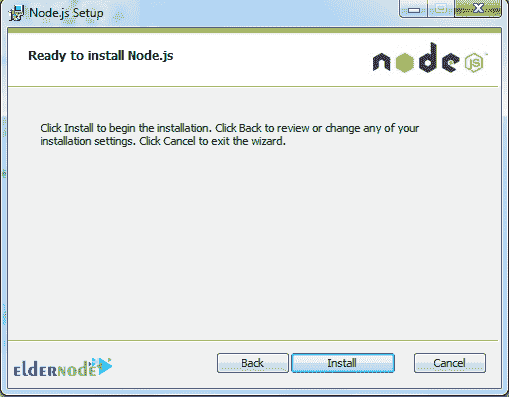

# 如何在 Windows - Eldernode 上安装 React JS

> 原文：<https://blog.eldernode.com/install-react-js-on-windows/>


如何在 Windows 上安装 React JS？React JS 是一个用 JavaScript 编程语言开发的强大而先进的库。该图书馆由脸书于 2013 年以开源的名义推出。从那以后，在 JavaScript 开发者社区的帮助下，React JS 日益壮大，现在是最受欢迎的 JavaScript 库之一。

在本文中，我们将教你如何在 Windows 上安装 React JS。

**[购买 Windows 虚拟专用服务器](https://eldernode.com/windows-vps/)**

## 安装 Node.js

第一步是为 Windows 下载 Node.js 安装程序。使用最新的 [Windows 长期支持(LTS)版本，使用 Windows Installer 图标选择 64 位版本](https://nodejs.org/en/download/)。


下载完成后运行 Node.js 安装程序。 按照下面的步骤，直到安装过程完成:

1


2


3


4



5


6


现在 Node.js 已经成功安装，我们可以进入下一步了。

## **命令行提示环境**

我们需要使用命令提示符与 Node.js 和节点包管理器 ( NPM )交互来安装 React。下面是我们需要使用的基本命令来创建文件夹/目录:

**1。** 如何列出目录内容:

```
dir  dir <directory_name>
```

**结果:**列出当前目录或指定目录的内容。

**2。** 如何换到一个目录:

```
cd <directory_name>
```

**结果:**更改到指定目录。请注意，命令提示符将更改为显示当前目录。

**3。** 如何切换到以前的目录:

```
cd..
```

**结果:**切换到当前目录的上一级目录。

**4。** 如何制作目录:

```
mkdir <directory_name>
```

**结果:**用指定的名称创建一个新目录。

### 在 Windows 中打开命令提示符

a)打开开始菜单，键入命令，然后**搜索**。

b)选择**命令** **提示符**或 **Node.js 命令提示符。**

c)两种选择都可以。


如在C:\ Users \<username>中，会打开一个窗口，在该窗口中，您系统上的 < username > 将是您登录的用户。 


在下面的例子中，我们运行上面的命令之一来查看结果:

```
dir
```


让我们用这个命令来看看下载文件夹的内容:

```
dir downloads
```


路径显示我们仍然在目录 C:\Users\ReactUser > 中，但是，我们正在查看C:\ Users \ react user \ downloads的内容，我们看到它有一个文件。

使用以下命令移动到下载目录:

```
cd downloads
```


当命令提示符显示C:\ Users \ react user \ Downloads>时，我们已经切换到下载文件夹。您可以使用 dir 命令来查看这个**目录/文件夹**的内容。接下来，使用以下命令返回到上一个目录:

```
cd..
```


为我们的第一个项目创建一个新目录，并将其命名为 **reactproject1** 。我们将使用以下命令:

```
mkdir reactproject1
```


同样，我们使用 dir 命令列出当前文件夹中的文件:

```
dir
```


如果你想了解更多关于命令的信息，请查看这个[微软链接](https://docs.microsoft.com/en-us/windows-server/administration/windows-commands/windows-commands)。

在 Windows 上安装 React

## 有两种方法可以为你的项目安装 React。两种方法我们都教，所以你可以选择哪种方法适合你。【T2

第一种方法

### 此安装选项允许您完全控制已安装并定义为依赖项的所有内容。

**1。** 第一步，打开命令提示。

**2。** 创建一个名为 reactproject1 的项目文件夹。

按 Enter 键执行命令。

```
mkdir reactproject1
```

**3。** 移动到项目文件夹，用 cd reactproject1 ，这样就可以把 React 安装进去了。

**4。** 使用以下命令创建一个 package.json 文件。

```
cd reactproject1
```

```
npm init
```


**5。** 使用 npm install — save react 安装 react 和其他模块，这将把 React 安装到您的项目中，并使用依赖项更新 package.json 文件。

您可以使用 npm install 来安装其他软件包——保存和您想要安装的软件包的名称。

```
npm install --save react
```

这里我们正在安装 react-dom :

第二法

```
npm install --save react-dom
```

### **1。** 第一步，打开命令行，键入**NPM install-g create-react-app**。这将安装 Create-React-App 模块，这使得用一个命令创建 React 并将其部署到项目中变得非常容易。 

Create-React-App 安装在以下位置:

```
npm install -g create-react-app
```

C:\Users\ <用户名>\ AppData \ Roaming \ NPM \ node _ modules \ create-react-app \

当创建一个新项目时，为了确保你在期望的目录中，你可以使用 dir 来查看你在哪里，以及CD<directory _ name>或 cd..到达所需位置。

**2。** 第二步:创建一个新项目并将 React 部署到其中，运行create-React-app<project _ name>。这样做是为了创建 reactproject2 。

整个过程是自动化的，从为项目创建一个新的 React app 文件夹开始，然后安装包和依赖项。

```
create-react-app reactproject2
```

默认包包括 react 、 react-dom 和 react-scripts 。安装将需要几分钟时间。


运行 React 项目应用程序

## 为此，您需要使用命令提示符切换到项目文件夹，然后启动它。 cd reactproject2 命令将把我们带到 reactproject2 文件夹。

npm start 将运行项目应用程序。

```
cd reactproject2
```


默认浏览器将打开并加载项目:


**尊敬的用户**，我们希望您能喜欢这个[教程](https://eldernode.com/category/tutorial/)，您可以在评论区提出关于本次培训的问题，或者解决[老年人节点培训](https://eldernode.com/blog/)领域的其他问题，请参考[提问页面](https://eldernode.com/ask)部分，并尽快提出您的问题。腾出时间给其他用户和专家来回答你的问题。

如何在 Windows 上安装 React JS？

好运。

Goodluck.