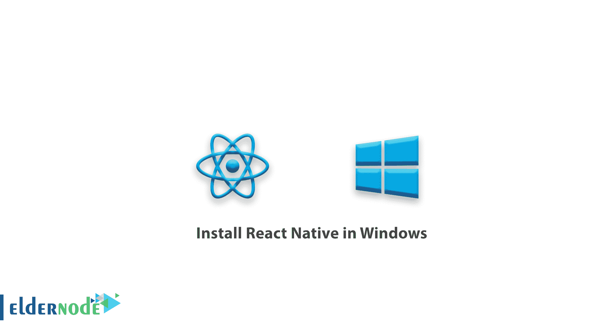
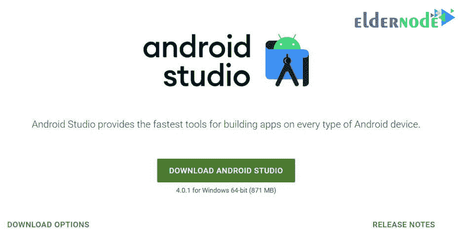
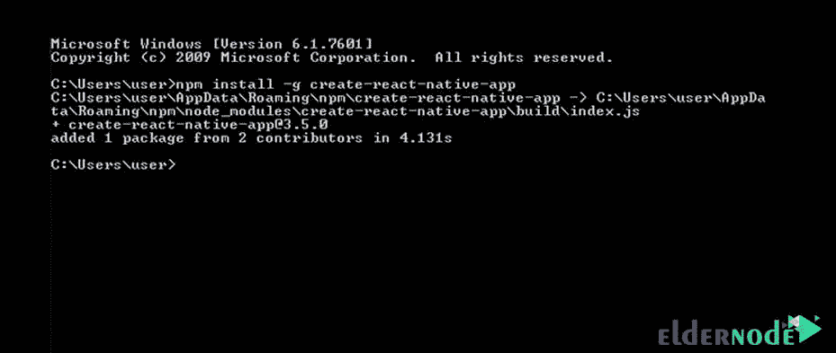
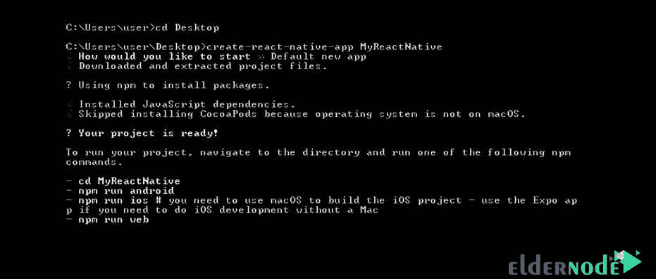
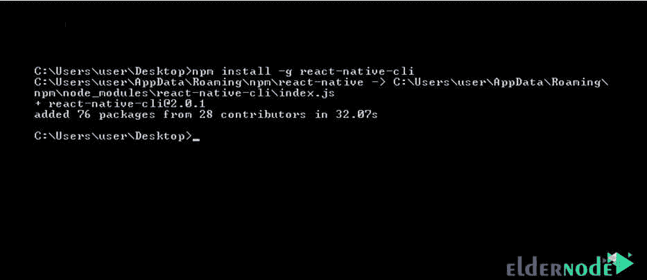
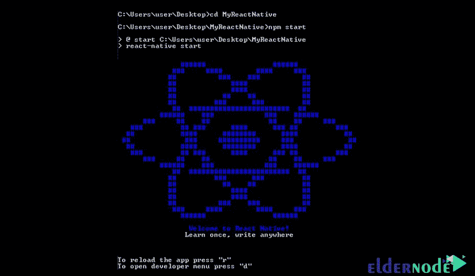
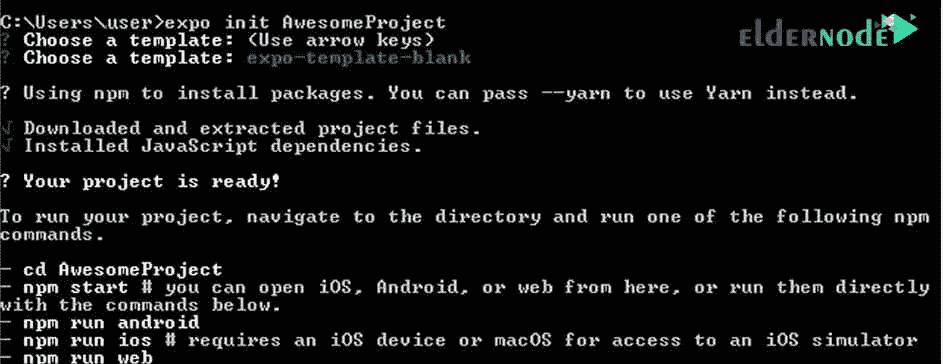
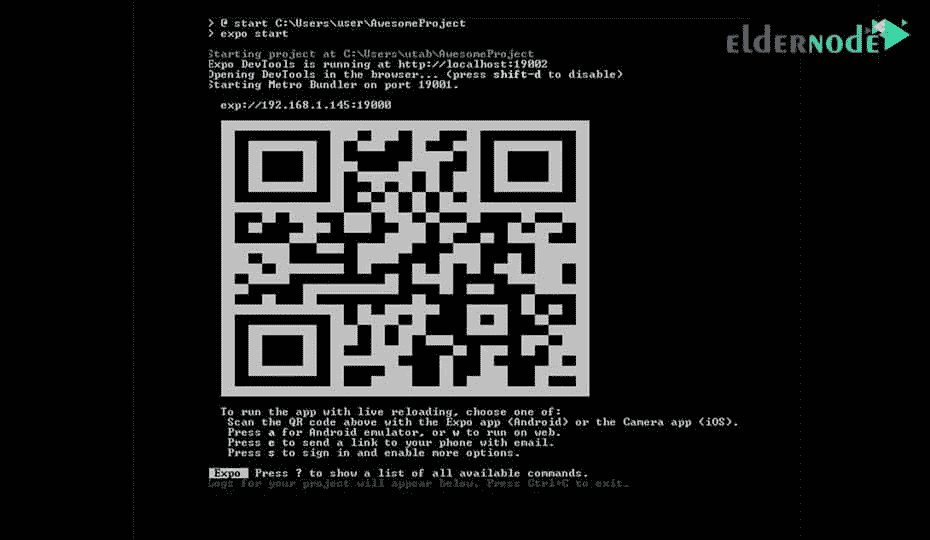

# 如何在 Windows 中安装 React Native

> 原文：<https://blog.eldernode.com/install-react-native-in-windows/>



如何在 Windows 中安装 React Native？ JavaScript 语言有几个框架和库，其中一个是 [React Native](https://reactnative.dev/) 。React Native 是用来把移动应用写成原生的。在这篇文章中，我们将教你如何在 Windows 中安装 react native。

[**购买 SSD VPS 托管服务器**](https://eldernode.com/ssd-vps/)

先决条件

## 在**安装** React Native 之前，你必须在你的系统上安装以下三个程序:

**1-** Node.js

**2-** 安卓工作室

**3-** JDK

我们建议你阅读 [Node.js 安装教程](https://eldernode.com/install-node-js-on-windows/)文章，学习如何安装 Node.js 。

要下载并安装 Android Studio，我们建议您直接从 [Android Stadio 网站](https://developer.android.com/studio?hl=es)下载并安装。



下面是**到安装的两种方式。**

**注意:** 需要注意的是，各个阶段都必须开启互联网。

第一种方法

## **1。打开命令行的**，输入如下命令:

**2。** 在上面代码的的**输出**中，你会在命令行中看到如下文字:

```
npm install -g create-react-native-app
```



**3。T3 在这一步中，创建一个文件夹来创建程序文件。我们在**桌面**上创建这个文件夹，并将其命名为 MyReactNative 。**

**4。** 在命令行中输入跟随命令进入路径:

**5。** 然后输入以下命令:

```
cd Desktop
```

**6。** 几分钟后你会看到下面的文字:

```
create-react-native-app MyReactNative
```



**7。** 这一步，你必须**安装** react-native-cli 。为此，在命令行中输入以下命令:

**8。** 在执行完上面的命令后，你会在输出中看到下面的代码:

```
npm install -g react-native-cli
```



**9。** 转到 MyReactNative **文件夹**，键入以下命令:

**10。** 如果所有步骤都正确执行，你将最后看到下图:

```
cd MyReactNative  npm start
```



方法 2:用 expo 安装 React Native

## 这种方法比第一种方法简单，T2 快。

**1。** 在命令行中，输入以下命令:

**2。** 执行完上述命令后，进入跟随命令。下面的命令**在您指定的路径中创建一个名为 AwesomeProject 的文件夹**。比如，我们的文件夹是在 C:/Users/user/ 中创建的。

```
npm install -g expo-cli
```

**3。**上面的命令的输出如下:

```
expo init AwesomeProject
```



**4。** 输入以下命令进入 AwesomeProject 文件夹:

**5。** 然后输入**下面的一个**两个命令:

```
cd AwesomeProject
```

**命令编号 1:**

**命令编号 1:**

```
npm start
```

现在，如果以上所有步骤都正确执行，您将在命令行中看到二维码后面的:

```
expo start
```



**尊敬的用户**，我们希望您能喜欢这个[教程](https://eldernode.com/category/tutorial/)，您可以在评论区提出关于本次培训的问题，或者解决[老年人节点培训](https://eldernode.com/blog/)领域的其他问题，请参考[提问页面](https://eldernode.com/ask)部分，并尽快提出您的问题。腾出时间给其他用户和专家来回答你的问题。

好运。

Goodluck.