# 如何在 Windows 上安装 RoboMongo-教程安装 robo mongo

> 原文：<https://blog.eldernode.com/install-robomongo-on-windows/>

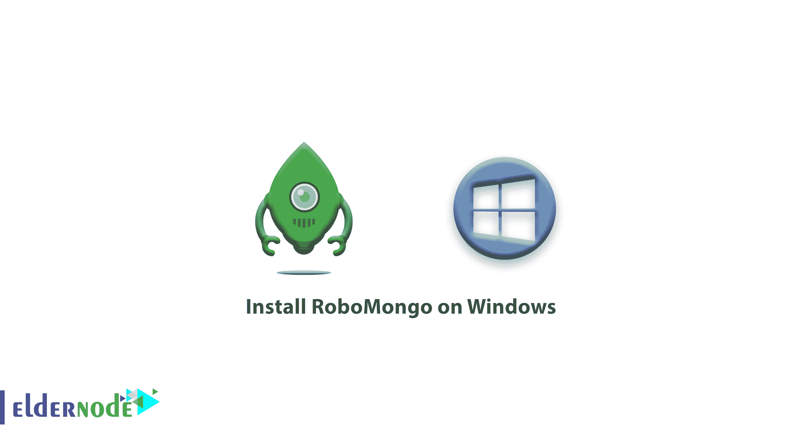

如何在 Windows 上安装 RoboMongo？RoboMongo 是一个帮助你管理数据库的可视化工具。Robomongo 是一款免费的开源软件，支持 Windows 、 Linux 、 Mac OS 等各种操作系统。当然，最近这个节目的名字从 RoboMongo 改成了 Robo 3T 。但许多用户都知道它的旧名 RoboMongo。Robomongo 用来充分利用 [MongoDB](https://eldernode.com/install-mongodb-on-windows/) 。

在这篇文章中，我们想教你如何下载和安装机器人软件。有了这个免费软件，你可以通过 GUI 轻松管理和控制 MongoDB，做你想做的事情。

[购买 Windows 虚拟专用服务器](https://eldernode.com/windows-vps/)

## Step 1: Download RoboMongo

第一步，要下载 RoboMongo 程序，必须进入其网站的[下载页面](https://robomongo.org/download)。然后根据您的操作系统下载现有的安装文件。为此，首先点击下载 Robo 3T 选项:

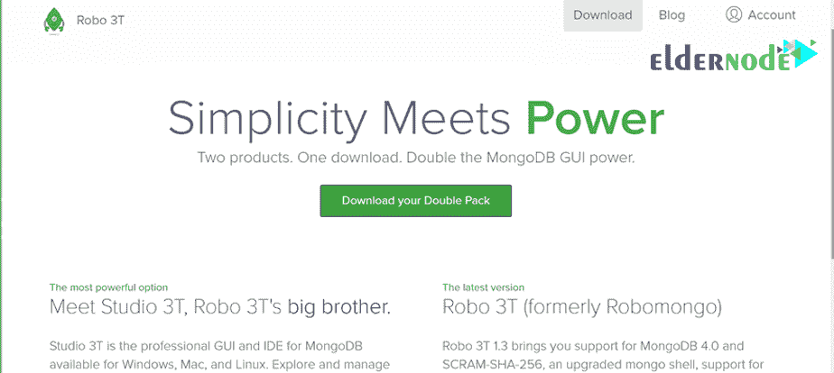

现在将打开一个对话框，您可以在其中选择并下载您的系统所需的版本:

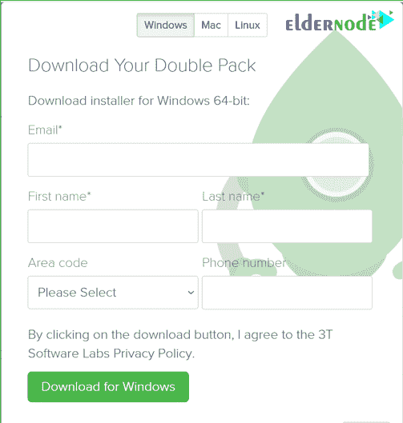

## 第二步:安装 RoboMongo

下载完成后，**双击下载文件上的**，点击下一步:

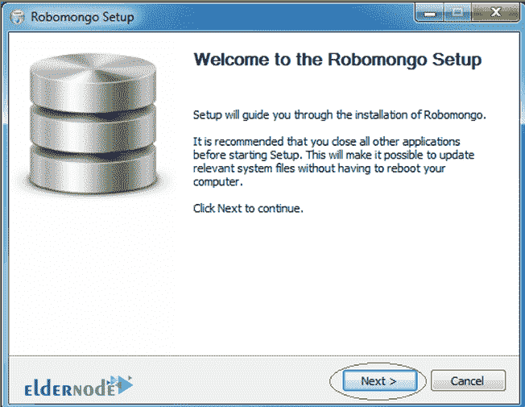

打开协议页面，接受显示的规则:

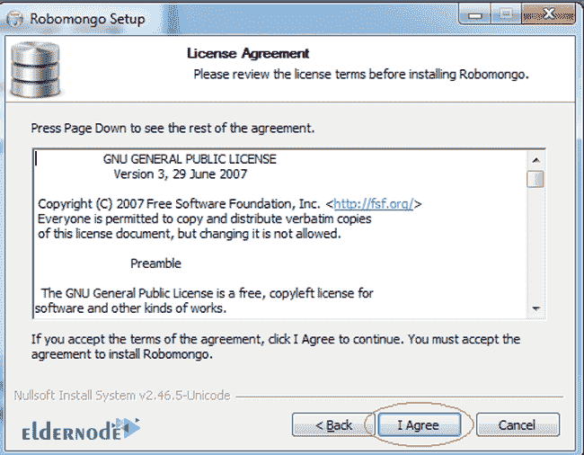

指定要保存 Robomongo 的路径:

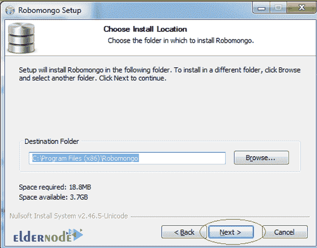

如果您不想在桌面上创建快捷方式，请选中下面的框:

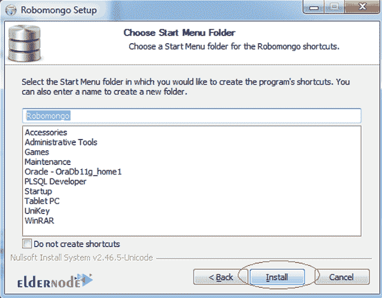

**最后**，点击完成按钮完成程序的安装。

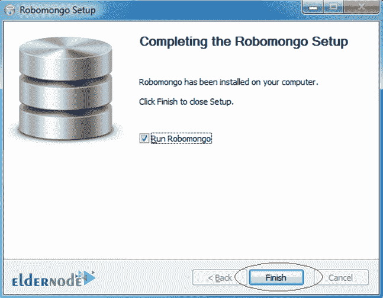

RoboMongo 很容易安装在你的电脑上，你可以用它来管理 MongoDB 数据库。

## Step 3: Use RoboMongo

安装后打开软件。

你第一眼看到的第一个页面就是你指定想要连接的 MongoDB 的地址和数据库信息的页面。

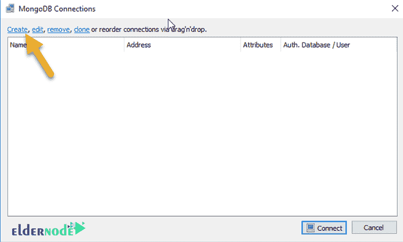

如上图所示，点击创建选项创建第一个连接。

**注意** 如果你不改变你在系统上安装的默认 MongoDB 设置，它的**地址**是 localhost ，它的**端口**是 27017 。但是，如果您更改了默认设置，您将需要输入新的信息。

您也可以在**名称字段**中指定连接名称，但这不是必需的，也不是很重要。使用 **测试** 按钮，可以测试该连接，确保其 **安全** 。

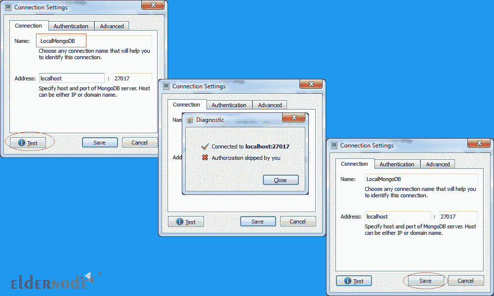

点击保存成功保存连接。

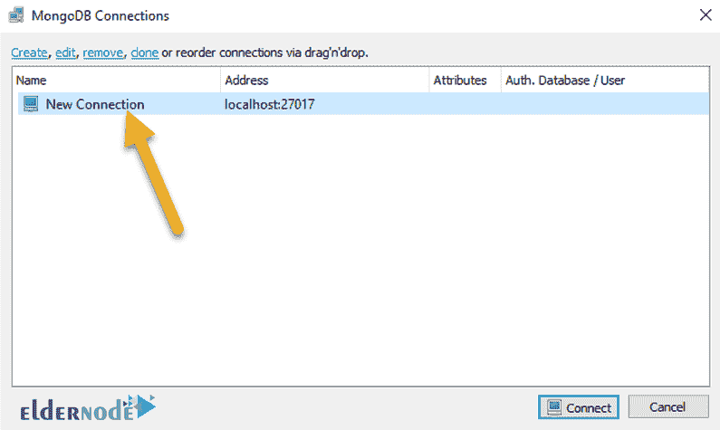

如您所见，连接已经建立。您现在可以使用 Connect 按钮建立连接，并管理您的数据库。

**亦作，见:**

[1-如何在 Windows 上安装 MongoDB](https://eldernode.com/install-mongodb-on-windows/)

[2-如何在 Ubuntu 20.04 服务器上保护 MongoDB](https://eldernode.com/secure-mongodb-ubuntu-20/)

**尊敬的用户**，我们希望您能喜欢这个[教程](https://eldernode.com/category/tutorial/)，您可以在评论区提出关于本次培训的问题，或者想解决[老年人节点培训](https://eldernode.com/blog/)领域的其他问题，请参考[提问页面](https://eldernode.com/ask)部分，并尽快提出您的问题。腾出时间给其他用户和专家来回答你的问题。

如何在 Windows 上安装 RoboMongo？

好运。