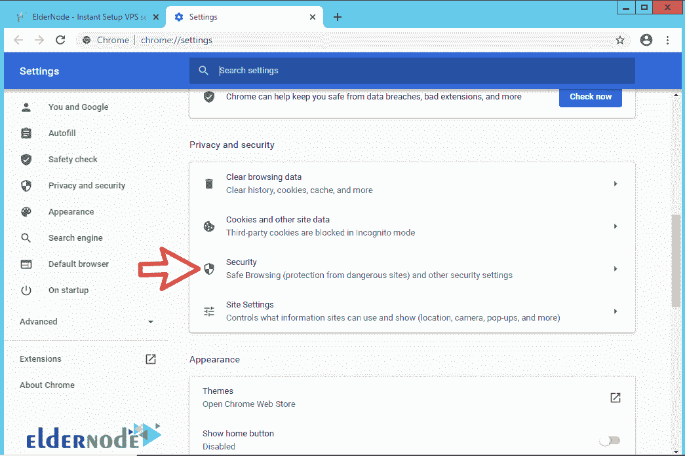
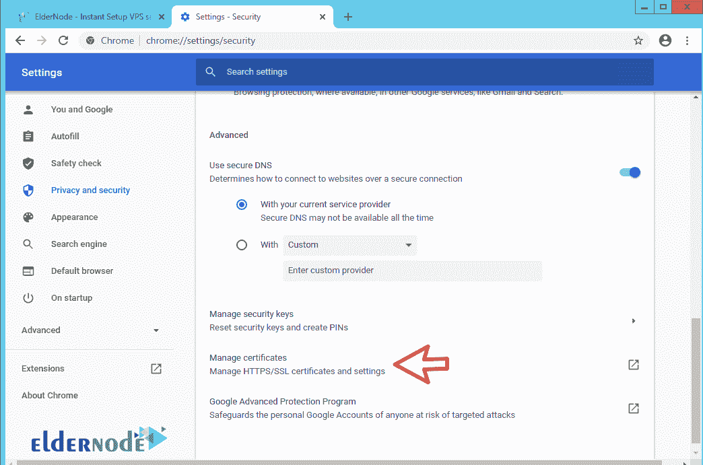
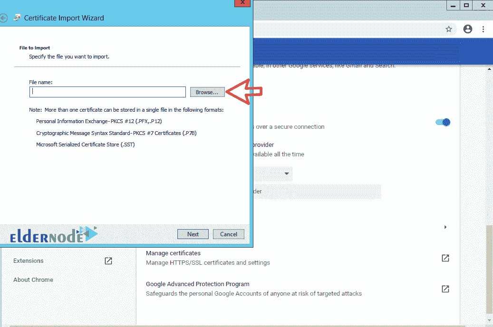

# 如何在 Google Chrome - ElderNode 博客中安装根证书

> 原文：<https://blog.eldernode.com/install-root-certificate-in-chrome/>

如何在 Google Chrome 中安装根证书？有时候一些基于网络的软件以及一些个人网站有**自签名** **SSL** s，这意味着即使它们有 [SSL](https://www.ssl.com/faqs/faq-what-is-ssl/) ，也会以红色显示给你。

**一般**，一些管理工具在 web 上提供，不再使用在系统上安装客户端软件。对于**增加的安全性**，这些服务附带一个自签名安全证书，它不被浏览器识别，这会减缓你**访问**网站的速度。

要解决这个问题，你必须**下载**那个集合和服务的[根证书](https://en.wikipedia.org/wiki/Root_certificate)。然后用我们将在下面解释的方法把它安装到你的[谷歌浏览器](https://www.google.com/intl/en_uk/chrome/)中。

**注意 :** 避免安装来自您不确定的网站和软件的证书。

跟随我们学习如何在谷歌浏览器中安装根证书。

[**elder node**中的虚拟主机计划](https://eldernode.com/linux-hosting/)

### 教程在谷歌浏览器中安装根证书

**1。先打开**你的谷歌 Chrome 。

**2。** 然后点击**主菜单**中的设置选项。

**3。** 在隐私和安全部分，点击安全。

**4。** 找到页面中间的管理证书选项**点击**即可。

**5。** 现在点击导入选项，点击**第一步**中的下一步。

**6。** 在**第二步**中，点击浏览，选择下载的证书。

**7。**T3 同样，点击下一步安装根证书直到步骤结束不变。

**注意:** 谷歌 Chrome 使用的是 Windows 个人安全证书库，所以你可以通过 Windows 安装证书。

如果需要在 Firefox 中安装证书，参考教程[在 Firefox](https://eldernode.com/install-root-certificate-in-firefox/) 中安装根证书。

**亦作，见:**

[1。如何在 Firefox 中启用 Cookies】](https://eldernode.com/enable-cookies-in-firefox/)

[2。如何清除谷歌 Chrome 浏览器历史](https://eldernode.com/clear-google-chrome-browser-history/)

[3。如何清除安卓手机上的谷歌 Chrome 历史记录](https://eldernode.com/clear-chrome-history-on-android/)

**尊敬的用户**，我们希望您能喜欢这个[教程](https://eldernode.com/category/tutorial/)，您可以在评论区提出关于本次培训的问题，或者解决[老年人节点培训](https://eldernode.com/blog/)领域的其他问题，请参考[提问页面](https://eldernode.com/ask)部分，并尽快提出您的问题。腾出时间给其他用户和专家来回答你的问题。

好运。