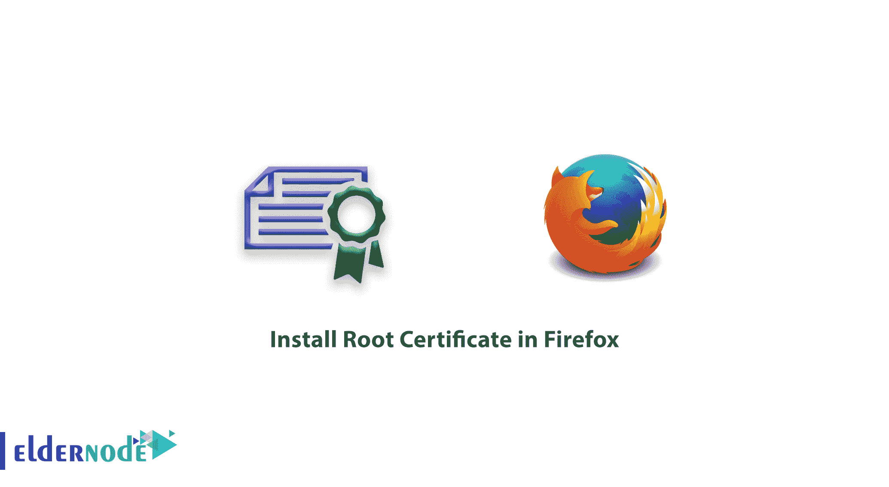
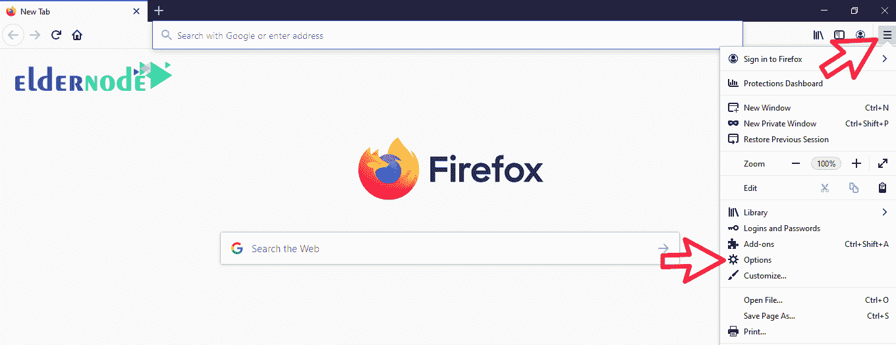
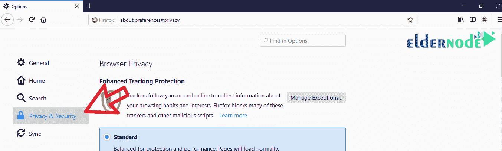
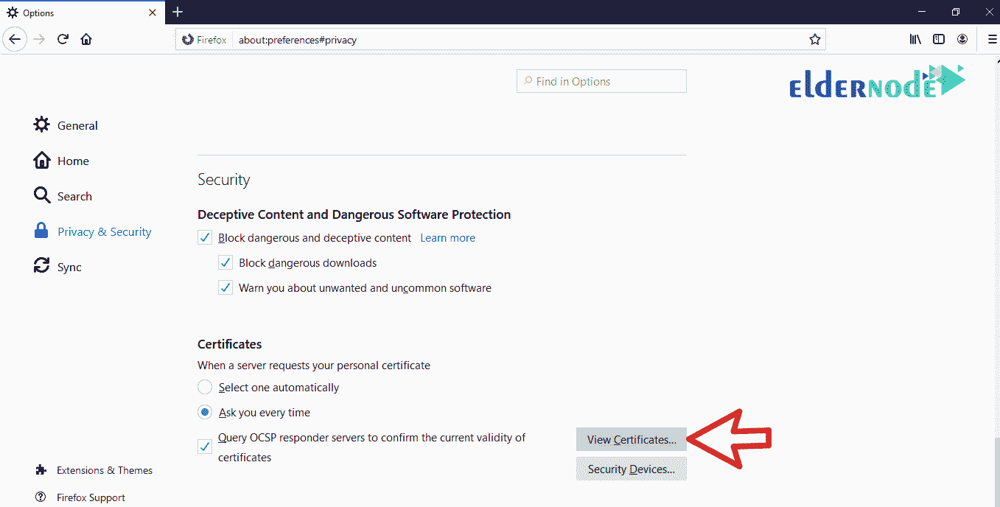
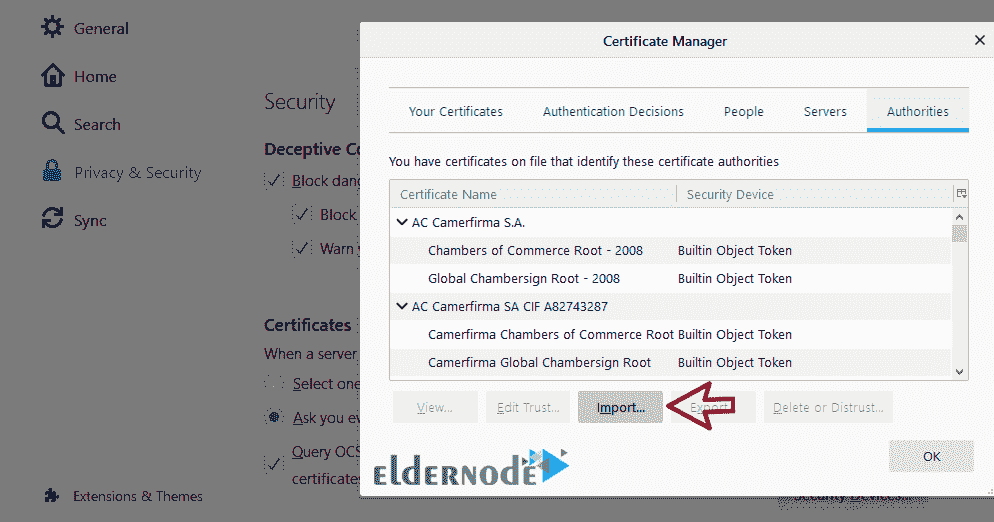

# 如何在 Firefox - ElderNode 博客中安装根证书

> 原文：<https://blog.eldernode.com/install-root-certificate-in-firefox/>

如何在 Firefox 中安装根证书？有时一些基于网络的软件以及一些个人网站有**自签名 SSL** ，这意味着即使它们有 [SSL](https://www.ssl.com/faqs/faq-what-is-ssl/) ，它们也会以红色显示给你。

在本文中，我们将教你如何在 [Firefox](https://www.mozilla.org/en-GB/firefox/new/) 中安装根证书，这样你就可以解决这个问题了。

**一般**，一些管理工具在 web 上提供，不再使用在系统上安装客户端软件。对于**增加的安全性**，这些服务附带一个自签名安全证书，它不被浏览器识别。这将降低您访问该网站的速度。

为了解决这个问题，你必须**下载**那套服务的[根证书](https://en.wikipedia.org/wiki/Root_certificate)。然后通过我们将在下面解释的方法将它安装到你的 Firefox 中。

[**elder node**中的虚拟主机计划](https://eldernode.com/linux-hosting/)

### 教程在 Firefox 中安装根证书

**1。** 首先，**下载**您想要的服务的根证书。

比如，如果使用 **VMware 的服务**，只需要上网搜索下载即可。

**注:** 一般在进入这些软件的登录页面或者那个公司的官网开始就可以下载根证书。

**2。** 下载后，打开你的火狐。

**3。从**主菜单**的**中，点击选项的选项。

**4。**T3 点击隐私&安全选项，显示**火狐安全设置**。

**5。** 然后在页面底部的**和证书部分，点击查看证书。**

****

****6。** 现在点击导入，选择你下载的根证书，最后点击打开。**

****

****7。** 后根证书 安装提示信息，**关闭**将 **Firefox** 完全打开再打开一次。**

****8。** 现在，通过输入您的网址，该网址使用了自签名安全证书，您将意识到安全证书已经被识别，从现在开始，您将可以毫无问题地访问您想要的网站。**

****注意:** 如果还是有问题，那么下载的根证书很可能是不正确或者有问题。**

****重要提示:** 避免安装自己不确定的证书站点和软件。**

****亦作，见:****

**[1。如何在 Firefox 中启用 Cookies】](https://eldernode.com/enable-cookies-in-firefox/)**

**[2。如何清除谷歌 Chrome 浏览器历史](https://eldernode.com/clear-google-chrome-browser-history/)**

**[3。如何清除安卓手机上的谷歌 Chrome 历史记录](https://eldernode.com/clear-chrome-history-on-android/)**

****尊敬的用户**，我们希望您能喜欢这个[教程](https://eldernode.com/category/tutorial/)，您可以在评论区提出关于本次培训的问题，或者想解决[老年人节点培训](https://eldernode.com/blog/)领域的其他问题，请参考[提问页面](https://eldernode.com/ask)部分，并尽快提出您的问题。腾出时间给其他用户和专家来回答你的问题。**

**好运。**