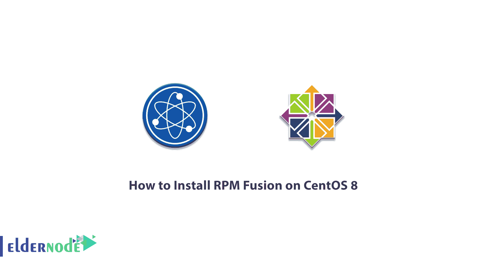

# 如何在 Centos 8 - Eldernode 博客上安装 RPM Fusion

> 原文：<https://blog.eldernode.com/install-rpm-fusion-on-centos-8/>



RPM Fusion 是一个由社区维护的软件库。这个项目提供了额外的包，由于法律原因，这些包不能在 Fedora 上分发。软件专利适用于一些 RPM 融合包。RPM Fusion 还为 Red Hat Enterprise Linux 提供了软件包。在本文中，我们尝试学习如何在 Centos 8 上安装 RPM Fusion。你可以访问 [Eldernode](https://eldernode.com/) 提供的套装来购买 [CentOS VPS](https://eldernode.com/centos-vps/) 服务器。

## **教程在 Centos 8 上安装 RPM Fusion**

请注意，RPM Fusion 存储库包括不附带 Redhat 或 Fedora 的包。要添加 RPM Fusion 存储库，可以使用下一节中列出的命令。请跟随本文学习如何在 Linux [Centos](https://blog.eldernode.com/tag/centos/) 8 上安装 RPM Fusion。

### **什么是 RPM 融合？**

RPM Fusion 是由一群志愿者维护的 Fedora 和 EL+EPEL 附加包的存储库。RPM Fusion 不是一个独立的存储库，而是 Fedora 的扩展。注意，这个存储库分发了 Fedora 不接受的包。应该注意的是，RPM Fusion 在不同的存储库中提供包，每个存储库都有自己的管理内容的规则。这些软件包是:

–免费存储库

–非免费存储库

–免费污染

–非自由污染

RPM Fusion 只分发可以合法分发的包。在下一节中，我们将解释如何在 CentOS 8 发行版上安装 RPM Fusion。

### **在 Centos 8 | Centos 7**T3 上安装 RPM Fusion

在此步骤中，我们将在 Centos 8、7 上安装 RPM Fusion。Rpm 融合存储库是互联网存储库。这意味着系统必须连接到互联网才能安装或使用它们。安装这些存储库并不需要花费您太多的时间，所以要安装这些存储库，按顺序完成以下步骤就足够了。

请注意，要在 Linux CentOS 上安装 RPM Fusion 存储库，必须首先运行以下命令。需要注意的是，您必须在 CentOS 中启用 EPEL 存储库。

```
$ sudo dnf install --nogpgcheck https://dl.fedoraproject.org/pub/epel/epel-release-latest-8.noarch.rpm
```

```
$ sudo dnf install --nogpgcheck https://download1.rpmfusion.org/free/el/rpmfusion-free-release-8.noarch.rpm https://download1.rpmfusion.org/nonfree/el/rpmfusion-nonfree-release-8.noarch.rpm
```

最后，您可以通过运行以下命令来完成 RPM Fusion 安装:

```
$ sudo dnf config-manager --enable PowerTools
```

您可以运行以下命令来检查 RPM 融合存储库在系统上是否处于活动状态:

```
yum repolist rpmfusion-*
```

## 结论

RPM Fusion 是 Fedora、CentOS/RHEL 和类似发行版最流行的第三方存储库之一。RPM 融合是三个项目合并的结果:运球、新鲜 RPM 和利夫纳。在本文中，我们试图简单地学习如何在 Centos Server 上安装 RPM Fusion。