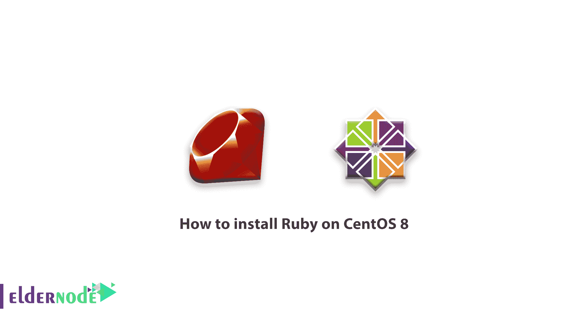

# 如何在 CentOS 8 上安装 Ruby-CentOS 8 带 Ruby

> 原文：<https://blog.eldernode.com/install-ruby-centos8/>



为了介绍另一个 web 应用程序，在本文中，我们将学习如何在 CentOS 8 上安装 Ruby。但是首先，ruby 是什么？它是一种动态的、多用途的、免费的开源编程语言，通常用于 web 应用程序的开发。这种高级编程语言有助于维护和不断改进语言，以获得更好、更高效的代码。您可以在各种应用程序中使用它，例如数据分析、定制数据库解决方案和原型制作等等。

## 如何在 CentOS 8 上安装 Ruby

让我们浏览一下本指南的步骤，向您展示如何在 CentOS 8 上安装 Ruby。

**[购买 VPS 服务器](https://eldernode.com/vps/)**

### 通过 Appstream 存储库在 CentOS 8 上安装 Ruby

你应该启动你的终端，更新系统的包和库，使用 **AppStream** repo 安装 Ruby。

```
sudo dnf update
```

为了确保安装了下面提到的包，请使用下面的命令。

```
sudo dnf install gnupg2 curl tar
```

最后，您可以通过键入以下命令从 Appstream 存储库中安装 Ruby:

```
sudo dnf install @ruby 
```

完成后，通过运行命令验证安装的 **Ruby** 的版本。

```
ruby --version 
```

### 使用 RVM 管理器在 CentOS 8 上安装 Ruby

**RVM** ， **Ruby 版本管理器**是一个多功能的命令行工具和 [包管理器](https://en.wikipedia.org/wiki/Package_manager) ，它允许你安装和管理多个 Ruby 环境。

首先以 root 用户身份下载 **RVM** 启动脚本，安装 **rvm。**

**注意**:要运行下面的命令，您需要从普通用户切换到根用户。

```
curl -sSL https://get.rvm.io | bash 
```

然后，您会发现正在安装一个新的组 **rvm** 。由于安装程序不再自动将用户添加到 **rvm** 组，您将会收到它的通知，用户需要自己完成此操作。因此，安装完成后，将普通用户添加到 **rvm** 组中。

```
usermod -aG rvm eldernode
```

然后，运行以下命令来更新系统环境变量。

```
source /etc/profile.d/rvm.sh 
```

接下来，重装 **RVM** 。

```
rvm reload
```

您可以通过键入以下命令来安装软件包要求:

```
rvm requirements
```

当你确定安装成功时，检查一下可以下载的各种版本的 Ruby。

```
rvm list known
```

运行下面的命令，使用 **RVM** 管理器安装 Ruby。

**注**:用下面突出显示的替换最新版本的 Ruby。

```
rvm install ruby 2.7.1 
```

试着享受这段休息时间，因为这需要一段时间。然后，在安装完成时验证 **Ruby** 的版本。

```
ruby --version
```

为了反映由 **RVM** 经理安装的最新版本，**红宝石**的版本已经改变。

如果您需要将上述版本作为 Ruby 的默认版本，您需要运行:

```
rvm use 2.7.1 --default 
```

**好样的** ！您已经完成了安装 Ruby 的步骤。此外，你可以阅读更多的 [CentOS 8](https://eldernode.com/tag/learning-centos-8/) 成为专家。

亲爱的用户，我们希望你喜欢这个教程，你可以在评论区提出关于这个培训的问题，或者解决 [Eldernode](https://eldernode.com/) 培训领域的其他问题，请参考 [提问页面](https://eldernode.com/ask) 部分并在其中提出你的问题。