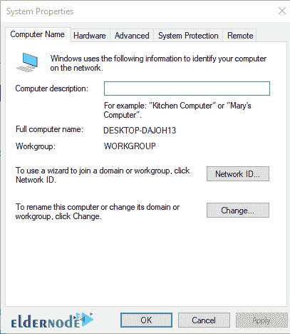
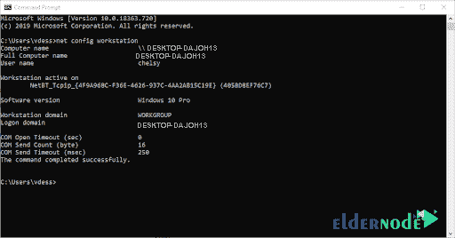
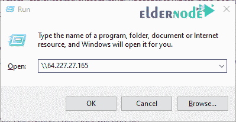
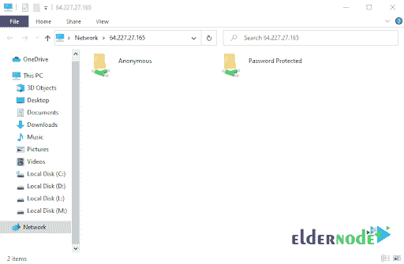
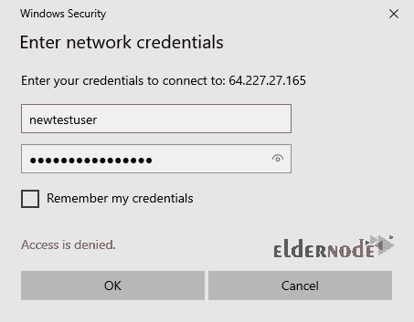
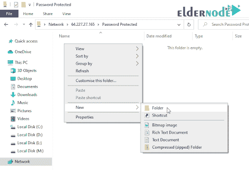
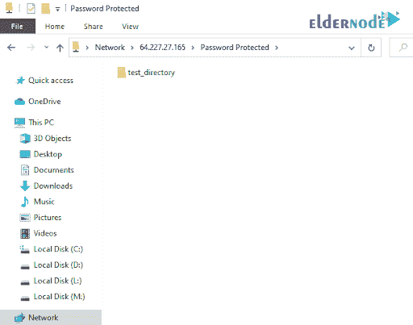

# 如何在 Linux/Windows 上安装 Samba

> 原文：<https://blog.eldernode.com/install-samba-on-linux-windows/>


如何在 Linux/Windows 上安装 Samba？Samba 是免费的开源软件，它允许文件在 Windows 和 T2 Linux 系统间简单方便地共享。确切的说，它是对[SMB](https://en.wikipedia.org/wiki/Server_Message_Block#:~:text=In%20computer%20networking%2C%20Server%20Message,between%20nodes%20on%20a%20network.)/[CIFS](https://cifs.com/#:~:text=Common%20Internet%20File%20System%20(CIFS,files%20on%20the%20remote%20server.)协议的一个开源实现。

( CIFS ) **通用互联网文件系统**协议是 SMB 协议的一种方言。描述一个协议的不同变体的消息包的集合被称为方言。

( SMB ) **服务器消息块**协议是一种客户端-服务器通信协议，用于共享对文件、打印机、串行端口和网络上其他资源的访问。

使用 **Samba** 时，可以在 Linux / Unix 服务器和 Windows 客户端之间共享文件和打印服务、用户认证和授权、名称解析、服务公告。

**[购买 VPS，便宜的 VPS 托管服务器带即时激活](https://eldernode.com/vps/)**

## 桑巴的主要任务

**1。** 与 Windows 机器 共用一个 Linux 驱动。

**2。** 用 Linux 机器访问 SMB 共享。

**3。** 与 Windows 机器共用一台 Linux 打印机。

**4。** 与 Linux 机器共用一台 Windows 打印机。

**5。** 在 Unix / Linux 服务器上设置域控制器，并将 **Windows 客户端**集成到域控制器。

Samba 还可以充当域控制器或常规域成员。如果你有一个混合的网络环境，包含了 Windows 和 T2 的 Linux 计算机，那么这个选项使得 Samba 几乎成为一个必备组件。

## 安装前介绍

为了**安装 Samba** ，你需要**以拥有 Sudo 权限的用户，或者作为 root 用户，登录**你的 Linux 服务器。

**注:** 为了简化本教程中的步骤，我们将使用根用户。

如果您决定以您的用户身份(拥有 sudo 权限)安装软件，不要忘记在每个命令的开头键入 Sudo 命令。

你还需要一台 Windows 电脑，我们将把从 / 连接到。

### 在 CentOS 7 上安装 Samba

由于在 CentOS 和其他基于 RedHat 的发行版上的安装大多使用 **yum 工具**进行最佳管理，我们将使用它在我们的 CentOS 7 上安装 Samba 并更新我们的系统。

首先让我们删除所有可能仍在系统中缓存的包。

要从任何已启用的存储库中一次性清除所有缓存文件，我们将使用以下命令:

```
[[[email protected]](/cdn-cgi/l/email-protection) ~]# yum clean all
```

接下来，让我们确保我们所有的系统包都已更新。

我们使用 -y 标志对任何提示进行**自动确认**:

```
[[[email protected]](/cdn-cgi/l/email-protection) ~]# yum -y update
```

现在，您可以继续进行 Samba 安装。

注意我们如何再次使用 -y 标志来**自动确认**安装提示。

使用以下命令可以轻松安装 Samba :

```
[[[email protected]](/cdn-cgi/l/email-protection) ~]# yum -y install samba samba-client samba-common
```

Yum 就是这样一个伟大的工具，它会自动安装 Samba 所需的任何依赖项。

在安装输出的最后，您应该会看到类似于以下输出的内容:

```
Installed:  samba.x86_64 0:4.9.1-10.el7_7 samba-client.x86_64 0:4.9.1-10.el7_7 samba-common.noarch 0:4.9.1-10.el7_7    Dependency Installed:  libsmbclient.x86_64 0:4.9.1-10.el7_7 libwbclient.x86_64 0:4.9.1-10.el7_7  samba-client-libs.x86_64 0:4.9.1-10.el7_7 samba-common-libs.x86_64 0:4.9.1-10.el7_7  samba-common-tools.x86_64 0:4.9.1-10.el7_7 samba-libs.x86_64 0:4.9.1-10.el7_7    Complete!
```

安装完成后，可以检查 Samba 版本:

```
[[[email protected]](/cdn-cgi/l/email-protection) ~]# smbd --version  Version 4.9.1
```

### 如何配置 Samba

安装桑巴后，你需要 **配置** 来符合你的设置和标准。

**注意:** 在您在我们的 **Linux 机器**上用 S amba 配置开始之前，您需要在您的 **Windows 计算机**上验证工作组。

要在您的 Windows 电脑上确认T2 工作组，请执行以下操作:

**1。** **在这台电脑或者我的电脑上右键**。

**2。** 点击属性。

**3。T3 选择高级系统设置。**

**4。** 电脑名称将显示以下窗口，显示您需要的数据。



您也可以**运行** cmd (从窗口开始框)并运行以下命令:

```
net config workstation
```

上面的命令将显示你需要的关于**工作站域**的信息。

您将看到类似下图的内容:



现在您已经有了关于 Windows 计算机工作组的信息，您可以继续在您的 Linux 系统上进行 **Samba 配置**。

Samba 配置文件可以在/etc/Samba/SMB . conf找到。

**注意:** 在我们进行任何更改之前，请确保创建一个备份原始配置文件的副本。

为了**创建原始配置文件 smb.conf 的备份**，您将使用以下命令创建一个名为 smb.conf_orig 的备份副本:

```
[[[email protected]](/cdn-cgi/l/email-protection) ~]# cp /etc/samba/smb.conf /etc/samba/smb.conf_orig
```

我们将通过为匿名文件共享服务配置 Samba 来启动。

在这个共享中，任何用户都可以读写。我们将首先创建一个名为“匿名共享目录的**目录**，我们的文件将存储在这里:

```
[[[email protected]](/cdn-cgi/l/email-protection) ~]# mkdir -p /samba/anonymous_shared_directory
```

现在，你需要申请适当的权限在你的目录上:

```
[[[email protected]](/cdn-cgi/l/email-protection) ~]# chmod -R 0775 /samba/anonymous_shared_directory  [[[email protected]](/cdn-cgi/l/email-protection) ~]# chown -R nobody:nobody /samba/anonymous_shared_directory
```

如果您正在使用 SELinux ，您将需要为 **samba 共享目录**更改 SELinux 安全上下文:

```
[[[email protected]](/cdn-cgi/l/email-protection) ~]# chcon -t samba_share_t /samba/anonymous_shared_directory
```

要对您的配置文件进行所需的更改，您需要**用首选的 CLI 文本编辑器 ( [Nano](https://eldernode.com/connect-to-nano-server/) 或 [Vim](https://eldernode.com/use-vi-full-text-editor/) )打开**the/etc/samba/SMB . conf文件。

```
[[[email protected]](/cdn-cgi/l/email-protection) ~]# vim /etc/samba/smb.conf
```

现在我们将通过**添加**和**编辑**以下指令来配置我们的匿名份额:

```
[global]  workgroup = WORKGROUP  security = user  netbios name = centos7  printcap name = cups  idmap config * : backend = tdb  cups options = raw  map to guest = bad user    [Anonymous]  comment = anonymous file share  path = /samba/anonymous_shared_directory  browseable = yes  writable = yes  guest ok = yes  guest only = yes  read only = no  force user = nobody
```

您的 Samba 配置文件现在应该如下所示:

```
[[[email protected]](/cdn-cgi/l/email-protection) samba]# cat /etc/samba/smb.conf    # See smb.conf.example for a more detailed config file or  # read the smb.conf manpage.  # Run 'testparm' to verify the config is correct after  # you modified it.    [global]  workgroup = WORKGROUP  security = user  netbios name = centos7  printcap name = cups  idmap config * : backend = tdb  cups options = raw  map to guest = bad user    [Anonymous]  comment = anonymous file share  path = /samba/anonymous_shared_directory  browseable = yes  writable = yes  guest ok = yes  guest only = yes  read only = no  force user = nobody    [homes]  comment = Home Directories  valid users = %S, %D%w%S  browseable = No  read only = No  inherit acls = Yes    [printers]  comment = All Printers  path = /var/tmp  printable = Yes  create mask = 0600  browseable = No    [print$]  comment = Printer Drivers  path = /var/lib/samba/drivers  write list = @printadmin root  force group = @printadmin  create mask = 0664  directory mask = 0775
```

**注意:** 不要忘记保存所做的修改并**关闭**文本编辑器。

为了**验证**您当前的 samba 设置，运行以下命令:

```
[[[email protected]](/cdn-cgi/l/email-protection) samba]# testparm  rlimit_max: increasing rlimit_max (1024) to minimum Windows limit (16384)  Registered MSG_REQ_POOL_USAGE  Registered MSG_REQ_DMALLOC_MARK and LOG_CHANGED  Load smb config files from /etc/samba/smb.conf  rlimit_max: increasing rlimit_max (1024) to minimum Windows limit (16384)  Processing section "[Anonymous]"  Processing section "[homes]"  Processing section "[printers]"  Processing section "[print$]"  Loaded services file OK.  Server role: ROLE_STANDALONE
```

按回车来查看服务定义的转储。

在你继续**启动**这个桑巴服务之前，你需要配置你的防火墙来配合它工作。

如何在 Linux/Windows 上安装 Samba？

Samba 需要打开以下端口才能正常运行:

```
Port 137 (TCP) - netbios-ns - NETBIOS Name Service  Port 138 (TCP) - netbios-dgm - NETBIOS Datagram Service  Port 139 (TCP) - netbios-ssn - NETBIOS session service  Port 445 (TCP) - microsoft-ds - if you are using Active Directory
```

并且:

```
Port 389 (TCP) - for LDAP (Active Directory Mode)  Port 445 (TCP) - NetBIOS was moved to 445 after 2000 and beyond, (CIFS)  Port 901 (TCP) - for SWAT service (not related to client communication)
```

我们将从配置 csf.conf 文件开始。

让我们用您选择的文本编辑器**打开**我们的 csf 配置文件:

```
[[[email protected]](/cdn-cgi/l/email-protection) ~]# vim /etc/csf/csf.conf
```

现在，确保将端口添加到适当的部分:

```
# Allow incoming TCP ports  TCP_IN = "20,21,25,53,80,110,139,143,443,445,465,587,993,995,53835"  # Allow outgoing TCP ports  TCP_OUT = "20,21,25,53,80,110,139,143,113,443,445,587,993,995,53835"
```

保存更改并重新加载防火墙规则:

```
[[[email protected]](/cdn-cgi/l/email-protection) ~]# csf -r
```

如果您正在运行防火墙服务，只需**使用以下命令添加服务**:

```
[[[email protected]](/cdn-cgi/l/email-protection) ~]# firewall-cmd --permanent --zone=public --add-service=samba
```

重新加载防火墙服务:

```
[[[email protected]](/cdn-cgi/l/email-protection) ~]# firewall-cmd --reload
```

启动 Samba 服务，并确保它在系统启动时自动启动。

桑巴使用**两个** **系统** **服务**来运行:

**1。****SMB . service:**实现了监听**端口** 139 和 445 的文件共享和打印服务。

**2。****nmb . service:**实现NetBIOSoverIP naming服务给客户端，监听端口 137 。

```
[[[email protected]](/cdn-cgi/l/email-protection) ~]# systemctl start smb.service  [[[email protected]](/cdn-cgi/l/email-protection) ~]# systemctl start nmb.service
```

**注意:** 为了确保这些服务在系统启动时自动启动，您需要启用它们:

```
[[[email protected]](/cdn-cgi/l/email-protection) ~]# [[[email protected]](/cdn-cgi/l/email-protection) ~]# systemctl enable smb.service  Created symlink from /etc/systemd/system/multi-user.target.wants/smb.service to /usr/lib/systemd/system/smb.service.  [[[email protected]](/cdn-cgi/l/email-protection) ~]# systemctl enable nmb.service  Created symlink from /etc/systemd/system/multi-user.target.wants/nmb.service to /usr/lib/systemd/system/nmb.service.
```

为了测试你新实现的匿名分享做以下事情:

**1。** 转到 Windows 电脑

**2。** 点击开始->-运行，我们要输入的是服务器的 IP 地址，就像这样。

**3。T3 按下确定。您的匿名目录将显示在文件浏览器中。**

**4。** **双击**进入目录，然后**右键**创建一个新文本文档。

**5。** 选择一个文件名然后保存它。(为此，我们将我们的文件命名为 testfile 。)

确保新文件在你的 Linux 机器上也是可用的:

```
[[[email protected]](/cdn-cgi/l/email-protection) ~]# [[[email protected]](/cdn-cgi/l/email-protection) ~]# ls -l /samba/anonymous_shared_directory  total 0  -rwxr--r--. 1 nobody nobody 0 Mar 30 22:03 testfile.txt
```

如何在 Linux/Windows 上安装 Samba？

## 如何为私有股份配置 Samba】

这种类型的共享需要一个用户名和一个密码才能访问。我们需要**创建**一个用户 / 组的用户，他们被允许访问我们的共享。

一旦我们为我们的 Samba 用户建立了一个组，我们就可以很容易地一次为他们分配任何需要的特权。

要创建一个新组,使用以下命令:

```
[[[email protected]](/cdn-cgi/l/email-protection) ~]# groupadd sambausergroup
```

我们现在已经成功地为我们的用户创建了一个名为 sambausergroup 的组。让我们继续并创建我们的用户。

我们将它命名为 newtestuser ，我们将在一个命令中将它分配给我们的组，同时拒绝他的 shell 访问。

Samba 用户账户与系统账户分开，所以我们打算只授予 Samba 特权的用户不需要 shell 访问 / 密码。

如果你决定合并，你可以**安装** " samba-winbind 软件包，它用于将系统用户和密码与 samba 用户数据库同步，以及其他功能。

如何在 Linux/Windows 上安装 Samba？

要添加您的用户,请使用以下命令:

```
[[[email protected]](/cdn-cgi/l/email-protection) ~]# useradd -s /sbin/nologin -g sambausergroup newtestuser
```

我们的用户访问我们的共享还需要一个密码，所以让为他创建一个 Samba 访问 密码:

```
[[[email protected]](/cdn-cgi/l/email-protection) ~]# smbpasswd -a newtestuser  New SMB password:  Retype new SMB password:  Added user newtestuser.
```

这个受密码保护的共享的 Samba 用户现在需要一个地方来存储他们的文件，所以我们需要为他们创建一个目录。

这个将被称为“密码保护目录”:

```
[[[email protected]](/cdn-cgi/l/email-protection) samba]# mkdir -p /samba/password_protected_directory
```

来自我们创建的组 sambausergroup 的用户需要读取、写入和执行该目录中的文件的权限，因此我们将使用以下命令授予他们这些权限:

```
[[email protected]](/cdn-cgi/l/email-protection) samba]# setfacl -R -m "g:sambausergroup:rwx" /samba/password_protected_directory
```

您还需要对这个应用 SELinux 安全上下文:

```
[[[email protected]](/cdn-cgi/l/email-protection) samba]# chcon -t samba_share_t /samba/password_protected_directory/
```

打开 Samba 配置文件，**为我们的私有共享添加**设置:

```
[[[email protected]](/cdn-cgi/l/email-protection) ~]# vim /etc/samba/smb.conf
```

```
[Password Protected]  comment = needs username and password to access  path = /samba/password_protected_directory  valid users = @sambausergroup  guest ok = no  writable = yes  browsable = yes
```

完整配置文件现在将如下所示:

```
# See smb.conf.example for a more detailed config file or  # read the smb.conf manpage.  # Run 'testparm' to verify the config is correct after  # you modified it.    [global]  workgroup = WORKGROUP  security = user  netbios name = centos7  printcap name = cups  idmap config * : backend = tdb  cups options = raw  map to guest = bad user    [Password Protected]  comment = needs username and password to access  path = /samba/password_protected_directory  valid users = @sambausergroup  guest ok = no  writable = yes  browsable = yes    [Anonymous]  comment = anonymous file share  path = /samba/anonymous_shared_directory  browseable = yes  writable = yes  guest ok = yes  guest only = yes  read only = no  force user = nobody    [homes]  comment = Home Directories  valid users = %S, %D%w%S  browseable = No  read only = No  inherit acls = Yes    [printers]  comment = All Printers  path = /var/tmp  printable = Yes  create mask = 0600  browseable = No    [print$]  comment = Printer Drivers  path = /var/lib/samba/drivers  write list = @printadmin root  force group = @printadmin  create mask = 0664  directory mask = 0775
```

现在您可以用 testparm 命令测试您的配置:

```
[[[email protected]](/cdn-cgi/l/email-protection) samba]# testparm  rlimit_max: increasing rlimit_max (1024) to minimum Windows limit (16384)  Registered MSG_REQ_POOL_USAGE  Registered MSG_REQ_DMALLOC_MARK and LOG_CHANGED  Load smb config files from /etc/samba/smb.conf  rlimit_max: increasing rlimit_max (1024) to minimum Windows limit (16384)  Processing section "[Password Protected]"  Processing section "[Anonymous]"  Processing section "[homes]"  Processing section "[printers]"  Processing section "[print$]"  Loaded services file OK.  Server role: ROLE_STANDALONE
```

按回车来查看你的服务定义的转储。

对于**测试**，从你的 Windows 电脑连接，点击开始–>运行和输入你的服务器 IP\ \ serverIP—>Ok。



现在，你将拥有匿名目录和密码保护目录:



**双击密码保护目录上的**会打开如下提示，我们需要在这里输入我们的 newtestuser 凭证:



为了确保一切正常运行，请在您的密码保护目录中创建一个新目录:



为了这个目的，这个将被命名为 test_directory f 。



最后，**从你的 Linux 机器上确认**你的目录的存在。

```
[[[email protected]](/cdn-cgi/l/email-protection) /]# ls -l /samba/password_protected_directory/  total 0  drwxr-xr-x. 2 newtestuser sambausergroup 6 Apr 3 21:12 test_directory
```

**尊敬的用户**，我们希望您能喜欢这个[教程](https://eldernode.com/category/tutorial/)，您可以在评论区提出关于本次培训的问题，或者解决[老年人节点培训](https://eldernode.com/blog/)领域的其他问题，请参考[提问页面](https://eldernode.com/ask)部分，并尽快提出您的问题。腾出时间给其他用户和专家来回答你的问题。

如何在 Linux/Windows 上安装 Samba？

好运。